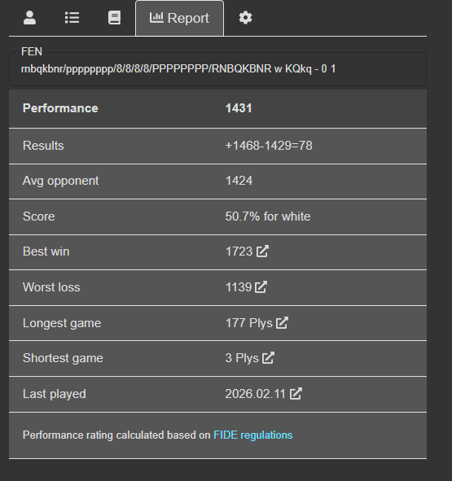

He decidido continuar con un cambio radical en la arquitectura del front.

Funcionalidades:
1. Mover el codigo streamlit a un carpeta src/streamlit 
2. Aplicar la architecture de docs/ROADMAP_FRONT_CHESS_TRAINER.md con FrontEnd en React + Vite ,capa de servicios con Fast APi (algo ya implementado) y backend actual.
2.1- El Front y back desde este preparado para manejar seguridad mediante autenticación y autorización con jwt.
2.2- Diseñar un modelo de roles (a implementar en otro sprint) admin, basic gamer, analysis board, excercise creator, stats viewer, tactics viewer , upload masive pgn etc.
3. Aplicar en funcionalidad
3.1- Chess Board : Tablero interactivo usando Chess.js + ChessBoard.js para reutiliza desde otros módulos.
3.2- Conección con Stockfish para poder jugar con el motor usando el tablero interactivo.
3.3- Migrar módulo de Explorar de Partidas a React + Vite
3.4- Navegar partidas seleccionadas desde Exploradores de Archivos usando la capa de servicios Fast Api.
3.5- Implementar módulo "analysis feeback" (front, servicios con backend existente usando stockfish)
3.6- Implementar módulo "Create Exercises" simil Lichess (front usando la lib de lichess para tablero y piezas, servicios con backend existente). Ver 3.7  
3.7- Implementar módulo "chess games training" (front, servicios con backend existente) 
	3.7.1. En base al perfil del usuario (post analisis de features) sugerir ejercicios de práctica concretos. Para ellos deberiamos disponer de una base local o externa de ejercicios que se puedan asociar con el perfil de usuarios (proponer alternativas online gratis o diseñar un modelo para importar ejercicios de diferentes fuentes en un proceso backend previo) (perfil usuario)
3.8- Implementar módulo "chess games stats" (front, servicios con backend existente) 
	3.7.1. Mostrar ranking de aperturas (usuario con blancas) y defenzas (usuaarios con negras) utilizadas. 
	3.7.2. Ranking de primer movida con blancas del usuario.
	Pantalla de ejemplo:
	
	3.7.4. Reporte resumen según pantalla de ejemplo
	
	Los links a partidas usar las fuentes (sean lichess , chess.com u otra), sino tienen links a sitios de ajedrez levantar el pgn en el trablero interactivo del chess_trainer. Dejar como opcional ver en tablero del chess_trainer o en el tablero de la fuente original. (perfil usuario)
3.9- Survivorship Bias module
3.10- Implementar módulo "Log viewer" (front, servicios con backend existente) (perfil admin)
3.11- EDA Analysis para gran cantidad de partidas (perfil admin).

Tareas:
1 - Actualizar documentación de arquitectura con estos requisitos en docs/ROADMAP_FRONT_CHESS_TRAINER.md 
2- Por cada funcionalidad
	2.1- Crear rama issue con rama asociada en git
	2.2- Crear y probar ok test unitarios
	2.3- Crear casos de prueba para probar el servicio rests desde postman.
	2.4- Crear paginas React + Vite usando el servicio rest mockeado.
	2.5- Una vez que el test unitario de ok adaptar los servicios rest correspondientes.
	2.6- Integrar el front con el back real mediante esos servicios.
	2.5- Desarrollar test de integración utilizando alguna herramienta para React + Vite para pruebas de integración.
	2.6- Desarrollar en forma iterativa incremental el módulo de logs (punto 3.10)
	
Trabajemos en forma interactiva empezando en depurar este mismo promt