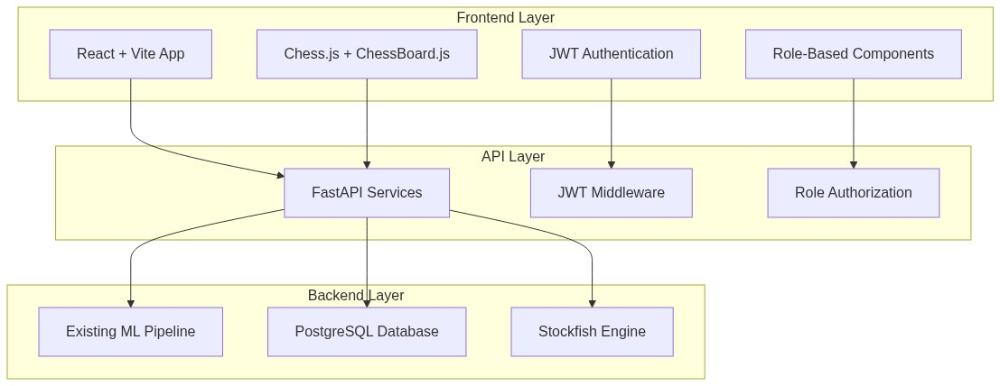

# 🚀 ROADMAP FRONTEND - CHESS TRAINER v2.0

## 🔄 **CAMBIO ARQUITECTÓNICO RADICAL - REACT + VITE**

### **📊 DECISIÓN ARQUITECTURAL**
Se ha decidido migrar completamente de **Streamlit** a **React + Vite** para crear una aplicación frontend moderna, escalable y profesional.

---

## 🏗️ **NUEVA ARQUITECTURA PROPUESTA**




### **🔧 STACK TECNOLÓGICO**

**Frontend (Nuevo)**:
- ⚛️ **React 18** - Framework principal
- ⚡ **Vite** - Build tool y dev server
- ♟️ **Chess.js** - Motor de ajedrez JavaScript  
- 🎯 **ChessBoard.js** - Componente tablero interactivo
- 🔐 **JWT** - Autenticación y autorización
- 🎨 **Material-UI/Tailwind** - Componentes UI
- 📊 **Recharts/Chart.js** - Visualizaciones

**API Layer (Mejorado)**:
- 🚀 **FastAPI** - API REST unificada
- 🔐 **JWT Middleware** - Seguridad
- 👥 **Role-Based Access Control** 
- 📝 **OpenAPI/Swagger** - Documentación automática

**Backend (Existente)**:
- 🗃️ **PostgreSQL** - Base de datos principal
- 🤖 **Stockfish** - Motor de análisis
- 🧠 **ML Pipeline** - Análisis de errores
- 🔬 **Survivorship Bias Module**

---

## 👥 **SISTEMA DE ROLES PROPUESTO**

### **Roles y Permisos**

| Rol                  | Descripción           | Permisos                                 |
| -------------------- | --------------------- | ---------------------------------------- |
| **admin**            | Administrador sistema | Todos los módulos + gestión usuarios     |
| **basic_gamer**      | Jugador básico        | Jugar vs Stockfish, ver partidas propias |
| **analysis_board**   | Analista              | Análisis completo, tablero con engine    |
| **exercise_creator** | Creador ejercicios    | Crear/editar ejercicios tácticos         |
| **stats_viewer**     | Visualizador stats    | Dashboard estadísticas avanzadas         |
| **tactics_trainer**  | Entrenador táctico    | Módulo entrenamiento táctico             |
| **pgn_uploader**     | Cargador masivo       | Upload masivo de PGN                     |
| **eda_analyst**      | Analista EDA          | Análisis exploratorio de datos           |

### **Matriz de Funcionalidades por Rol**

| Funcionalidad           | admin | basic_gamer | analysis_board | exercise_creator | stats_viewer | tactics_trainer | pgn_uploader | eda_analyst |
| ----------------------- | ----- | ----------- | -------------- | ---------------- | ------------ | --------------- | ------------ | ----------- |
| Chess Board Interactive | ✅     | ✅           | ✅              | ✅                | ❌            | ✅               | ❌            | ❌           |
| Play vs Stockfish       | ✅     | ✅           | ✅              | ✅                | ❌            | ✅               | ❌            | ❌           |
| Games Explorer          | ✅     | 📝           | ✅              | ✅                | ✅            | ✅               | ✅            | ✅           |
| Analysis Feedback       | ✅     | 📝           | ✅              | ✅                | ✅            | ✅               | ❌            | ✅           |
| Create Exercises        | ✅     | ❌           | ❌              | ✅                | ❌            | ✅               | ❌            | ❌           |
| Chess Stats             | ✅     | 📝           | ✅              | ✅                | ✅            | ✅               | ✅            | ✅           |
| Training Module         | ✅     | ✅           | ✅              | ✅                | ❌            | ✅               | ❌            | ❌           |
| Survivorship Bias       | ✅     | ❌           | ✅              | ❌                | ✅            | ❌               | ❌            | ✅           |
| Log Viewer (Progresivo) | ✅     | ❌           | ❌              | ❌                | ❌            | ❌               | ❌            | ❌           |
| EDA Analysis            | ✅     | ❌           | ❌              | ❌                | ❌            | ❌               | ❌            | ✅           |

**Leyenda**: ✅ = Acceso completo, 📝 = Solo datos propios, ❌ = Sin acceso

---

## 🚀 **MIGRACIÓN Y ESTRUCTURA DE ARCHIVOS**

### **📁 Nueva Estructura de Proyecto**

```
chess_trainer/
├── src/
│   ├── streamlit/                    # 📦 Código Streamlit movido aquí
│   │   ├── pages/
│   │   ├── components/
│   │   └── app.py
│   │
│   ├── frontend/                     # ⚛️ Nueva aplicación React + Vite
│   │   ├── public/
│   │   ├── src/
│   │   │   ├── components/
│   │   │   │   ├── chess/
│   │   │   │   │   ├── ChessBoard.jsx        # Tablero interactivo
│   │   │   │   │   ├── StockfishEngine.jsx   # Integración Stockfish
│   │   │   │   │   └── GameAnalysis.jsx      # Análisis posicional
│   │   │   │   ├── auth/
│   │   │   │   │   ├── Login.jsx
│   │   │   │   │   ├── RoleGuard.jsx         # Control acceso por roles
│   │   │   │   │   └── JWTManager.js         # Gestión tokens JWT
│   │   │   │   ├── games/
│   │   │   │   │   ├── GamesExplorer.jsx     # Explorador partidas
│   │   │   │   │   ├── GameViewer.jsx        # Visor individual
│   │   │   │   │   └── GameUploader.jsx      # Carga masiva PGN
│   │   │   │   └── shared/
│   │   │   │       ├── Layout.jsx
│   │   │   │       ├── Navbar.jsx
│   │   │   │       └── ProtectedRoute.jsx
│   │   │   ├── pages/
│   │   │   │   ├── Dashboard.jsx
│   │   │   │   ├── ChessBoardPage.jsx        # 3.1 Chess Board
│   │   │   │   ├── StockfishPage.jsx         # 3.2 Play vs Stockfish
│   │   │   │   ├── GamesExplorerPage.jsx     # 3.3 Games Explorer
│   │   │   │   ├── AnalysisFeedbackPage.jsx  # 3.5 Analysis Feedback
│   │   │   │   ├── ExerciseCreatorPage.jsx   # 3.6 Create Exercises
│   │   │   │   ├── StatsViewerPage.jsx       # 3.7 Chess Stats
│   │   │   │   ├── TrainingPage.jsx          # 3.8 Training Module
│   │   │   │   ├── SurvivorshipPage.jsx      # 3.9 Survivorship Bias
│   │   │   │   ├── LogViewerPage.jsx         # 3.10 Log Viewer (admin)
│   │   │   │   └── EDAAnalysisPage.jsx       # 3.11 EDA Analysis (admin)
│   │   │   ├── services/
│   │   │   │   ├── api.js                    # Cliente HTTP base
│   │   │   │   ├── authService.js            # Servicios autenticación
│   │   │   │   ├── gamesService.js           # Servicios partidas
│   │   │   │   ├── analysisService.js        # Servicios análisis
│   │   │   │   └── stockfishService.js       # Servicios motor
│   │   │   ├── hooks/
│   │   │   │   ├── useAuth.js
│   │   │   │   ├── useChessEngine.js
│   │   │   │   └── useGames.js
│   │   │   └── utils/
│   │   │       ├── chessUtils.js
│   │   │       ├── pgnParser.js
│   │   │       └── roleUtils.js
│   │   ├── package.json
│   │   ├── vite.config.js
│   │   └── README.md
│   │
│   └── api/                          # 🚀 FastAPI Services Layer
│       ├── main.py                   # Aplicación principal
│       ├── auth/
│       │   ├── jwt_manager.py        # Gestión JWT
│       │   ├── roles.py              # Definición roles
│       │   └── middleware.py         # Middleware autenticación
│       ├── routers/
│       │   ├── auth.py               # Endpoints autenticación
│       │   ├── chess.py              # Endpoints tablero/engine
│       │   ├── games.py              # Endpoints partidas
│       │   ├── analysis.py           # Endpoints análisis
│       │   ├── exercises.py          # Endpoints ejercicios
│       │   ├── stats.py              # Endpoints estadísticas
│       │   ├── training.py           # Endpoints entrenamiento
│       │   ├── survivorship.py       # Endpoints survivorship bias
│       │   ├── logs.py               # Endpoints logs (admin)
│       │   └── eda.py                # Endpoints EDA (admin)
│       ├── models/
│       │   ├── user.py
│       │   ├── game.py
│       │   ├── analysis.py
│       │   └── exercise.py
│       └── services/
│           ├── chess_service.py
│           ├── stockfish_service.py
│           ├── analysis_service.py
│           └── database_service.py
```

---

## 🎯 **ROADMAP DE IMPLEMENTACIÓN POR FUNCIONALIDADES**

### **FASE 0: Preparación y Migración Base**
**Duración estimada**: 2 días

**Tareas**:
1. ✅ Mover código Streamlit a `src/streamlit/`
2. ✅ Crear estructura React + Vite en `src/frontend/`
3. ✅ Configurar FastAPI unificada en `src/api/`
4. ✅ Configurar sistema JWT + roles
5. ✅ Crear documentación de APIs con Swagger

---

### **🆕 FUNCIONALIDAD 2.5: Sistema de Notificaciones + Extracción de Features**
**Issue**: `#notification-system-features`  
**Duración**: 3 días  
**Rol principal**: `admin`, `pgn_uploader`  
**Prioridad**: Alta - Requisito previo para 3.1

**Objetivos**:
- Implementar sistema de notificaciones con campanita en Navigation
- Crear endpoint API para iniciar extracción de features desde UI
- Integrar con script existente `generate_features_with_tactics.py`
- Notificar cuando el proceso de extracción esté completo
- Permitir a usuarios iniciar procesamiento desde ImportPage

**Componentes**:
```javascript
// ✅ COMPLETADO
// src/frontend/src/components/shared/NotificationBell.jsx
// - Campanita en Navigation con badge de notificaciones no leídas
// - Popover con lista de notificaciones
// - Marcar como leídas, eliminar, limpiar todas
// - Polling cada 10 segundos (futuro: WebSocket)

// src/frontend/src/services/notificationService.js
// - CRUD de notificaciones
// - Integración con API

// src/api/routers/features.py
// - POST /api/features/extract - Iniciar extracción
// - GET /api/features/status/{job_id} - Estado del job
// - GET /api/features/jobs - Listar jobs
// - Endpoints de notificaciones integrados

// src/frontend/src/pages/ImportPage.jsx
// - Botón "Extraer Features a PostgreSQL"
// - Integración con featuresService
```

**Flujo de trabajo**:
1. Usuario sube archivos PGN a través de ImportPage
2. Usuario presiona botón "🚀 Extraer Features a PostgreSQL"
3. Se inicia proceso en backend usando `generate_features_with_tactics.py`
4. Se crea notificación "En proceso" visible en campanita
5. Proceso se ejecuta en background
6. Al completar, se actualiza notificación a "Completado" con estadísticas
7. Usuario recibe notificación visual en campanita

**APIs**:
- `POST /api/features/extract` - Iniciar extracción de features
- `GET /api/features/status/{job_id}` - Obtener estado del job
- `GET /api/features/jobs` - Listar todos los jobs
- `GET /api/features/notifications` - Obtener notificaciones
- `PUT /api/features/notifications/{id}/read` - Marcar como leída
- `DELETE /api/features/notifications/{id}` - Eliminar notificación

**Estado**: ✅ Implementado completamente

---

### **FUNCIONALIDAD 3.1: Chess Board Interactivo + Log System Base**
**Issue**: `#chess-board-react`  
**Duración**: 6 días (ampliado +1 día para logging)  
**Rol principal**: `basic_gamer`, `analysis_board` + `admin`

**Objetivos**:
- Tablero interactivo usando Chess.js + ChessBoard.js
- Navegación por jugadas (anterior/siguiente)
- Click para mostrar información de casillas
- Modo análisis con evaluación de posición
- **🆕 Sistema de logging base para admin**

**Implementación**:
```javascript
// src/frontend/src/components/chess/ChessBoard.jsx
import ChessJS from 'chess.js'
import Chessboard from 'chessboardjsx'
import { logChessEvent } from '../services/logService'

const InteractiveChessBoard = ({
    pgn,
    onMoveChange,
    allowMoves = false,
    showAnalysis = false
}) => {
    // Lógica del tablero interactivo
    const handleMove = (move) => {
        logChessEvent('board_move', { move, pgn, timestamp: new Date() })
        onMoveChange(move)
    }
}
```

**APIs necesarias**:
- `GET /api/chess/position-analysis` - Análisis posicional
- `POST /api/chess/validate-move` - Validar jugada
- **🆕 `POST /api/logs/chess` - Logging eventos tablero**
- **🆕 `GET /api/logs/chess` - Ver logs tablero (admin)**

**Componente Log Viewer inicial**:
```javascript
// src/frontend/src/components/admin/LogViewer.jsx
const LogViewer = ({ module = 'chess' }) => {
    const [logs, setLogs] = useState([])
    const [filters, setFilters] = useState({ level: 'all', module })
    
    // Solo muestra logs del módulo actual
    // Se expandirá con cada nueva funcionalidad
}
```

---

### **FUNCIONALIDAD 3.2: Conexión con Stockfish + Logs Engine**
**Issue**: `#stockfish-integration`  
**Duración**: 5 días (ampliado +1 día para logging)  
**Rol principal**: `basic_gamer`, `analysis_board` + `admin`

**Objetivos**:
- Jugar partidas contra Stockfish
- Diferentes niveles de dificultad
- Análisis en tiempo real (opcional)
- Guardar partidas jugadas
- **🆕 Logging de interacciones con motor**

**Implementación**:
```javascript
// src/frontend/src/services/stockfishService.js
class StockfishService {
    async makeMove(fen, depth = 10) {
        const startTime = performance.now()
        const result = await api.post('/api/stockfish/move', { fen, depth })
        const endTime = performance.now()
        
        // Log rendimiento del motor
        await logService.logEngineEvent('move_calculated', {
            fen, depth, 
            responseTime: endTime - startTime,
            move: result.data.move
        })
        
        return result
    }
}
```

**APIs necesarias**:
- `POST /api/stockfish/move` - Obtener jugada del motor
- `POST /api/stockfish/analyze` - Análisis posicional
- `POST /api/games/save-vs-engine` - Guardar partida vs engine
- **🆕 `POST /api/logs/engine` - Logging eventos motor**
- **🆕 `GET /api/logs/engine` - Ver logs motor (admin)**

**Log Viewer expandido**:
```javascript
// Ahora maneja chess + engine logs
const LogViewer = ({ modules = ['chess', 'engine'] }) => {
    // Filtros por múltiples módulos
    // Tabs para separar tipos de logs
}
```

---

### **FUNCIONALIDAD 3.3: Games Explorer en React + Logs Database**
**Issue**: `#games-explorer-react`  
**Duración**: 7 días (ampliado +1 día para logging)  
**Rol principal**: Todos los roles con permisos + `admin`

**Objetivos**:
- Migrar explorador de partidas a React
- Tabla paginada con filtros avanzados  
- Vista detallada con tablero integrado
- Export de selecciones a PGN
- **🆕 Logging de consultas y accesos a BD**

**Implementación**:
```javascript
// src/frontend/src/pages/GamesExplorerPage.jsx
const GamesExplorerPage = () => {
    const [games, setGames] = useState([])
    const [filters, setFilters] = useState({})
    
    const loadGames = async () => {
        const startTime = performance.now()
        const result = await gamesService.getGames(filters)
        const endTime = performance.now()
        
        // Log performance de queries
        await logService.logDatabaseEvent('games_query', {
            filters,
            resultCount: result.data.length,
            queryTime: endTime - startTime,
            userId: currentUser.id
        })
        
        setGames(result.data)
    }
}
```

**APIs necesarias**:
- `GET /api/games/paginated` - Partidas paginadas
- `GET /api/games/filters` - Opciones de filtros
- `GET /api/games/{id}/details` - Detalle de partida
- `POST /api/games/export` - Export PGN
- **🆕 `POST /api/logs/database` - Logging consultas BD**
- **🆕 `GET /api/logs/database` - Ver logs BD (admin)**

**Log Viewer expandido**:
```javascript
// Ahora maneja chess + engine + database logs
const LogViewer = ({ modules = ['chess', 'engine', 'database'] }) => {
    // Dashboard con métricas por módulo
    // Filtros avanzados por usuario, tiempo, etc.
}
```

---

### **FUNCIONALIDAD 3.4: Navegación de Partidas**
**Issue**: `#game-navigation`  
**Duración**: 3 días  
**Dependencia**: 3.1 + 3.3

**Objetivos**:
- Integrar tablero con explorador
- Navegación fluida por jugadas
- Sincronización entre componentes
- Análisis por jugada

**Implementación**:
```javascript
// Integración entre GamesExplorer y ChessBoard
const GameViewer = ({ gameId }) => {
    const game = useGame(gameId)
    const [currentMove, setCurrentMove] = useState(0)
    
    return (
        <div className="game-viewer">
            <ChessBoard 
                pgn={game.pgn}
                currentMove={currentMove}
                onMoveChange={setCurrentMove}
            />
            <MoveList 
                moves={game.moves}
                currentMove={currentMove}
                onMoveSelect={setCurrentMove}
            />
        </div>
    )
}
```

### **FUNCIONALIDAD 3.6: Chess Games Stats**
**Issue**: `#chess-stats`  
**Duración**: 6 días  
**Rol principal**: `stats_viewer`, `eda_analyst`

**Objetivos**:
- Dashboard estadísticas generales
- Gráficos de rendimiento temporal
- Análisis por apertura y fase de juego
- Comparación entre jugadores

**Implementación**:
```javascript
// src/frontend/src/pages/StatsViewerPage.jsx
const StatsViewerPage = () => {
    const [stats, setStats] = useState({})
    const [filters, setFilters] = useState({})
    
    const { data: playerStats } = useQuery(
        ['stats', filters],
        () => statsService.getStats(filters)
    )
}
```

**APIs necesarias**:
- `GET /api/stats/overview` - Estadísticas generales
- `GET /api/stats/temporal` - Evolución temporal
- `GET /api/stats/openings` - Stats por apertura
- `GET /api/stats/comparison` - Comparar jugadores

---

---

### **FUNCIONALIDAD 3.6: Analysis Feedback Module**
**Issue**: `#analysis-feedback`  
**Duración**: 5 días  
**Rol principal**: `analysis_board`, `stats_viewer`

**Objetivos**:
- Dashboard de análisis de errores ML
- Visualización de feedback por partida
- Comparación de rendimiento temporal
- Recomendaciones de mejora

**Implementación**:
```javascript
// src/frontend/src/pages/AnalysisFeedbackPage.jsx
const AnalysisFeedbackPage = () => {
    const [analysis, setAnalysis] = useState(null)
    const [gameId, setGameId] = useState('')
    
    const runAnalysis = async () => {
        const result = await analysisService.analyzeGame(gameId)
        setAnalysis(result)
    }
}
```

**APIs necesarias**:
- `POST /api/analysis/run` - Ejecutar análisis ML
- `GET /api/analysis/{id}/results` - Obtener resultados
- `GET /api/analysis/history` - Historial análisis

---

### **FUNCIONALIDAD 3.7: Create Exercises (estilo Lichess)**
**Issue**: `#exercise-creator`  
**Duración**: 8 días  
**Rol principal**: `exercise_creator`, `tactics_trainer`

**Objetivos**:
- Editor de posiciones interactivo
- Creación de ejercicios tácticos
- Biblioteca de patrones tácticos
- Sistema de etiquetas y dificultad

**Implementación**:
```javascript
// src/frontend/src/pages/ExerciseCreatorPage.jsx
const ExerciseCreatorPage = () => {
    const [position, setPosition] = useState('')
    const [solution, setSolution] = useState([])
    const [tags, setTags] = useState([])
    
    const saveExercise = async () => {
        await exercisesService.create({
            position,
            solution,
            tags,
            difficulty
        })
    }
}
```

**APIs necesarias**:
- `POST /api/exercises/create` - Crear ejercicio
- `GET /api/exercises/patterns` - Patrones tácticos
- `PUT /api/exercises/{id}` - Actualizar ejercicio
- `DELETE /api/exercises/{id}` - Eliminar ejercicio

---

### **FUNCIONALIDAD 3.8: Training Module**
**Issue**: `#training-module`  
**Duración**: 7 días  
**Rol principal**: `tactics_trainer`, `basic_gamer`

**Objetivos**:
- Sistema de entrenamiento adaptativo
- Ejercicios tácticos progresivos
- Tracking de progreso individual
- Sistema de puntuación y logros

**Implementación**:
```javascript
// src/frontend/src/pages/TrainingPage.jsx
const TrainingPage = () => {
    const [currentExercise, setCurrentExercise] = useState(null)
    const [userProgress, setUserProgress] = useState({})
    
    const solveExercise = async (moves) => {
        const result = await trainingService.submit(
            currentExercise.id,
            moves
        )
        updateProgress(result)
    }
}
```

**APIs necesarias**:
- `GET /api/training/next-exercise` - Próximo ejercicio
- `POST /api/training/submit` - Enviar solución
- `GET /api/training/progress` - Progreso usuario
- `GET /api/training/leaderboard` - Ranking usuarios

---

### **FUNCIONALIDAD 3.9: Survivorship Bias Module + Logs Analytics**
**Issue**: `#survivorship-bias`  
**Duración**: 5 días (ampliado +1 día para logging)  
**Rol principal**: `eda_analyst`, `stats_viewer` + `admin`

**Objetivos**:
- Implementar módulo Survivorship Bias existente
- Dashboard de análisis de sesgos
- Detección de patrones problemáticos
- Reporte estructurado JSON
- **🆕 Logging de análisis y resultados**

**Implementación**:
```javascript
// src/frontend/src/pages/SurvivorshipPage.jsx
const SurvivorshipPage = () => {
    const runBiasAnalysis = async () => {
        setIsAnalyzing(true)
        const startTime = performance.now()
        
        try {
            const report = await survivorshipService.analyze()
            const endTime = performance.now()
            
            // Log análisis completado
            await logService.logAnalysisEvent('survivorship_analysis', {
                duration: endTime - startTime,
                reportId: report.id,
                findings: report.summary,
                userId: currentUser.id
            })
            
            setBiasReport(report)
        } catch (error) {
            // Log errores de análisis
            await logService.logError('survivorship_analysis_failed', error)
        } finally {
            setIsAnalyzing(false)
        }
    }
}
```

**APIs necesarias**:
- `POST /api/survivorship/analyze` - Ejecutar análisis
- `GET /api/survivorship/report/{id}` - Obtener reporte
- `GET /api/survivorship/history` - Historial análisis
- **🆕 `POST /api/logs/analytics` - Logging análisis**
- **🆕 `GET /api/logs/analytics` - Ver logs análisis (admin)**

---

### **FUNCIONALIDAD 3.10: Sistema de Log Viewer Completo (Consolidación)**
**Issue**: `#log-system-complete`  
**Duración**: 2 días  
**Rol principal**: `admin`

**Objetivos**:
- **Consolidar todos los logs desarrollados progresivamente**
- Dashboard unificado con métricas avanzadas
- Alertas y notificaciones automáticas
- Export y backup de logs
- Sistema de retención y archivado

**Sistema completo incluye**:
```javascript
// src/frontend/src/pages/LogViewerPage.jsx
const LogViewerPage = () => {
    const modules = [
        'chess',      // 3.1 - Eventos del tablero
        'engine',     // 3.2 - Stockfish interactions
        'database',   // 3.3 - Consultas BD
        'navigation', // 3.4 - Game navigation
        'analysis',   // 3.5 - ML Analysis feedback
        'exercises',  // 3.6 - Exercise creation
        'stats',      // 3.7 - Statistics queries
        'training',   // 3.8 - Training sessions
        'analytics'   // 3.9 - Survivorship bias
    ]
    
    return (
        <AdminDashboard>
            <LogMetricsDashboard modules={modules} />
            <LogSearchAndFilter />
            <LogExportAndBackup />
            <LogAlertSystem />
        </AdminDashboard>
    )
}
```

**Características finales**:
- 📊 **Dashboard de métricas** en tiempo real
- 🔍 **Búsqueda avanzada** con regex y filtros
- 📤 **Export automático** de logs críticos
- 🚨 **Sistema de alertas** para errores recurrentes
- 📈 **Análisis de tendencias** y patrones de uso
- 🗄️ **Archivado automático** de logs antiguos

---

### **FUNCIONALIDAD 3.11: EDA Analysis (Admin)**
**Issue**: `#eda-analysis-admin`  
**Duración**: 9 días  
**Rol principal**: `admin`, `eda_analyst`

**Objetivos**:
- Análisis exploratorio masivo de datos
- Visualizaciones interactivas avanzadas
- Detección de patrones y anomalías
- Reportes automatizados

**Implementación**:
```javascript
// src/frontend/src/pages/EDAAnalysisPage.jsx
const EDAAnalysisPage = () => {
    const [datasets, setDatasets] = useState([])
    const [analysis, setAnalysis] = useState(null)
    const [visualizations, setVisualizations] = useState([])
    
    const runEDA = async (dataset) => {
        const results = await edaService.analyze(dataset)
        setAnalysis(results)
        setVisualizations(results.charts)
    }
}
```

**APIs necesarias**:
- `GET /api/eda/datasets` - Datasets disponibles
- `POST /api/eda/analyze` - Ejecutar EDA
- `GET /api/eda/results/{id}` - Resultados EDA
- `POST /api/eda/export-report` - Export reporte

---

## 📋 **PLAN DE IMPLEMENTACIÓN INTEGRADO**

### **METODOLOGÍA POR FUNCIONALIDAD (Actualizada con Logging Progresivo)**

Para cada funcionalidad se seguirá este flujo mejorado:

1. **📋 Crear Issue y Branch**
```bash
# Crear branch para la funcionalidad
git checkout -b feature/{funcionalidad}
```

2. **🧪 Desarrollar Tests Unitarios + Logging Tests**
```javascript
// Ejemplo: src/frontend/src/tests/ChessBoard.test.jsx
import { render, fireEvent } from '@testing-library/react'
import ChessBoard from '../components/chess/ChessBoard'
import { logService } from '../services/logService'

describe('ChessBoard Component', () => {
    test('renders correctly', () => {
        render(<ChessBoard pgn="1.e4 e5" />)
        expect(screen.getByTestId('chess-board')).toBeInTheDocument()
    })
    
    test('logs chess events correctly', async () => {
        const logSpy = jest.spyOn(logService, 'logEvent')
        render(<ChessBoard pgn="1.e4 e5" />)
        fireEvent.click(screen.getByTestId('next-move'))
        
        expect(logSpy).toHaveBeenCalledWith('chess', 'move_navigation', 
            expect.objectContaining({ direction: 'next' }))
    })
})
```

3. **📝 Crear Casos de Prueba Postman + Logs APIs**
```json
{
    "info": { "name": "Chess Board API + Logs Tests" },
    "item": [
        {
            "name": "Analyze Position",
            "request": {
                "method": "POST",
                "url": "{{baseUrl}}/api/chess/position-analysis"
            }
        },
        {
            "name": "Log Chess Event",
            "request": {
                "method": "POST", 
                "url": "{{baseUrl}}/api/logs/chess",
                "body": {
                    "mode": "raw",
                    "raw": "{\"event\":\"move_made\",\"data\":{\"move\":\"e4\"}}"
                }
            }
        }
    ]
}
```

4. **⚛️ Desarrollar Frontend con Mocks + Logging**
```javascript
// Mock del servicio durante desarrollo
const chessService = {
    analyzePosition: jest.fn().mockResolvedValue({
        eval: 0.3,
        bestMove: "Nf6",
        depth: 15
    })
}

const logService = {
    logEvent: jest.fn().mockResolvedValue(true)
}
```

5. **🚀 Implementar APIs FastAPI + Logging Endpoints**
```python
# src/api/routers/chess.py
from fastapi import APIRouter, Depends
from .auth import get_current_user, require_role
from .logging import log_request

router = APIRouter()

@router.post("/position-analysis")
async def analyze_position(
    fen: str,
    current_user = Depends(get_current_user),
    _ = Depends(require_role("analysis_board"))
):
    # Implementar lógica
    result = await chess_engine.analyze(fen)
    
    # Log automático de la operación
    await log_request("chess", "position_analysis", {
        "user_id": current_user.id,
        "fen": fen,
        "result_eval": result.eval
    })
    
    return result

# Endpoint específico de logging
@router.post("/logs")  
async def log_chess_event(
    event: str,
    data: dict,
    current_user = Depends(get_current_user)
):
    await logging_service.log_event("chess", event, data, current_user.id)
    return {"status": "logged"}
```

6. **🔗 Integración Frontend-Backend + Log Viewer Update**
```javascript
// Reemplazar mocks por servicios reales
const chessService = new ChessService(apiClient)
const logService = new LogService(apiClient)

// Actualizar Log Viewer para incluir nuevo módulo
const LogViewer = ({ modules }) => {
    // Automáticamente detecta nuevos módulos
    useEffect(() => {
        setAvailableModules([...modules, 'chess']) // nuevo módulo
    }, [])
}
```

7. **🧪 Tests de Integración + Log Validation**
```javascript
// Tests E2E con validación de logs
import { setupServer } from 'msw/node'
import { rest } from 'msw'

const server = setupServer(
    rest.post('/api/chess/position-analysis', (req, res, ctx) => {
        return res(ctx.json({ eval: 0.3, bestMove: "Nf6" }))
    }),
    rest.post('/api/logs/chess', (req, res, ctx) => {
        return res(ctx.json({ status: 'logged' }))
    })
)

test('chess analysis logs events correctly', async () => {
    // Test que valida tanto funcionalidad como logging
})
```

**🎯 Beneficios de la Metodología con Logging Progresivo:**
- ✅ **Zero Technical Debt**: Logging desde día 1
- ✅ **Debugging Inmediato**: Problemas detectados al momento
- ✅ **Métricas Reales**: Datos de uso desde el desarrollo
- ✅ **Sistema Robusto**: Log viewer crece orgánicamente
- ✅ **Admin Empowered**: Visibilidad completa del sistema

---

## ⚡ **CRONOGRAMA DE DESARROLLO ACTUALIZADO**

### **Mes 1: Fundación + Logging Base**
- **Semana 1**: FASE 0 (2 días) + **Funcionalidad 2.5** (4 días) - Carga Masiva PGN ⭐
- **Semana 2**: Funcionalidad 3.1 (6 días) + Log System Base  
- **Semana 3-4**: Funcionalidad 3.2 (5 días) + 3.3 (7 días) + Logs Engine/Database

### **Mes 2: Core Features + Logging Expansion**  
- **Semana 5**: Funcionalidad 3.4 (3 días) + Logs Navigation
- **Semana 6-7**: Funcionalidad 3.5 (5 días) + 3.6 (8 días) + Logs Analysis/Exercises
- **Semana 8**: Buffer y refinamiento del sistema de logs

### **Mes 3: Advanced Features + Logging Completo**
- **Semana 9-10**: Funcionalidad 3.7 (6 días) + 3.8 (7 días) + Logs Stats/Training
- **Semana 11**: Funcionalidad 3.9 (5 días) + Logs Analytics
- **Semana 12**: Funcionalidad 3.10 (2 días) + 3.11 EDA (9 días) + Log System Final

**Ventajas del logging progresivo**:
- ✅ **Debugging inmediato** durante desarrollo
- ✅ **Monitoreo desde día 1** de cada funcionalidad  
- ✅ **Detección temprana** de problemas de rendimiento
- ✅ **Métricas de uso** desde el inicio
- ✅ **Sistema completo al final** sin deuda técnica

---

## 🔧 **ARQUITECTURA DE LOGGING PROGRESIVO**

### **Estructura de Logs por Módulo**
```javascript
// src/frontend/src/services/logService.js
class LogService {
    constructor() {
        this.modules = {
            chess: { events: 0, errors: 0 },
            engine: { events: 0, errors: 0 },
            database: { events: 0, errors: 0 },
            // Se expande con cada funcionalidad
        }
    }
    
    async logEvent(module, event, data) {
        const logEntry = {
            timestamp: new Date().toISOString(),
            module,
            event,
            data,
            userId: getCurrentUser()?.id,
            sessionId: getSessionId()
        }
        
        // Enviar a API
        await api.post(`/api/logs/${module}`, logEntry)
        
        // Actualizar métricas locales
        this.modules[module].events++
    }
    
    async logError(module, error, context = {}) {
        const errorEntry = {
            timestamp: new Date().toISOString(),
            module,
            level: 'ERROR',
            message: error.message,
            stack: error.stack,
            context,
            userId: getCurrentUser()?.id
        }
        
        await api.post(`/api/logs/${module}/error`, errorEntry)
        this.modules[module].errors++
    }
}
```

### **Log Viewer Evolutivo**
```javascript
// Evolución del componente LogViewer a través de las fases
// Fase 1 (3.1): Solo chess logs
// Fase 2 (3.2): chess + engine logs  
// Fase 3 (3.3): chess + engine + database logs
// ...
// Fase Final (3.10): Todos los módulos + dashboard avanzado
```

---

## 🛡️ **CONSIDERACIONES DE SEGURIDAD**

### **JWT Implementation**
```javascript
// src/frontend/src/services/authService.js
class AuthService {
    login(credentials) {
        return api.post('/auth/login', credentials)
            .then(response => {
                const { token, user } = response.data
                localStorage.setItem('token', token)
                localStorage.setItem('user', JSON.stringify(user))
                return { token, user }
            })
    }
    
    hasRole(role) {
        const user = this.getCurrentUser()
        return user?.roles.includes(role)
    }
}
```

### **Role-Based Access Control**
```python
# src/api/auth/middleware.py
from functools import wraps
from fastapi import HTTPException, Depends

def require_role(required_role: str):
    def decorator(func):
        @wraps(func)
        async def wrapper(*args, **kwargs):
            current_user = kwargs.get('current_user')
            if required_role not in current_user.roles:
                raise HTTPException(403, "Insufficient permissions")
            return await func(*args, **kwargs)
        return wrapper
    return decorator
```

---

## 📊 **MÉTRICAS DE ÉXITO**

### **Technical KPIs**
- ✅ **Performance**: Tiempo de carga < 2s
- ✅ **Test Coverage**: > 80% cobertura de código
- ✅ **API Response Time**: < 500ms promedio
- ✅ **Bundle Size**: < 5MB aplicación React

### **User Experience KPIs**  
- ✅ **User Adoption**: > 90% usuarios migrando de Streamlit
- ✅ **Feature Usage**: Cada funcionalidad usada por > 60% usuarios
- ✅ **Error Rate**: < 1% errores en producción
- ✅ **User Satisfaction**: Puntuación > 4.5/5 en feedback

---

## 🚀 **PRÓXIMOS PASOS INMEDIATOS**

### **1. Setup Inicial (Hoy)**
```bash
# Mover Streamlit
mkdir src/streamlit
mv src/pages src/streamlit/
mv src/components src/streamlit/
mv src/app.py src/streamlit/

# Crear React app
cd src
npm create vite@latest frontend -- --template react
cd frontend && npm install

# Instalar dependencias chess
npm install chess.js chessboardjsx
npm install @mui/material @emotion/react @emotion/styled
npm install axios react-query react-router-dom
npm install @testing-library/react @testing-library/jest-dom
```

### **2. Configurar FastAPI (Mañana)**
```python
# src/api/main.py
from fastapi import FastAPI
from fastapi.middleware.cors import CORSMiddleware
from .routers import auth, chess, games

app = FastAPI(title="Chess Trainer API v2.0")

app.add_middleware(
    CORSMiddleware,
    allow_origins=["http://localhost:3000"],
    allow_methods=["*"],
    allow_headers=["*"],
)

app.include_router(auth.router, prefix="/auth")
app.include_router(chess.router, prefix="/chess") 
app.include_router(games.router, prefix="/games")
```

### **3. Primer Issue (Esta semana)**
Crear issue `#chess-board-react` y comenzar desarrollo del tablero interactivo.

---

## 📋 **ESTADO ACTUAL DEL PROYECTO**

### **✅ SPRINT 1: Database Browser + Authentication - COMPLETADO**
**Fecha de completado**: 14 de Febrero, 2026  
**Branch**: `feature/frontend-sprint1-database-browser`  
**Versión**: v0.1.122-f8e6b29

#### **Funcionalidades Implementadas**

##### **1. Sistema de Autenticación JWT**
- ✅ Backend FastAPI con JWT tokens
- ✅ Endpoints `/auth/register`, `/auth/login`, `/auth/me`
- ✅ Role-Based Access Control (RBAC) implementado
- ✅ Middleware de protección de rutas
- ✅ 3 roles configurados: `admin`, `analyst`, `user`

##### **2. Frontend React con Autenticación**
- ✅ Componentes de login/registro
- ✅ AuthContext con gestión de sesión
- ✅ ProtectedRoute para protección de rutas
- ✅ Gestión de tokens en localStorage
- ✅ Refresh automático de sesión

##### **3. Database Browser con Filtros por Rol**
- ✅ Vista de todas las partidas para `admin` y `analyst`
- ✅ Vista filtrada (solo partidas propias) para `user`
- ✅ Campo `imported_by` en modelo `Game`
- ✅ Migración Alembic para campo nuevo
- ✅ Paginación funcional en todas las vistas

##### **4. Testing y Validación**
- ✅ 3 usuarios de prueba creados:
  - **admin** (rol: admin) - Contraseña: `admin123`
  - **analyst** (rol: analyst) - Contraseña: `analyst123`
  - **user** (rol: user) - Contraseña: `user123`
- ✅ 33 partidas importadas por usuario `user`
- ✅ Total de 237,250 partidas en base de datos PostgreSQL
- ✅ Validación de filtros por rol confirmada

#### **Documentación de Pruebas**
📖 Ver: [TESTING_AUTHENTICATION.md](TESTING_AUTHENTICATION.md) - Guía completa para reproducir todas las pruebas de autenticación y filtros por rol.

#### **Repositorio y Versión Control**
- **Commits**: 9 commits organizados (autenticación + docs + scripts + artifacts)
- **Archivos**: 185+ archivos agregados, 33 legacy files eliminados
- **Tamaño**: 53.79 MiB de cambios subidos
- **Organización**: .gitignore actualizado para excluir mlartifacts/ y mlruns/

---

## 🎯 **PRÓXIMAS FUNCIONALIDADES (Roadmap Activo)**

### **FUNCIONALIDAD 3.1: Chess Board Interactivo + Log System Base**
**Prioridad**: ALTA (Siguiente sprint)  
**Estado**: 🔜 Por iniciar

#### **Objetivos**
- Implementar tablero de ajedrez interactivo en React
- Integrar Chess.js para validación de movimientos
- Sistema de logs básico para eventos del tablero
- Reproducción de partidas desde Database Browser

#### **Componentes a Desarrollar**
- `ChessBoard.jsx` - Tablero interactivo
- `GameLoader.jsx` - Cargador de partidas desde DB
- `MoveHistory.jsx` - Historial de movimientos
- `LogViewer.jsx` - Visor de logs de eventos

**Tiempo estimado**: 2-3 semanas

---

### **FUNCIONALIDAD 3.2: Conexión con Stockfish + Logs Engine**
**Prioridad**: ALTA  
**Estado**: 🔜 Por iniciar (después de 3.1)

#### **Objetivos**
- Integración backend con Stockfish engine
- API endpoints para análisis de posiciones
- Sistema de logs de engine (evaluaciones, variantes)
- UI para mostrar evaluaciones en tiempo real

**Tiempo estimado**: 2-3 semanas

---

### **FUNCIONALIDAD 3.3: Games Explorer en React + Logs Database**
**Prioridad**: MEDIA  
**Estado**: 🔜 Por iniciar (después de 3.2)

#### **Objetivos**
- Mejorar Database Browser con filtros avanzados
- Búsqueda por posición FEN
- Filtros por apertura, resultado, Elo
- Logs de consultas a base de datos

**Tiempo estimado**: 1-2 semanas

---

**✅ Roadmap Frontend React + Vite completado y listo para implementación**

> **Nota**: Esta migración arquitectónica transformará completamente la experiencia del usuario, proporcionando una aplicación web moderna, escalable y profesional.

---

_Documento actualizado: 14 de Febrero, 2026_  
_Última revisión: Sprint 1 completado_  
_Próxima revisión: Al completar FUNCIONALIDAD 3.1_