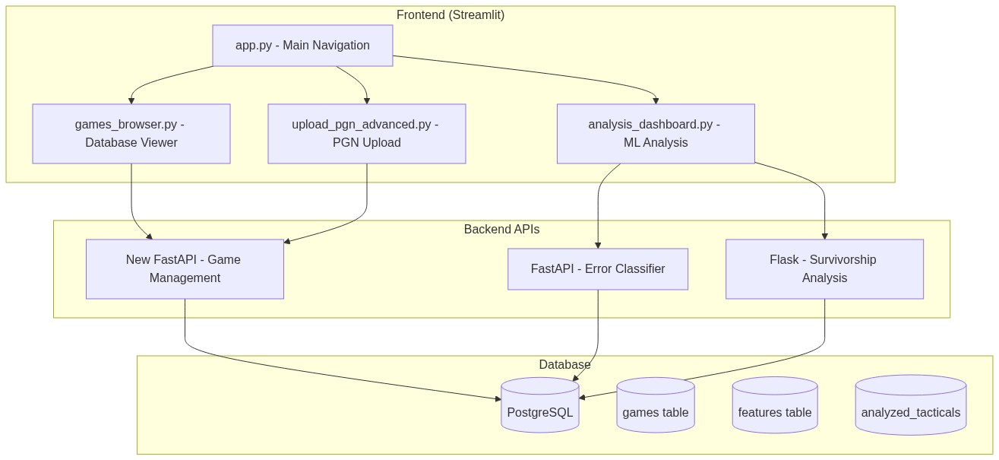

# 🚀 ROADMAP FRONTEND - CHESS TRAINER

## Análisis de Arquitectura y Plan de Desarrollo

---

## 📊 **ANÁLISIS DE ARQUITECTURA ACTUAL**

### ✅ **Lo que ya tenemos implementado:**

**Frontend (Streamlit):**
- 🎯 **Aplicación principal**: [app.py](src/app.py) con navegación por páginas
- 📤 **Upload PGN básico**: [upload_pgn.py](src/pages/upload_pgn.py) 
- 📊 **Visor de resúmenes**: [summary_viewer.py](src/pages/summary_viewer.py)
- 🤖 **Predictor de errores**: [predictor_error_label.py](src/pages/predictor_error_label.py)
- 🧠 **Entrenamiento táctico**: [tactics.py](src/pages/tactics.py)

**Backend APIs:**
- 🚀 **FastAPI**: [chess_error_classifier_api.py](src/api/chess_error_classifier_api.py) - Clasificador ML
- 🔬 **Flask API**: [survivorship_api.py](src/api/survivorship_api.py) - Análisis supervivencia

**Base de Datos:**
- 🗃️ **PostgreSQL** configurado con Docker
- 📋 **Esquemas**: games, features, analyzed_tacticals

### ❌ **Lo que falta implementar:**

## 🎯 **FUNCIONALIDADES REQUERIDAS vs ESTADO ACTUAL**

### 1. **📋 Mostrar partidas cargadas en la base de datos**
- **Estado**: ❌ **FALTA** 
- **Actual**: Solo hay visor de CSV, no consulta a BD PostgreSQL
- **Necesita**: Nueva página con conexión a BD + queries dinámicas

### 2. **📤 Cargar PGN (upload + copy/paste)**  
- **Estado**: 🟡 **PARCIAL**
- **Actual**: Solo upload básico, guarda archivo pero no procesa a BD
- **Necesita**: Procesamiento automático + copy/paste + múltiples partidas

### 3. **🔬 Ejecutar análisis error_level + supervivencia**
- **Estado**: 🟡 **PARCIAL** 
- **Actual**: APIs existen pero no integradas con frontend
- **Necesita**: Nuevas páginas que consuman las APIs

---

## 🚀 **ROADMAP FRONTEND DEVELOPMENT**

### **FASE 1: Database Integration (Prioridad Alta)**
```python
# Nuevas páginas necesarias:
src/pages/
├── games_browser.py          # 📋 Explorar partidas en BD
├── upload_pgn_advanced.py    # 📤 Upload + procesamiento completo  
└── analysis_dashboard.py     # 🔬 Dashboard análisis ML
```

### **FASE 2: Enhanced PGN Management (Prioridad Alta)**
```python
src/components/
├── pgn_parser.py            # 🔧 Parseo PGN avanzado
├── database_connector.py    # 🗃️ Conexión BD reutilizable
└── pgn_uploader.py          # 📤 Componente upload completo
```

### **FASE 3: ML Analysis Integration (Prioridad Media)**
```python
src/pages/
├── error_analysis.py        # 🎯 Análisis errores específicos
├── survivorship_analysis.py # 📊 Dashboard supervivencia
└── batch_analysis.py        # 🔄 Análisis masivo
```

### **FASE 4: Advanced Features (Prioridad Baja)**
```python
src/pages/
├── user_progress_tracker.py # 📈 Seguimiento progreso
├── comparative_analysis.py  # ⚖️ Comparar usuarios
└── export_manager.py        # 📤 Exportar resultados
```

---

## 🏗️ **ARQUITECTURA PROPUESTA**



## 💡 **MEJORAS ARQUITECTURALES SUGERIDAS**

### 1. **Unificar APIs en FastAPI**
```python
# Actual: FastAPI + Flask (mixto)
# Propuesto: Solo FastAPI para consistency
src/api/
├── main_api.py              # 🎯 API unificada FastAPI
├── routers/
│   ├── games.py             # 🎮 CRUD partidas
│   ├── analysis.py          # 📊 Análisis ML
│   └── survivorship.py      # 🔬 Supervivencia
```

### 2. **Database Manager Centralizado**
```python
src/services/
├── database_service.py      # 🗃️ Servicio BD centralizado
├── pgn_processing_service.py # 🔧 Procesamiento PGN
└── analysis_service.py      # 📊 Servicios análisis
```

### 3. **Component-Based Frontend**
```python
src/components/
├── shared/
│   ├── database_table.py    # 📋 Tabla BD reutilizable
│   ├── upload_widget.py     # 📤 Widget upload universal
│   └── analysis_chart.py    # 📊 Gráficos análisis
```

---

## 📋 **PLAN DE IMPLEMENTACIÓN DETALLADO**

### **SPRINT 1 (Alta Prioridad): Database Browser**
```python
# Objetivo: Mostrar partidas cargadas en BD
# Tiempo estimado: 3-4 días

Tareas:
✅ Crear src/components/database_connector.py
✅ Crear src/pages/games_browser.py  
✅ Integrar queries PostgreSQL
✅ Implementar filtros (usuario, fecha, rating)
✅ Añadir paginación de resultados
```

### **SPRINT 2 (Alta Prioridad): Advanced PGN Upload** 
```python
# Objetivo: Upload + copy/paste + procesamiento automático
# Tiempo estimado: 4-5 días

Tareas:
✅ Mejorar src/pages/upload_pgn.py
✅ Añadir copy/paste de PGN
✅ Procesamiento múltiples partidas
✅ Integración con import_pgns_parallel.py
✅ Feedback de progreso en tiempo real
```

### **SPRINT 3 (Media Prioridad): ML Analysis Dashboard**
```python
# Objetivo: Frontend para APIs de análisis existentes  
# Tiempo estimado: 3-4 días

Tareas:
✅ Crear src/pages/analysis_dashboard.py
✅ Integrar FastAPI error classifier
✅ Integrar Flask survivorship API
✅ Visualizaciones de resultados
✅ Export de reportes
```

---

## 🎯 **IMPLEMENTACIÓN INMEDIATA RECOMENDADA**

**Empezar por SPRINT 1** - Es lo más crítico porque el usuario necesita ver qué datos ya tiene cargados antes de hacer análisis.

### **Archivos que crear/modificar:**

1. **src/components/database_connector.py** - Conexión BD reutilizable
2. **src/pages/games_browser.py** - Browser principal de partidas  
3. **src/pages/upload_pgn_advanced.py** - Upload mejorado
4. **src/pages/analysis_dashboard.py** - Dashboard análisis ML

---

## 🎮 **FUNCIONALIDADES DETALLADAS POR COMPONENTE**

### **📋 Games Browser (games_browser.py)**
```python
Funcionalidades:
- Tabla con paginación de todas las partidas en BD
- Filtros: jugador, rating, fecha, resultado
- Vista detallada de partida individual
- Export de selecciones a PGN
- Estadísticas por jugador
- Búsqueda de texto en partidas
```

### **📤 Advanced PGN Upload (upload_pgn_advanced.py)**
```python
Funcionalidades:
- Upload de archivos .pgn múltiples
- Copy/paste de texto PGN
- Preview antes de procesar
- Procesamiento automático a BD
- Progress bar en tiempo real
- Validación de formato PGN
- Manejo de errores detallado
```

### **🔬 Analysis Dashboard (analysis_dashboard.py)**
```python
Funcionalidades:
- Selector de usuario para análisis
- Botón "Analizar Error Level" → FastAPI
- Botón "Analizar Supervivencia" → Flask API
- Visualización de resultados ML
- Gráficos interactivos con Plotly
- Export de reportes PDF/CSV
- Historial de análisis
```

---

## 🛠️ **CONSIDERACIONES TÉCNICAS**

### **Database Connector**
```python
# src/components/database_connector.py
class DatabaseConnector:
    def __init__(self):
        self.db_manager = DatabaseManager()
    
    def get_games_paginated(self, page=1, per_page=50, filters=None):
        # Implementar paginación eficiente
        pass
    
    def search_games(self, query):
        # Búsqueda de texto en partidas
        pass
```

### **API Integration**
```python
# Integración con APIs existentes
import requests
import streamlit as st

def call_error_classifier_api(game_data):
    response = requests.post(
        "http://localhost:8000/predict",
        json=game_data
    )
    return response.json()

def call_survivorship_api(filters=None):
    response = requests.get(
        "http://localhost:5000/analysis/survivorship",
        params=filters or {}
    )
    return response.json()
```

### **Progress Tracking**
```python
# Para uploads con progress bar
def process_pgn_with_progress(pgn_content):
    games = parse_pgn_games(pgn_content)
    progress_bar = st.progress(0)
    
    for i, game in enumerate(games):
        # Procesar game
        progress = (i + 1) / len(games)
        progress_bar.progress(progress)
        time.sleep(0.1)  # Simular procesamiento
```

---

## 📈 **MÉTRICAS DE ÉXITO**

### **SPRINT 1 - Database Browser**
- ✅ Mostrar >1000 partidas con paginación fluida
- ✅ Filtros funcionales (jugador, rating, fecha)
- ✅ Tiempo de respuesta <2 segundos
- ✅ Export PGN de selecciones funciona

### **SPRINT 2 - Advanced Upload**
- ✅ Upload archivos >10MB sin fallos
- ✅ Copy/paste PGN de >100 partidas
- ✅ Procesamiento automático a BD
- ✅ Progress feedback en tiempo real

### **SPRINT 3 - Analysis Dashboard**
- ✅ Integración completa con ambas APIs
- ✅ Visualizaciones interactivas
- ✅ Export de reportes funcional
- ✅ Historial de análisis persistente

---

## 🚨 **RIESGOS Y MITIGACIONES**

### **Riesgo 1: Rendimiento BD con muchas partidas**
- **Mitigación**: Implementar paginación + indexing en PostgreSQL
- **Fallback**: Cache de consultas frecuentes

### **Riesgo 2: APIs lentas para análisis masivo**
- **Mitigación**: Implementar análisis asíncrono + progress tracking
- **Fallback**: Batch processing en background

### **Riesgo 3: Upload de archivos muy grandes**
- **Mitigación**: Límite de tamaño + procesamiento en chunks
- **Fallback**: Procesamiento offline + notificaciones

---

## 🎯 **SIGUIENTE PASO INMEDIATO**

**RECOMENDACIÓN**: Empezar con la implementación del **Database Browser** (games_browser.py)

**Razones**:
1. **Es fundamental** - El usuario necesita ver qué datos tiene
2. **Es independiente** - No depende de otras funcionalidades nuevas
3. **Es visible** - Impacto inmediato en la experiencia de usuario
4. **Es base** - Otros componentes lo utilizarán

**Comando para empezar**:
```bash
# Crear el componente base
touch src/components/database_connector.py
touch src/pages/games_browser.py

# Modificar navegación principal
# Editar src/app.py para añadir enlace a games_browser
```

---

## 📞 **CONTACTO Y SOPORTE**

- **📖 Documentación**: `docs/` directory
- **🔧 Issues técnicos**: GitHub Issues
- **💬 Desarrollo**: Discord #frontend-development
- **📧 Arquitectura**: chess.trainer.architecture@gmail.com

---

**✅ Roadmap Frontend Chess Trainer completado y listo para implementación**

> **Nota**: Este roadmap está diseñado para ser implementado de forma incremental, priorizando las funcionalidades más críticas para el usuario final.

---

_Documento creado: 2026-01-15_  
_Próxima revisión: Al completar SPRINT 1_