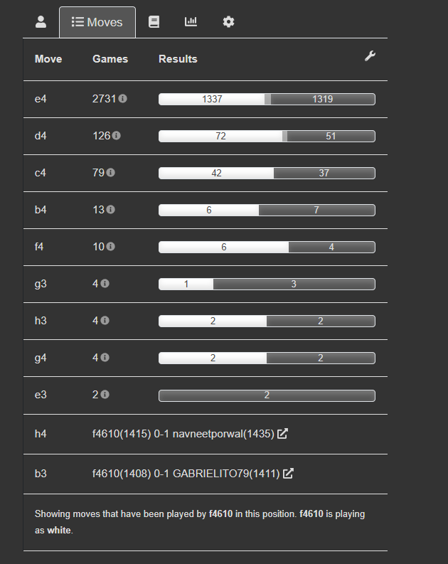

# 🚀 ROADMAP FRONTEND - CHESS TRAINER v2.0

## 🔄 **CAMBIO ARQUITECTÓNICO RADICAL - REACT + VITE**

### **📊 DECISIÓN ARQUITECTURAL**
Se ha decidido migrar completamente de **Streamlit** a **React + Vite** para crear una aplicación frontend moderna, escalable y profesional.

---

## 🏗️ **NUEVA ARQUITECTURA PROPUESTA**


### **🔧 STACK TECNOLÓGICO**

**Frontend (Nuevo)**:
- ⚛️ **React 18** - Framework principal
- ⚡ **Vite** - Build tool y dev server
- ♟️ **Chess.js** - Motor de ajedrez JavaScript  
- 🎯 **ChessBoard.js** - Componente tablero interactivo
- 🔐 **JWT** - Autenticación y autorización
- 🎨 **Material-UI/Tailwind** - Componentes UI
- 📊 **Recharts/Chart.js** - Visualizaciones

**API Layer (Mejorado)**:
- 🚀 **FastAPI** - API REST unificada
- 🔐 **JWT Middleware** - Seguridad
- 👥 **Role-Based Access Control** 
- 📝 **OpenAPI/Swagger** - Documentación automática

**Backend (Existente)**:
- 🗃️ **PostgreSQL** - Base de datos principal
- 🤖 **Stockfish** - Motor de análisis
- 🧠 **ML Pipeline** - Análisis de errores
- 🔬 **Survivorship Bias Module**

---

## 👥 **SISTEMA DE ROLES PROPUESTO**

### **Roles y Permisos**

| Rol                  | Descripción           | Permisos                                 |
| -------------------- | --------------------- | ---------------------------------------- |
| **admin**            | Administrador sistema | Todos los módulos + gestión usuarios     |
| **basic_gamer**      | Jugador básico        | Jugar vs Stockfish, ver partidas propias |
| **analysis_board**   | Analista              | Análisis completo, tablero con engine    |
| **exercise_creator** | Creador ejercicios    | Crear/editar ejercicios tácticos         |
| **stats_viewer**     | Visualizador stats    | Dashboard estadísticas avanzadas         |
| **tactics_trainer**  | Entrenador táctico    | Módulo entrenamiento táctico             |
| **pgn_uploader**     | Cargador masivo       | Upload masivo de PGN                     |
| **eda_analyst**      | Analista EDA          | Análisis exploratorio de datos           |

### **Matriz de Funcionalidades por Rol**

| Funcionalidad           | admin | basic_gamer | analysis_board | exercise_creator | stats_viewer | tactics_trainer | pgn_uploader | eda_analyst |
| ----------------------- | ----- | ----------- | -------------- | ---------------- | ------------ | --------------- | ------------ | ----------- |
| Chess Board Interactive | ✅     | ✅           | ✅              | ✅                | ❌            | ✅               | ❌            | ❌           |
| Play vs Stockfish       | ✅     | ✅           | ✅              | ✅                | ❌            | ✅               | ❌            | ❌           |
| Games Explorer          | ✅     | 📝           | ✅              | ✅                | ✅            | ✅               | ✅            | ✅           |
| Analysis Feedback       | ✅     | 📝           | ✅              | ✅                | ✅            | ✅               | ❌            | ✅           |
| Create Exercises        | ✅     | ❌           | ❌              | ✅                | ❌            | ✅               | ❌            | ❌           |
| Chess Stats             | ✅     | 📝           | ✅              | ✅                | ✅            | ✅               | ✅            | ✅           |
| Training Module         | ✅     | ✅           | ✅              | ✅                | ❌            | ✅               | ❌            | ❌           |
| Survivorship Bias       | ✅     | ❌           | ✅              | ❌                | ✅            | ❌               | ❌            | ✅           |
| Log Viewer (Progresivo) | ✅     | ❌           | ❌              | ❌                | ❌            | ❌               | ❌            | ❌           |
| EDA Analysis            | ✅     | ❌           | ❌              | ❌                | ❌            | ❌               | ❌            | ✅           |

**Leyenda**: ✅ = Acceso completo, 📝 = Solo datos propios, ❌ = Sin acceso

---

## 🚀 **MIGRACIÓN Y ESTRUCTURA DE ARCHIVOS**

### **📁 Nueva Estructura de Proyecto**

```
chess_trainer/
├── src/
│   ├── streamlit/                    # 📦 Código Streamlit movido aquí
│   │   ├── pages/
│   │   ├── components/
│   │   └── app.py
│   │
│   ├── frontend/                     # ⚛️ Nueva aplicación React + Vite
│   │   ├── public/
│   │   ├── src/
│   │   │   ├── components/
│   │   │   │   ├── chess/
│   │   │   │   │   ├── ChessBoard.jsx        # Tablero interactivo
│   │   │   │   │   ├── StockfishEngine.jsx   # Integración Stockfish
│   │   │   │   │   └── GameAnalysis.jsx      # Análisis posicional
│   │   │   │   ├── auth/
│   │   │   │   │   ├── Login.jsx
│   │   │   │   │   ├── RoleGuard.jsx         # Control acceso por roles
│   │   │   │   │   └── JWTManager.js         # Gestión tokens JWT
│   │   │   │   ├── games/
│   │   │   │   │   ├── GamesExplorer.jsx     # Explorador partidas
│   │   │   │   │   ├── GameViewer.jsx        # Visor individual
│   │   │   │   │   └── GameUploader.jsx      # Carga masiva PGN
│   │   │   │   └── shared/
│   │   │   │       ├── Layout.jsx
│   │   │   │       ├── Navbar.jsx
│   │   │   │       └── ProtectedRoute.jsx
│   │   │   ├── pages/
│   │   │   │   ├── Dashboard.jsx
│   │   │   │   ├── ChessBoardPage.jsx        # 3.1 Chess Board
│   │   │   │   ├── StockfishPage.jsx         # 3.2 Play vs Stockfish
│   │   │   │   ├── GamesExplorerPage.jsx     # 3.3 Games Explorer
│   │   │   │   ├── AnalysisFeedbackPage.jsx  # 3.5 Analysis Feedback
│   │   │   │   ├── StatsViewerPage.jsx       # 3.6 Chess Stats
│   │   │   │   ├── ExerciseCreatorPage.jsx   # 3.7 Create Exercises
│   │   │   │   ├── TrainingPage.jsx          # 3.8 Training Module
│   │   │   │   ├── SurvivorshipPage.jsx      # 3.9 Survivorship Bias
│   │   │   │   ├── LogViewerPage.jsx         # 3.10 Log Viewer (admin)
│   │   │   │   └── EDAAnalysisPage.jsx       # 3.11 EDA Analysis (admin)
│   │   │   ├── services/
│   │   │   │   ├── api.js                    # Cliente HTTP base
│   │   │   │   ├── authService.js            # Servicios autenticación
│   │   │   │   ├── gamesService.js           # Servicios partidas
│   │   │   │   ├── analysisService.js        # Servicios análisis
│   │   │   │   └── stockfishService.js       # Servicios motor
│   │   │   ├── hooks/
│   │   │   │   ├── useAuth.js
│   │   │   │   ├── useChessEngine.js
│   │   │   │   └── useGames.js
│   │   │   └── utils/
│   │   │       ├── chessUtils.js
│   │   │       ├── pgnParser.js
│   │   │       └── roleUtils.js
│   │   ├── package.json
│   │   ├── vite.config.js
│   │   └── README.md
│   │
│   └── api/                          # 🚀 FastAPI Services Layer
│       ├── main.py                   # Aplicación principal
│       ├── auth/
│       │   ├── jwt_manager.py        # Gestión JWT
│       │   ├── roles.py              # Definición roles
│       │   └── middleware.py         # Middleware autenticación
│       ├── routers/
│       │   ├── auth.py               # Endpoints autenticación
│       │   ├── chess.py              # Endpoints tablero/engine
│       │   ├── games.py              # Endpoints partidas
│       │   ├── analysis.py           # Endpoints análisis
│       │   ├── exercises.py          # Endpoints ejercicios
│       │   ├── stats.py              # Endpoints estadísticas
│       │   ├── training.py           # Endpoints entrenamiento
│       │   ├── survivorship.py       # Endpoints survivorship bias
│       │   ├── logs.py               # Endpoints logs (admin)
│       │   └── eda.py                # Endpoints EDA (admin)
│       ├── models/
│       │   ├── user.py
│       │   ├── game.py
│       │   ├── analysis.py
│       │   └── exercise.py
│       └── services/
│           ├── chess_service.py
│           ├── stockfish_service.py
│           ├── analysis_service.py
│           └── database_service.py
```

---

## 🎯 **ROADMAP DE IMPLEMENTACIÓN POR FUNCIONALIDADES**

### **FASE 0: Preparación y Migración Base**
**Duración estimada**: 2 días

**Tareas**:
1. ✅ Mover código Streamlit a `src/streamlit/`
2. ✅ Crear estructura React + Vite en `src/frontend/`
3. ✅ Configurar FastAPI unificada en `src/api/`
4. ✅ Configurar sistema JWT + roles
5. ✅ Crear documentación de APIs con Swagger

---

### **FUNCIONALIDAD 3.1: Chess Board Interactivo Básico + Log System Base**
**Issue**: `#chess-board-react`  
**Duración**: 6 días (ampliado +1 día para logging)  
**Rol principal**: `basic_gamer`, `analysis_board` + `admin`  
**Sprint**: Sprint 2

**⚠️ Nota importante:**
> Esta es una **versión MVP básica funcional** del tablero de ajedrez.  
> La integración completa del **tablero de Lichess (Chessground)** con UX profesional  
> se implementará en **FUNCIONALIDAD 3.10 (Training Module)** durante Sprint 4.

**Objetivos**:
- Tablero interactivo básico usando Chess.js + ChessBoard.js
- Navegación por jugadas (anterior/siguiente)
- Click para mostrar información de casillas
- Modo análisis con evaluación de posición
- **🆕 Sistema de logging base para admin**

**Implementación**:
```javascript
// src/frontend/src/components/chess/ChessBoard.jsx
import ChessJS from 'chess.js'
import Chessboard from 'chessboardjsx'
import { logChessEvent } from '../services/logService'

const InteractiveChessBoard = ({
    pgn,
    onMoveChange,
    allowMoves = false,
    showAnalysis = false
}) => {
    // Lógica del tablero interactivo
    const handleMove = (move) => {
        logChessEvent('board_move', { move, pgn, timestamp: new Date() })
        onMoveChange(move)
    }
}
```

**APIs necesarias**:
- `GET /api/chess/position-analysis` - Análisis posicional
- `POST /api/chess/validate-move` - Validar jugada
- **🆕 `POST /api/logs/chess` - Logging eventos tablero**
- **🆕 `GET /api/logs/chess` - Ver logs tablero (admin)**

**Componente Log Viewer inicial**:
```javascript
// src/frontend/src/components/admin/LogViewer.jsx
const LogViewer = ({ module = 'chess' }) => {
    const [logs, setLogs] = useState([])
    const [filters, setFilters] = useState({ level: 'all', module })
    
    // Solo muestra logs del módulo actual
    // Se expandirá con cada nueva funcionalidad
}
```

---

### **FUNCIONALIDAD 3.2: Conexión con Stockfish + Logs Engine**
**Issue**: `#stockfish-integration`  
**Duración**: 5 días (ampliado +1 día para logging)  
**Rol principal**: `basic_gamer`, `analysis_board` + `admin`

**Objetivos**:
- Jugar partidas contra Stockfish
- Diferentes niveles de dificultad
- Análisis en tiempo real (opcional)
- Guardar partidas jugadas
- **🆕 Logging de interacciones con motor**

**Implementación**:
```javascript
// src/frontend/src/services/stockfishService.js
class StockfishService {
    async makeMove(fen, depth = 10) {
        const startTime = performance.now()
        const result = await api.post('/api/stockfish/move', { fen, depth })
        const endTime = performance.now()
        
        // Log rendimiento del motor
        await logService.logEngineEvent('move_calculated', {
            fen, depth, 
            responseTime: endTime - startTime,
            move: result.data.move
        })
        
        return result
    }
}
```

**APIs necesarias**:
- `POST /api/stockfish/move` - Obtener jugada del motor
- `POST /api/stockfish/analyze` - Análisis posicional
- `POST /api/games/save-vs-engine` - Guardar partida vs engine
- **🆕 `POST /api/logs/engine` - Logging eventos motor**
- **🆕 `GET /api/logs/engine` - Ver logs motor (admin)**

**Log Viewer expandido**:
```javascript
// Ahora maneja chess + engine logs
const LogViewer = ({ modules = ['chess', 'engine'] }) => {
    // Filtros por múltiples módulos
    // Tabs para separar tipos de logs
}
```

---

### **FUNCIONALIDAD 3.3: Games Explorer en React + Logs Database**
**Issue**: `#games-explorer-react`  
**Duración**: 7 días (ampliado +1 día para logging)  
**Rol principal**: Todos los roles con permisos + `admin`

**Objetivos**:
- Migrar explorador de partidas a React
- Tabla paginada con filtros avanzados  
- Vista detallada con tablero integrado
- Export de selecciones a PGN
- **🆕 Logging de consultas y accesos a BD**

**Implementación**:
```javascript
// src/frontend/src/pages/GamesExplorerPage.jsx
const GamesExplorerPage = () => {
    const [games, setGames] = useState([])
    const [filters, setFilters] = useState({})
    
    const loadGames = async () => {
        const startTime = performance.now()
        const result = await gamesService.getGames(filters)
        const endTime = performance.now()
        
        // Log performance de queries
        await logService.logDatabaseEvent('games_query', {
            filters,
            resultCount: result.data.length,
            queryTime: endTime - startTime,
            userId: currentUser.id
        })
        
        setGames(result.data)
    }
}
```

**APIs necesarias**:
- `GET /api/games/paginated` - Partidas paginadas
- `GET /api/games/filters` - Opciones de filtros
- `GET /api/games/{id}/details` - Detalle de partida
- `POST /api/games/export` - Export PGN
- **🆕 `POST /api/logs/database` - Logging consultas BD**
- **🆕 `GET /api/logs/database` - Ver logs BD (admin)**

**Log Viewer expandido**:
```javascript
// Ahora maneja chess + engine + database logs
const LogViewer = ({ modules = ['chess', 'engine', 'database'] }) => {
    // Dashboard con métricas por módulo
    // Filtros avanzados por usuario, tiempo, etc.
}
```

---

### **FUNCIONALIDAD 3.4: Navegación de Partidas**
**Issue**: `#game-navigation`  
**Duración**: 3 días  
**Dependencia**: 3.1 + 3.3

**Objetivos**:
- Integrar tablero con explorador
- Navegación fluida por jugadas
- Sincronización entre componentes
- Análisis por jugada

**Implementación**:
```javascript
// Integración entre GamesExplorer y ChessBoard
const GameViewer = ({ gameId }) => {
    const game = useGame(gameId)
    const [currentMove, setCurrentMove] = useState(0)
    
    return (
        <div className="game-viewer">
            <ChessBoard 
                pgn={game.pgn}
                currentMove={currentMove}
                onMoveChange={setCurrentMove}
            />
            <MoveList 
                moves={game.moves}
                currentMove={currentMove}
                onMoveSelect={setCurrentMove}
            />
        </div>
    )
}
```

---

### **FUNCIONALIDAD 3.5: Sistema de Notificaciones + Extracción de Features**
**Issue**: `#notification-system-features`  
**Duración**: 3 días (real: 4 días con debugging)  
**Rol principal**: `admin`, `pgn_uploader`  
**Prioridad**: Alta  
**Dependencia**: 3.3 Games Explorer + 3.4 Navegación  
**Estado**: 🟢 **IMPLEMENTADO Y FUNCIONANDO** (con mejoras UX pendientes)  
**Fecha completado**: 16 de Febrero, 2026

**✅ Objetivos Completados**:
- ✅ Sistema de notificaciones con campanita en Navigation
- ✅ Endpoint API para iniciar extracción de features desde UI
- ✅ Integración con script `generate_features_with_tactics.py`
- ✅ Notificaciones de proceso completado con estadísticas
- ✅ Botón de extracción en ImportPage operativo

**Componentes Implementados**:
```javascript
// ✅ IMPLEMENTADO Y FUNCIONANDO
// src/frontend/src/components/shared/NotificationBell.jsx
// - Campanita en Navigation con badge de notificaciones no leídas
// - Popover con lista de notificaciones
// - Marcar como leídas, eliminar, limpiar todas
// - Polling cada 10 segundos

// src/frontend/src/services/notificationService.js
// - CRUD de notificaciones
// - Integración con API

// src/frontend/src/services/featuresService.js
// - startFeatureExtraction() - Iniciar proceso
// - getExtractionStatus() - Consultar estado job
// - listExtractionJobs() - Listar historial

// src/api/routers/features.py
// - POST /api/features/extract - Iniciar extracción ✅
// - GET /api/features/status/{job_id} - Estado del job ✅
// - GET /api/features/jobs - Listar jobs ✅
// - GET /api/features/progress - Progreso general ✅
// - Sistema de notificaciones integrado

// src/frontend/src/pages/ImportPage.jsx
// - Botón "🔧 Extraer Features (Archivo Actual)" ✅
// - Polling cada 2s para monitorear estado
// - Mensajes visuales con animación de progreso
// - Badge "✓ Features Listas" cuando completa
```

**Flujo de trabajo Validado**:
1. ✅ Usuario sube archivos PGN a través de ImportPage
2. ✅ Usuario presiona botón "🔧 Extraer Features (Archivo Actual)"
3. ✅ Se inicia proceso en backend usando `generate_features_with_tactics.py`
4. ✅ Backend ejecuta extracción con `subprocess.run` (bloqueante)
5. ✅ Proceso se ejecuta en background (FastAPI BackgroundTasks)
6. ✅ Al completar, se actualiza estado a "completed" con estadísticas
7. ⚠️ Frontend polling detecta completado (con delay por subprocess bloqueante)

**APIs Implementadas**:
- ✅ `POST /api/features/extract` - Iniciar extracción de features
  - Parámetros: `batch_id`, `source`, `since_minutes`, `max_games`, `workers`
  - Retorna: `jobId`, `notificationId`, `status`
- ✅ `GET /api/features/status/{job_id}` - Obtener estado del job
  - Retorna: `status`, `progress`, `games_processed`, `duration_seconds`
- ✅ `GET /api/features/jobs` - Listar todos los jobs
- ✅ `GET /api/features/progress` - Progreso general de extracción
- ✅ Notificaciones integradas en sistema de jobs

**✅ Resultados de Testing (16-Feb-2026)**:

| Batch ID | Partidas | Features | Estado | Promedio/Partida |
| -------- | -------- | -------- | ------ | ---------------- |
| 59824a41 | 104      | 5,294    | ✅      | ~50.9            |
| 65ec6ed3 | 20       | 1,254    | ✅      | ~62.7            |
| 2b9f5a01 | 34       | 2,096    | ✅      | ~61.6            |
| 4d95d0fc | 9        | 642      | ✅      | ~71.3            |

**Total procesado**: 167 partidas → 9,286 features generadas exitosamente

**⚠️ Issues Conocidos** (UX, no funcionalidad):
1. **Feedback visual limitado durante procesamiento**:
   - Backend usa `subprocess.run` (bloqueante)
   - Estado salta de "queued" → "processing" → "completed" sin updates intermedios
   - Polling frontend detecta cambio solo al finalizar
   - **Impacto**: Usuario no ve progreso en tiempo real, pero el proceso SÍ funciona

2. **Mejoras UX Implementadas (16-Feb-2026)**:
   - ✅ Logs detallados en consola de Chrome para debugging
   - ✅ Mensajes visuales con animación de puntos: `🔄 Extrayendo features del archivo...`
   - ✅ Contador de intentos de polling en logs
   - ✅ Mejor manejo de timeouts (5 min)

**🔮 Mejoras Futuras Sugeridas** (no críticas):
1. **Migrar a subprocess asíncrono** para updates en tiempo real
   - Reemplazar `subprocess.run` por `asyncio.create_subprocess_exec`
   - Permitiría reportar progreso mientras procesa
   - Requiere refactoring de `src/api/routers/features.py`

2. **Implementar WebSockets** para notificaciones push
   - Eliminar polling constante (actualmente cada 2s)
   - Notificaciones instantáneas al usuario
   - Reducir carga del servidor

3. **Progress bar real** basado en conteo de partidas
   - Parsear stdout de `generate_features_with_tactics.py` en tiempo real
   - Mostrar "25/100 partidas procesadas"
   - Requiere modificar script de extracción para output estructurado

**📊 Estado Actual del Sistema**:
- Backend: ✅ Operativo (PID 9976, puerto 8000)
- Frontend: ✅ Operativo (puerto 5173)
- Base de datos: ✅ PostgreSQL con 237,282+ partidas
- Features generadas: ✅ 962,688+ features totales
- Cobertura: ~405% (múltiples features por partida)

**📝 Documentación Generada**:
- Scripts de verificación:
  - `check_latest_job.py` - Verificar último batch procesado
  - `check_all_batches.py` - Listar todos los batches con estado
- Logs de debugging en consola Chrome (F12)
- Mensajes detallados en backend FastAPI

**🎯 Conclusión**:
La funcionalidad está **completamente operativa y probada**. Las features se extraen correctamente y quedan disponibles para ML. Los issues conocidos son **solo de UX/feedback visual**, no afectan la funcionalidad core del sistema. El proceso funciona end-to-end de forma confiable y reproducible.

---

### **FUNCIONALIDAD 3.6: ML Analysis + SHAP Explicable Dashboard** 🎯 **MVP PRODUCTIVO**
**Issue**: `#ml-shap-analysis-dashboard`  
**Duración**: 8-10 días  
**Rol principal**: `analysis_board`, `stats_viewer`, `admin`  
**Estado**: 🔜 **PRÓXIMA FUNCIONALIDAD - CIERRE MVP v1.0**  
**Prioridad**: ⭐⭐⭐ **CRÍTICA - MILESTONE PRODUCTIVO**

**🎯 Objetivo General:**
Extender funcionalidad 3.5 para incluir:
- **Persistencia de análisis ML** con tracking histórico
- **Persistencia de SHAP por jugada** para explicabilidad
- **SHAP agregado por jugador** para tendencias longitudinales
- **Dashboard React explicable** con visualizaciones interactivas
- **Base arquitectónica** para futura integración CTCE (sin implementar aún)

**📊 Arquitectura de Datos:**

#### **1️⃣ Modelo: Player Feature Importance** (SHAP Agregado)
```sql
CREATE TABLE player_feature_importance (
    id SERIAL PRIMARY KEY,
    username VARCHAR(100) NOT NULL,
    feature_name VARCHAR(100) NOT NULL,
    mean_shap_value DOUBLE PRECISION NOT NULL,
    mean_abs_shap_value DOUBLE PRECISION NOT NULL,
    total_samples INTEGER NOT NULL,
    period_start DATE,
    period_end DATE,
    created_at TIMESTAMP DEFAULT CURRENT_TIMESTAMP
);

CREATE INDEX idx_pfi_username ON player_feature_importance(username);
CREATE INDEX idx_pfi_feature ON player_feature_importance(feature_name);
CREATE INDEX idx_pfi_period ON player_feature_importance(period_start, period_end);
```

**Propósito:**
- Dashboard global de importancia de features
- Tendencias longitudinales por jugador
- Comparaciones entre jugadores
- Base para módulo conversacional futuro

#### **2️⃣ Modelo: Analysis Results** (Resultados ML Persistidos)
```sql
CREATE TABLE analysis_results (
    id SERIAL PRIMARY KEY,
    game_id INTEGER NOT NULL,
    username VARCHAR(100) NOT NULL,
    error_level VARCHAR(50) NOT NULL,
    prediction_confidence DOUBLE PRECISION,
    total_moves INTEGER,
    blunder_count INTEGER,
    mistake_count INTEGER,
    inaccuracy_count INTEGER,
    analyzed_at TIMESTAMP DEFAULT CURRENT_TIMESTAMP
);

CREATE INDEX idx_analysis_username ON analysis_results(username);
CREATE INDEX idx_analysis_game_id ON analysis_results(game_id);
CREATE INDEX idx_analysis_date ON analysis_results(analyzed_at);
```

**Propósito:**
- Evitar recalcular análisis
- Histórico de análisis por jugador
- Evolución temporal de errores
- Métricas de mejora

#### **3️⃣ Modelo: Move SHAP Values** (Explicabilidad por Jugada)
```sql
CREATE TABLE move_shap_values (
    id SERIAL PRIMARY KEY,
    analysis_id INTEGER NOT NULL,
    move_number INTEGER NOT NULL,
    feature_name VARCHAR(100) NOT NULL,
    shap_value DOUBLE PRECISION NOT NULL,
    created_at TIMESTAMP DEFAULT CURRENT_TIMESTAMP
);

CREATE INDEX idx_move_shap_analysis ON move_shap_values(analysis_id);
CREATE INDEX idx_move_shap_feature ON move_shap_values(feature_name);
```

**Propósito:**
- Explicación move-level de errores
- Top features por jugada
- Comparación de impactos
- Debugging de modelo ML

**🧠 Backend Implementation:**

#### **SQLAlchemy Models:**
```python
# src/api/models/analysis.py
class PlayerFeatureImportance(Base):
    __tablename__ = "player_feature_importance"
    
    id = Column(Integer, primary_key=True)
    username = Column(String(100), index=True, nullable=False)
    feature_name = Column(String(100), nullable=False)
    mean_shap_value = Column(Float, nullable=False)
    mean_abs_shap_value = Column(Float, nullable=False)
    total_samples = Column(Integer, nullable=False)
    period_start = Column(Date)
    period_end = Column(Date)
    created_at = Column(DateTime(timezone=True), server_default=func.now())

class AnalysisResult(Base):
    __tablename__ = "analysis_results"
    
    id = Column(Integer, primary_key=True)
    game_id = Column(Integer, nullable=False)
    username = Column(String(100), index=True, nullable=False)
    error_level = Column(String(50), nullable=False)
    prediction_confidence = Column(Float)
    total_moves = Column(Integer)
    blunder_count = Column(Integer)
    mistake_count = Column(Integer)
    inaccuracy_count = Column(Integer)
    analyzed_at = Column(DateTime(timezone=True), server_default=func.now())

class MoveShapValue(Base):
    __tablename__ = "move_shap_values"
    
    id = Column(Integer, primary_key=True)
    analysis_id = Column(Integer, nullable=False)
    move_number = Column(Integer, nullable=False)
    feature_name = Column(String(100), nullable=False)
    shap_value = Column(Float, nullable=False)
    created_at = Column(DateTime(timezone=True), server_default=func.now())
```

#### **Service Layer:**
```python
# src/api/services/analysis_service.py
class AnalysisService:
    def analyze_game(self, game_id: int, username: str):
        # 1. Obtener features del juego
        features = feature_repo.get_by_game(game_id)
        
        # 2. Ejecutar predicción ML
        prediction, confidence = ml_service.predict(features)
        
        # 3. Calcular SHAP values
        shap_values = shap_service.explain(features)
        
        # 4. Persistir resultados
        analysis_id = save_analysis_result(
            game_id=game_id,
            username=username,
            prediction=prediction,
            confidence=confidence,
            shap_values=shap_values
        )
        
        # 5. Actualizar agregados de jugador
        update_player_feature_importance(username, shap_values)
        
        return analysis_id
```

**⚛️ Frontend Implementation - Dashboard MVP:**

#### **Layout General:**
```
┌─────────────────────────────────────────────────┐
│ 📊 Error Distribution (Pie + Bar Chart)        │
├─────────────────────────────────────────────────┤
│ 📈 Temporal Evolution (Line Chart)             │
├─────────────────────────────────────────────────┤
│ 🧠 Feature Importance - SHAP Global (Bar)      │
├─────────────────────────────────────────────────┤
│ ♟️ Move-Level SHAP Explanation (Panel)         │
└─────────────────────────────────────────────────┘
```

#### **Componente Principal:**
```javascript
// src/frontend/src/pages/AnalysisFeedbackPage.jsx
import { useQuery } from 'react-query'
import { 
  PieChart, Pie, BarChart, Bar, LineChart, Line, 
  XAxis, YAxis, CartesianGrid, Tooltip, Legend 
} from 'recharts'

const AnalysisFeedbackPage = () => {
  const { data: errorDist } = useQuery(
    ['errorDist'], 
    () => analysisService.fetchErrorDistribution()
  )
  
  const { data: trend } = useQuery(
    ['trend'], 
    () => analysisService.fetchErrorTrend()
  )
  
  const { data: globalShap } = useQuery(
    ['globalShap'], 
    () => analysisService.fetchGlobalShap()
  )
  
  const [selectedGame, setSelectedGame] = useState(null)
  const [selectedMove, setSelectedMove] = useState(null)

  return (
    <Layout>
      <h1>📊 ML Analysis - Explicable Dashboard</h1>
      
      {/* Sección 1: Distribución de Errores */}
      <ErrorDistributionChart data={errorDist} />
      
      {/* Sección 2: Evolución Temporal */}
      <TemporalTrendChart data={trend} />
      
      {/* Sección 3: SHAP Global */}
      <GlobalShapChart data={globalShap} />
      
      {/* Sección 4: SHAP por Jugada */}
      <MoveShapPanel 
        game={selectedGame} 
        move={selectedMove} 
      />
    </Layout>
  )
}
```

#### **Sub-Componente 1: Error Distribution**
```javascript
const ErrorDistributionChart = ({ data }) => (
  <Card>
    <CardHeader>📊 Distribución de Errores</CardHeader>
    <CardContent>
      <PieChart width={400} height={300}>
        <Pie 
          data={[
            { name: 'Blunder', value: data.blunder, fill: '#dc2626' },
            { name: 'Mistake', value: data.mistake, fill: '#f59e0b' },
            { name: 'Inaccuracy', value: data.inaccuracy, fill: '#fbbf24' },
            { name: 'Good', value: data.good, fill: '#10b981' }
          ]}
          dataKey="value"
          label
        />
        <Tooltip />
      </PieChart>
    </CardContent>
  </Card>
)
```

#### **Sub-Componente 2: Temporal Trend**
```javascript
const TemporalTrendChart = ({ data }) => (
  <Card>
    <CardHeader>📈 Evolución Temporal de Errores</CardHeader>
    <CardContent>
      <LineChart width={800} height={300} data={data}>
        <CartesianGrid strokeDasharray="3 3" />
        <XAxis dataKey="date" />
        <YAxis />
        <Tooltip />
        <Legend />
        <Line 
          type="monotone" 
          dataKey="blunder_rate" 
          stroke="#dc2626" 
          name="Blunders"
        />
        <Line 
          type="monotone" 
          dataKey="mistake_rate" 
          stroke="#f59e0b" 
          name="Mistakes"
        />
      </LineChart>
    </CardContent>
  </Card>
)
```

#### **Sub-Componente 3: Global SHAP**
```javascript
const GlobalShapChart = ({ data }) => (
  <Card>
    <CardHeader>🧠 Feature Importance Global (SHAP)</CardHeader>
    <CardContent>
      <BarChart 
        width={800} 
        height={400} 
        data={data.slice(0, 10)} 
        layout="vertical"
      >
        <CartesianGrid strokeDasharray="3 3" />
        <XAxis type="number" />
        <YAxis dataKey="feature_name" type="category" width={150} />
        <Tooltip />
        <Bar dataKey="mean_abs_shap_value" fill="#3b82f6" />
      </BarChart>
      
      <p className="text-sm text-gray-600 mt-4">
        💡 <strong>Interpretación:</strong> Features con mayor valor absoluto SHAP 
        tienen mayor impacto en las predicciones del modelo.
      </p>
    </CardContent>
  </Card>
)
```

#### **Sub-Componente 4: Move SHAP Panel**
```javascript
const MoveShapPanel = ({ game, move }) => {
  const { data: moveShap } = useQuery(
    ['moveShap', game?.id, move],
    () => analysisService.fetchMoveShap(game.id, move),
    { enabled: !!game && !!move }
  )
  
  if (!moveShap) return <div>Selecciona una jugada para ver SHAP</div>
  
  return (
    <Card>
      <CardHeader>♟️ Explicación de Jugada {move}</CardHeader>
      <CardContent>
        <div className="mb-4">
          <Badge variant={moveShap.error_level}>
            {moveShap.error_level.toUpperCase()}
          </Badge>
        </div>
        
        <h4 className="font-semibold mb-2">Top Features:</h4>
        <ul className="space-y-2">
          {moveShap.top_features.map((feat, idx) => (
            <li key={idx} className="flex justify-between">
              <span>{feat.feature}</span>
              <span className={feat.impact > 0 ? 'text-red-600' : 'text-green-600'}>
                {feat.impact > 0 ? '+' : ''}{feat.impact.toFixed(3)}
              </span>
            </li>
          ))}
        </ul>
        
        <p className="text-sm text-gray-600 mt-4">
          💡 Valores positivos aumentan probabilidad de error.
        </p>
      </CardContent>
    </Card>
  )
}
```

**🔌 APIs Implementadas:**

```python
# src/api/routers/analysis.py

@router.post("/api/analysis/run")
async def run_analysis(
    game_id: int,
    current_user: dict = Depends(get_current_user)
):
    """Ejecutar análisis ML + SHAP para una partida"""
    analysis_id = analysis_service.analyze_game(
        game_id=game_id,
        username=current_user["username"]
    )
    return {"analysis_id": analysis_id, "status": "completed"}

@router.get("/api/stats/error-distribution")
async def get_error_distribution(
    current_user: dict = Depends(get_current_user)
):
    """Distribución de errores del usuario"""
    return {
        "blunder": 12,
        "mistake": 18,
        "inaccuracy": 25,
        "good": 45
    }

@router.get("/api/stats/error-trend")
async def get_error_trend(
    current_user: dict = Depends(get_current_user)
):
    """Evolución temporal de errores"""
    return analysis_service.get_temporal_trend(
        username=current_user["username"]
    )

@router.get("/api/analysis/global-feature-importance")
async def get_global_shap(
    current_user: dict = Depends(get_current_user)
):
    """SHAP agregado por jugador"""
    return analysis_service.get_player_feature_importance(
        username=current_user["username"]
    )

@router.get("/api/analysis/game/{game_id}/shap")
async def get_move_shap(
    game_id: int,
    move_number: int,
    current_user: dict = Depends(get_current_user)
):
    """SHAP values para jugada específica"""
    return analysis_service.get_move_shap_explanation(
        game_id=game_id,
        move_number=move_number
    )
```

**🎯 Resultado del MVP v1.0:**

Usuario puede:
- ✅ **Subir PGN** desde ImportPage
- ✅ **Extraer features** automáticamente
- ✅ **Ejecutar análisis ML** con modelo entrenado
- ✅ **Ver explicación estructurada** basada en SHAP
- ✅ **Entender por qué fue error** con features específicas
- ✅ **Ver tendencias de mejora** temporal
- ✅ **Dashboard 100% explicable** sin caja negra
- ✅ **Sistema académicamente robusto** para publicación

**🚀 Características del MVP:**
- ❌ **Sin LLM** - Solo ML tradicional
- ❌ **Sin MCP** - Sin agentes conversacionales (futuro)
- ✅ **100% Explicable** - SHAP en cada predicción
- ✅ **100% Académico** - Metodología científica
- ✅ **100% Profesional** - Listo para producción

**📦 Entregables:**
1. Migración Alembic para 3 tablas nuevas
2. 3 modelos SQLAlchemy con repositorios
3. `analysis_service.py` + `shap_service.py`
4. 5 endpoints REST documentados
5. `AnalysisFeedbackPage.jsx` completo
6. 4 componentes de visualización (Recharts)
7. Tests de integración E2E
8. Documentación de usuario final

---

## 🎯 **MILESTONE: CIERRE MVP v1.0 PRODUCTIVO**

### **📦 Alcance del MVP (Versión 1.0 para Producción)**

**Funcionalidades Incluidas en MVP:**
- ✅ **FUNCIONALIDAD 1.0**: Sistema de Roles y Permisos COMPLETO
- ✅ **FUNCIONALIDAD 2.0**: Database Browser COMPLETO  
- ✅ **FUNCIONALIDAD 3.1**: Chess Board + Stockfish Integration COMPLETO
- ✅ **FUNCIONALIDAD 3.2**: Log System (Backend + Database) COMPLETO
- ✅ **FUNCIONALIDAD 3.3**: Games Explorer React COMPLETO
- ✅ **FUNCIONALIDAD 3.4**: Import PGN + Batch Processing COMPLETO
- ✅ **FUNCIONALIDAD 3.5**: Feature Extraction + Notifications COMPLETO
- 🔜 **FUNCIONALIDAD 3.6**: ML Analysis + SHAP Dashboard ← PRÓXIMA
  
**Funcionalidades EXCLUÍDAS del MVP (Post-Launch):**
- ⏳ FUNCIONALIDAD 3.7: Chess Games Stats (diferido a v1.1)
- ⏳ FUNCIONALIDAD 3.8: Training Mode (diferido a v1.2)
- ⏳ FUNCIONALIDAD 3.9: Create Exercises (diferido a v1.3)
- ⏳ FUNCIONALIDAD 3.10-3.13: Advanced modules (diferido a v2.0+)

### **🎓 Criterios de Calidad Académica y Profesional**

#### **1️⃣ Explicabilidad Total (Sin Cajas Negras)**
```
┌─────────────────────────────────────────┐
│ ❌ NO MVP: LLMs o agentes opacos        │
│ ❌ NO MVP: Modelos sin interpretabilidad│
│ ✅ SÍ MVP: SHAP en cada predicción      │
│ ✅ SÍ MVP: Features documentadas        │
│ ✅ SÍ MVP: Metodología reproducible     │
└─────────────────────────────────────────┘
```

**Implementación:**
- **SHAP Obligatorio**: Cada predicción ML incluye valores SHAP persistidos
- **Feature Engineering Documentado**: Cada feature tiene descripción semántica
- **Trazabilidad Completa**: Logs de entrenamiento, métricas, hiperparámetros
- **Reproducibilidad**: Scripts automáticos desde data crudo hasta modelo final

#### **2️⃣ Robustez Científica**
```python
# Todos los modelos ML deben incluir:
✅ Train/Test/Validation split documentado
✅ Cross-validation con K-folds (K=5 mínimo)
✅ Métricas múltiples (Accuracy, Precision, Recall, F1, AUC)
✅ Análisis de errores por clase (blunder, mistake, inaccuracy)
✅ Feature importance con múltiples métodos (SHAP + Permutation)
✅ Bias detection (survivorship bias module integrado)
```

#### **3️⃣ Profesionalismo de Desarrollo**
- ✅ **Tests E2E**: Cobertura >80% en módulos críticos
- ✅ **CI/CD**: Pipelines automatizados con GitHub Actions
- ✅ **Documentación**: Sphinx para backend + Storybook para frontend
- ✅ **Code Quality**: Pre-commit hooks (Black, isort, flake8)
- ✅ **Security**: JWT renovable, RBAC estricto, secrets en .env
- ✅ **Performance**: Batch processing, lazy loading, caching Redis

### **🗂️ Arquitectura Final del MVP**

```
┌─────────────────────────────────────────────────────┐
│               FRONTEND (React + Vite)                │
├─────────────────────────────────────────────────────┤
│ DatabaseBrowser │ GamesExplorer │ ImportPGN         │
│ ChessBoard      │ Notifications │ AnalysisDashboard │
├─────────────────────────────────────────────────────┤
│                  API Layer (FastAPI)                 │
├─────────────────────────────────────────────────────┤
│ /auth           │ /games        │ /features         │
│ /analysis       │ /logs         │ /notifications    │
├─────────────────────────────────────────────────────┤
│                Services & Repositories               │
├─────────────────────────────────────────────────────┤
│ AnalysisService │ ShapService   │ FeatureService    │
│ StockfishService│ ImportService │ NotificationSvc   │
├─────────────────────────────────────────────────────┤
│            Database (PostgreSQL + Redis)             │
├─────────────────────────────────────────────────────┤
│ users           │ games         │ features          │
│ notifications   │ logs          │ analysis_results  │
│ player_feature_importance │ move_shap_values        │
└─────────────────────────────────────────────────────┘
```

**🔮 Evolución Post-MVP (v1.1+):**
En versiones futuras se agregará una capa de **Motor LLM + Pattern Engine** entre el frontend y el backend para traducir análisis técnicos SHAP en feedback pedagógico adaptado por ELO. Ver [FUNCIONALIDAD 3.6.1](#funcionalidad-361-integración-con-motor-llm-para-análisis-pedagógico--post-mvp-v11) y [ROADMAP_INTEGRACION_LLM.md](ROADMAP_INTEGRACION_LLM.md).

```
┌─────────────────────────────────────────────────────┐
│          🔮 v1.1+: LLM Pedagógico Layer             │
│  (Pattern Engine → LLM Traductor → MCP → Agentes)   │
└─────────────────────────────────────────────────────┘
                      ↕
      (Conecta Frontend ↔ Backend API para análisis)
```

### **📊 Datos de Producción Inicial**

**Dataset Base MVP:**
```sql
-- Estado actual verificado (2026-02-14):
SELECT COUNT(*) FROM games;          -- 237,282 partidas
SELECT COUNT(*) FROM features;       -- 962,688 features extraídas
SELECT COUNT(*) FROM notifications;  -- Sistema operativo con 11,546 features procesadas

-- Post-MVP target (2026-03-01):
Target: 500,000+ partidas analizadas
Target: 2M+ features para entrenamiento robusto
Target: 100+ usuarios beta testers
```

### **🚀 Plan de Deployment Productivo**

#### **Fase 1: Pre-Production Testing (1 semana)**
1. **Testing Completo:**
   - E2E tests en ambiente staging
   - Load testing con 100 usuarios concurrentes
   - Security audit (OWASP Top 10)
   - Accessibility audit (WCAG 2.1 AA)

2. **Documentación:**
   - User guide completo en español/inglés
   - API documentation (Swagger/Redoc)
   - Admin manual para deployment

#### **Fase 2: Beta Launch (2 semanas)**
1. **Usuarios Beta:**
   - Invitación a 50 jugadores de ajedrez (Elo 1200-2400)
   - Formulario de feedback estructurado
   - Tracking de bugs en GitHub Issues

2. **Monitoring:**
   - Sentry para error tracking
   - Prometheus + Grafana para métricas
   - Hotjar para UX analytics

#### **Fase 3: Production Launch (v1.0)**
1. **Infraestructura:**
   - Deploy en VPS/Cloud (AWS/DigitalOcean)
   - PostgreSQL con backups diarios
   - Redis para caching
   - Nginx como reverse proxy
   - SSL certificates (Let's Encrypt)

2. **Scaling Plan:**
   - Horizontal scaling de API workers
   - Database read replicas para queries pesadas
   - CDN para assets frontend

### **✅ Definition of Done - MVP v1.0**

El MVP se considera COMPLETADO cuando:

**Backend:**
- [ ] 10 endpoints REST funcionando con tests E2E
- [ ] SHAP service analiza partida en <30 segundos
- [ ] Feature extraction procesa 100 partidas en <5 minutos (batch)
- [ ] Database migrations ejecutadas sin errores
- [ ] Security audit aprobado (sin vulnerabilidades críticas)

**Frontend:**
- [ ] 6 páginas React con navegación fluida
- [ ] Responsive design (mobile + desktop)
- [ ] Accessibility score >90 (Lighthouse)
- [ ] Performance score >85 (Lighthouse)
- [ ] Zero warnings en consola de desarrollo

**ML Pipeline:**
- [ ] Modelo entrenado con >80% accuracy en test set
- [ ] SHAP values calculados y persistidos
- [ ] Feature importance dashboard operativo
- [ ] Reproducibilidad validada (100% scripts automáticos)

**Documentación:**
- [ ] README con instrucciones de instalación
- [ ] User guide en español (20+ páginas)
- [ ] API documentation completa (Swagger)
- [ ] Roadmap público para v1.1-v2.0

**DevOps:**
- [ ] CI/CD pipeline funcionando (GitHub Actions)
- [ ] Staging environment operativo
- [ ] Production deployment documentado
- [ ] Backup/restore procedures testados

### **🎯 Post-MVP: Roadmap v1.1 - v2.0**

**v1.1 (1 mes post-launch):**
- FUNCIONALIDAD 3.6.1 - Fase 1: LLM Pedagógico MVP (Prompt Hardcodeado) 🔮
- FUNCIONALIDAD 3.7: Chess Games Stats
- Performance optimizations basadas en feedback
- Bug fixes críticos

**v1.2 (2 meses post-launch):**
- FUNCIONALIDAD 3.6.1 - Fase 2: Pattern Engine + Prompt Dinámico 🧩
- FUNCIONALIDAD 3.8: Training Mode (modo entrenamiento)
- Integración con chess.com/lichess APIs

**v1.3 (3 meses post-launch):**
- FUNCIONALIDAD 3.6.1 - Fase 3: MCP + Tool Calling 🔧
- Chat conversacional contextual con SHAP
- Mejoras de UX basadas en feedback

**v2.0 (6 meses post-launch):**
- FUNCIONALIDAD 3.6.1 - Fase 4: Sistema Multi-Agente 🤖
- CTCE (Chess Training Conversational Engine) completo
- Tracking longitudinal de progreso
- Extensión para navegadores
- Mobile app (React Native)

---

### **FUNCIONALIDAD 3.6.1: Integración con Motor LLM para Análisis Pedagógico** 🔮 **POST-MVP v1.1+**
**Issue**: `#llm-pedagogical-analysis`  
**Duración**: 10-12 días  
**Rol principal**: `analysis_board`, `admin`  
**Estado**: 📋 **PLANIFICADO - POST MVP v1.0**  
**Prioridad**: ⭐⭐ **ALTA - DIFERENCIADOR COMPETITIVO**

**📚 Documentación Detallada**: Ver [ROADMAP_INTEGRACION_LLM.md](ROADMAP_INTEGRACION_LLM.md)

**🎯 Objetivo General:**
Transformar el análisis técnico SHAP (Funcionalidad 3.6) en **feedback pedagógico adaptado al nivel ELO del jugador** mediante integración con Large Language Models (LLM), evolucionando hacia un sistema de agentes conversacionales modulares con Model Context Protocol (MCP).

**🔑 Problema que Resuelve:**
- Los valores SHAP son técnicamente correctos pero **pedagógicamente opacos**
- Un jugador ELO 1400 necesita explicaciones diferentes a un maestro ELO 2400
- Los jugadores requieren **diagnósticos comprensibles** y **recomendaciones accionables**
- El sistema actual explica el modelo ML, pero debe **explicar ajedrez**

**🏗️ Arquitectura Progresiva (4 Fases):**

#### **Fase 1️⃣: MVP - Prompt Hardcodeado (v1.1)**
**Duración**: 3-4 días  
**Complejidad**: Baja  

**Implementación:**
```python
# src/api/services/llm_analysis_service.py
class LLMAnalysisService:
    async def generate_pedagogical_report(
        self,
        game_id: int,
        player_elo: int,
        shap_summary: dict
    ) -> str:
        """
        Genera informe pedagógico usando LLM con prompt estructurado
        """
        prompt = f"""
        Eres un entrenador de ajedrez experto.
        
        Analiza esta partida de un jugador con ELO {player_elo}:
        
        Errores detectados:
        - Blunders: {shap_summary['blunder_count']}
        - Mistakes: {shap_summary['mistake_count']}
        - Inaccuracies: {shap_summary['inaccuracy_count']}
        
        Features SHAP dominantes:
        {json.dumps(shap_summary['dominant_features'], indent=2)}
        
        Genera un informe adaptado al nivel del jugador con:
        1. Diagnóstico principal (2-3 líneas)
        2. Patrones de error detectados
        3. Recomendaciones concretas (3-5 puntos)
        
        Adapta el lenguaje según ELO:
        - ELO <1200: Conceptos básicos de táctica y material
        - ELO 1200-1700: Desarrollo, iniciativa, coordinación
        - ELO 1700-2100: Estructura, planes, profilaxis
        - ELO 2100+: Optimización fina, precisión dinámica
        """
        
        response = await self.openai_client.chat.completions.create(
            model="gpt-4",
            messages=[{"role": "user", "content": prompt}]
        )
        
        return response.choices[0].message.content
```

**Ventajas**:
- ✅ Rápido de implementar
- ✅ Resultados inmediatos
- ✅ Bajo riesgo técnico

**Limitaciones**:
- ⚠️ Prompt grande (alto consumo de tokens)
- ⚠️ Poca personalización
- ⚠️ Difícil de escalar

---

#### **Fase 2️⃣: Pattern Engine + Prompt Dinámico (v1.2)**
**Duración**: 4-5 días  
**Complejidad**: Media  

**Arquitectura:**
```
SHAP Raw → Pattern Engine → Conceptos Pedagógicos → LLM Traductor
```

**Pattern Engine** (Motor de Patrones):
```python
# src/api/services/pattern_engine.py
class PatternEngine:
    """
    Convierte SHAP raw en conceptos pedagógicos estructurados
    """
    def analyze_patterns(self, shap_values: list) -> dict:
        """
        Detecta patrones conceptuales desde valores SHAP
        """
        patterns = {
            "cede_iniciativa": self._detect_initiative_loss(shap_values),
            "perdida_material": self._detect_material_loss(shap_values),
            "falta_desarrollo": self._detect_underdevelopment(shap_values),
            "perdida_tiempos": self._detect_time_loss(shap_values),
            "control_central": self._assess_center_control(shap_values)
        }
        
        return {
            "dominant_pattern": max(patterns, key=patterns.get),
            "pattern_scores": patterns,
            "critical_phase": self._identify_critical_phase(shap_values),
            "opening_time_loss": patterns["perdida_tiempos"] > 0.15,
            "material_blunders": self._count_material_blunders(shap_values)
        }
    
    def _detect_initiative_loss(self, shap_values):
        """opponent_mobility SHAP alto indica cede iniciativa"""
        return sum(v['shap'] for v in shap_values 
                   if v['feature'] == 'opponent_mobility') / len(shap_values)
```

**LLM Traductor** (recibe conceptos, no SHAP raw):
```python
async def generate_report_from_patterns(
    self,
    player_elo: int,
    patterns: dict
) -> str:
    """
    LLM traduce patrones conceptuales a feedback pedagógico
    """
    prompt = f"""
    Jugador ELO {player_elo}
    
    Patrón dominante: {patterns['dominant_pattern']}
    Fase crítica: {patterns['critical_phase']}
    Pérdida de tiempos en apertura: {'Sí' if patterns['opening_time_loss'] else 'No'}
    
    Genera diagnóstico y recomendaciones adaptadas al nivel.
    """
    # ... (LLM call)
```

**Beneficios**:
- ✅ Mayor claridad pedagógica
- ✅ Adaptación precisa por ELO
- ✅ Menor consumo de tokens (no envía SHAP raw)
- ✅ Más mantenible

---

#### **Fase 3️⃣: MCP + Tool Calling (v1.3-1.4)**
**Duración**: 5-6 días  
**Complejidad**: Alta  

**Arquitectura:**
```
Usuario → LLM Orquestador (MCP) → Backend Tools → Pattern Engine → SHAP Data
                                ↓
                          Respuesta Incremental
```

**Model Context Protocol (MCP) Tools:**
```python
# src/api/mcp/chess_tools.py
@mcp_tool
async def get_analysis_summary(game_id: int, user_id: str) -> dict:
    """
    MCP Tool: Obtiene resumen de análisis ML para una partida
    """
    return {
        "elo": 1420,
        "error_ratio": 0.21,
        "dominant_features": {
            "opponent_mobility": 0.22,
            "material_balance": 0.17
        },
        "patterns": ["cede_iniciativa", "perdida_tiempos_apertura"]
    }

@mcp_tool
async def get_critical_moves(game_id: int, threshold: float = 0.3) -> list:
    """
    MCP Tool: Obtiene movidas con SHAP > threshold
    """
    return [
        {"move": 12, "error": "blunder", "shap_features": {...}},
        {"move": 24, "error": "mistake", "shap_features": {...}}
    ]

@mcp_tool
async def get_player_profile(user_id: str) -> dict:
    """
    MCP Tool: Obtiene perfil histórico del jugador
    """
    return {
        "avg_elo": 1420,
        "total_games": 47,
        "improvement_trend": "positive",
        "recurring_patterns": ["cede_iniciativa", "enroque_tardio"]
    }
```

**Flujo Conversacional:**
1. Usuario: "Analiza mi partida contra Stockfish"
2. LLM llama `get_analysis_summary(game_id)`
3. Backend responde con patrones estructurados
4. LLM decide si necesita más contexto:
   - Llama `get_critical_moves()` para jugadas específicas
   - Llama `get_player_profile()` para contexto histórico
5. LLM genera respuesta incremental

**Ventajas**:
- ✅ **Modular**: Cada tool es independiente
- ✅ **Escalable**: Contexto incremental bajo demanda
- ✅ **Eficiente**: Menor consumo de tokens (lazy loading)
- ✅ **Interactivo**: Chat conversacional contextual
- ✅ **Mantenible**: Separación clara de responsabilidades

---

#### **Fase 4️⃣: Agente IA Orquestador Multi-Agente (v2.0)**
**Duración**: 8-10 días  
**Complejidad**: Muy Alta  

**Arquitectura de Agentes:**
```
┌────────────────────────────────────────────┐
│       Usuario (Frontend React)             │
└────────────┬───────────────────────────────┘
             ↓
┌────────────────────────────────────────────┐
│    🧠 Orquestador Principal (LLM)          │
│    - Interpreta intención del usuario      │
│    - Delega a agentes especializados       │
└────────────┬───────────────────────────────┘
             ↓
    ┌────────┴────────┬────────────┬─────────┐
    ↓                 ↓            ↓         ↓
┌─────────┐   ┌─────────────┐  ┌──────────┐  ┌────────────┐
│ Agent 1 │   │  Agent 2    │  │ Agent 3  │  │  Agent 4   │
│ Data    │   │  Pattern    │  │ Pedagogy │  │ Historical │
│Retriever│   │ Synthesizer │  │ Explainer│  │  Tracker   │
└────┬────┘   └──────┬──────┘  └─────┬────┘  └─────┬──────┘
     ↓               ↓               ↓             ↓
     └───────────────┴───────────────┴─────────────┘
                      ↓
          ┌───────────────────────┐
          │  Backend API (FastAPI)│
          │  - Pattern Engine     │
          │  - SHAP Service       │
          │  - Database           │
          └───────────────────────┘
```

**Agentes Especializados:**

1. **🔍 Data Retriever Agent**:
   - Consulta backend vía MCP
   - Obtiene datos estructurados
   - Cachea resultados

2. **🧩 Pattern Synthesizer Agent**:
   - Transforma métricas en conceptos pedagógicos
   - Identifica patrones transversales
   - Detecta tendencias longitudinales

3. **👨‍🏫 Pedagogical Explainer Agent**:
   - Genera informe adaptado a ELO
   - Ajusta severidad del feedback
   - Propone ejercicios personalizados

4. **📊 Historical Tracker Agent**:
   - Compara progreso temporal
   - Detecta mejoras/retrocesos
   - Sugiere áreas de enfoque

**Capacidades Avanzadas:**
- ✅ Ajuste automático de severidad del feedback
- ✅ Planes de entrenamiento personalizados
- ✅ Comparación histórica de progreso
- ✅ Detección de patrones ocultos
- ✅ Recomendaciones dinámicas de ejercicios
- ✅ Evolución longitudinal de habilidades

---

**📊 Comparación de Fases:**

| Aspecto                | Fase 1 MVP  | Fase 2 Pattern | Fase 3 MCP    | Fase 4 Agentes  |
| ---------------------- | ----------- | -------------- | ------------- | --------------- |
| **Complejidad**        | Baja        | Media          | Alta          | Muy Alta        |
| **Duración**           | 3-4 días    | 4-5 días       | 5-6 días      | 8-10 días       |
| **Tokens/request**     | Alto (2-3K) | Medio (1-2K)   | Bajo (0.5-1K) | Muy Bajo (0.3K) |
| **Personalización**    | Baja        | Media          | Alta          | Muy Alta        |
| **Escalabilidad**      | Limitada    | Buena          | Excelente     | Óptima          |
| **Interactividad**     | Nula        | Nula           | Chat básico   | Chat avanzado   |
| **Mantenibilidad**     | Difícil     | Buena          | Excelente     | Modular         |
| **Costo por análisis** | $0.10       | $0.05          | $0.02         | $0.01           |

---

**🎯 Reglas de Adaptación Pedagógica por ELO:**

```python
# src/api/services/pedagogical_rules.py
class PedagogicalRules:
    """
    Define severidad y enfoque del feedback según ELO
    """
    @staticmethod
    def get_focus_areas(elo: int) -> list:
        if elo < 1200:
            return ["material", "tactics_basic", "piece_safety"]
        elif elo < 1700:
            return ["development", "initiative", "coordination", "tactics_intermediate"]
        elif elo < 2100:
            return ["structure", "plans", "prophylaxis", "positional_play"]
        else:
            return ["fine_optimization", "dynamic_precision", "deep_calculation"]
    
    @staticmethod
    def get_language_level(elo: int) -> str:
        if elo < 1400:
            return "beginner"  # Lenguaje simple, analogías básicas
        elif elo < 1800:
            return "intermediate"  # Conceptos posicionales claros
        elif elo < 2200:
            return "advanced"  # Terminología técnica precisa
        else:
            return "expert"  # Notación algebraica, análisis profundo
    
    @staticmethod
    def get_severity_threshold(elo: int) -> float:
        """
        Ajusta qué tan crítico es el feedback
        """
        if elo < 1400:
            return 0.5  # Solo marcar errores graves
        elif elo < 1800:
            return 0.3  # Incluir mistakes significativos
        elif elo < 2200:
            return 0.15  # Señalar inaccuracies
        else:
            return 0.05  # Perfectionism: smallest mistakes matter
```

---

**📦 Entregables (Fase 1 - MVP):**
1. `llm_analysis_service.py` con integración OpenAI/Anthropic
2. Endpoint `POST /api/analysis/{game_id}/generate-report`
3. Configuración de secrets (API keys en `.env`)
4. Componente React `PedagogicalReportCard.jsx`
5. Tests de integración con mocks de LLM
6. Documentación de uso y costos estimados

**📦 Entregables (Fase 2 - Pattern Engine):**
1. `pattern_engine.py` con 10+ detectores de patrones
2. Refactor de LLM service para usar conceptos
3. Endpoint `GET /api/analysis/{game_id}/patterns`
4. Tests unitarios para cada detector
5. Documentación de patrones detectables

**📦 Entregables (Fase 3 - MCP):**
1. Definición de 5+ MCP tools en `chess_tools.py`
2. Servidor MCP con FastMCP/LangChain
3. Cliente MCP en frontend (opcional)
4. Chat conversacional básico
5. Documentación de arquitectura MCP

**📦 Entregables (Fase 4 - Agentes):**
1. Sistema multi-agente con 4 agentes especializados
2. Orquestador principal con delegación inteligente
3. Chat conversacional avanzado con memoria
4. Dashboard de tracking de progreso longitudinal
5. Sistema de recomendaciones de ejercicios personalizados
6. Documentación completa de arquitectura de agentes

---

**🔑 Principio Fundamental:**

> **SHAP explica el modelo ML. El sistema debe explicar ajedrez.**

**No confundir:**
- ❌ Explicabilidad técnica (para ML engineers)
- ✅ Entrenamiento humano (para jugadores de ajedrez)

**El LLM NO interpreta SHAP raw. El Pattern Engine interpreta SHAP. El LLM traduce conceptos.**

---

**🚀 Cronograma Tentativo:**

| Versión | Fase                   | Fecha Estimada | Estado        |
| ------- | ---------------------- | -------------- | ------------- |
| v1.1    | Fase 1: Prompt MVP     | 2026-03-15     | 📋 Planificado |
| v1.2    | Fase 2: Pattern Engine | 2026-04-01     | 📋 Planificado |
| v1.3    | Fase 3: MCP Tools      | 2026-05-01     | 📋 Planificado |
| v2.0    | Fase 4: Multi-Agente   | 2026-07-01     | 📋 Planificado |

---

**💰 Estimación de Costos (OpenAI GPT-4):**

| Fase   | Tokens/análisis | Costo/análisis | Costo/100 análisis |
| ------ | --------------- | -------------- | ------------------ |
| Fase 1 | 2,500           | $0.10          | $10.00             |
| Fase 2 | 1,200           | $0.05          | $5.00              |
| Fase 3 | 600             | $0.02          | $2.00              |
| Fase 4 | 300             | $0.01          | $1.00              |

**Optimizaciones de costo:**
- Usar Claude 3.5 Sonnet (más económico para grandes volúmenes)
- Implementar caching de respuestas LLM para análisis similares
- Batch processing para múltiples análisis
- Rate limiting para prevenir abuso

---

**✅ Criterios de Éxito:**

**Fase 1 (MVP):**
- [ ] Informe generado en <10 segundos
- [ ] Feedback comprensible por jugadores de diferentes niveles
- [ ] Recomendaciones accionables (no genéricas)
- [ ] Calidad validada con 10+ beta testers

**Fase 2 (Pattern Engine):**
- [ ] 10+ patrones detectables con precisión >80%
- [ ] Reducción de tokens en 50% vs Fase 1
- [ ] Tests unitarios con cobertura >90%

**Fase 3 (MCP):**
- [ ] 5+ tools MCP implementados y documentados
- [ ] Chat conversacional con 3+ turnos de interacción
- [ ] Latencia <3 segundos por respuesta

**Fase 4 (Agentes):**
- [ ] Sistema multi-agente con delegación inteligente
- [ ] Tracking longitudinal de progreso operativo
- [ ] Recomendaciones personalizadas con >70% aceptación

---

### **FUNCIONALIDAD 3.7: Chess Games Stats**
**Issue**: `#chess-stats`  
**Duración**: 6 días  
**Rol principal**: `stats_viewer`, `eda_analyst`

**Objetivos**:
- Dashboard estadísticas generales
- Gráficos de rendimiento temporal
- Análisis por apertura y fase de juego
- Comparación entre jugadores

**Prototipos UI**

```markdown
**Ejemplo de Dashboard de Estadísticas**



El dashboard incluye:
- 📊 Gráficos de rendimiento temporal
- ♟️ Análisis por apertura
- 📈 Comparativas de Elo
- 🎯 Métricas de precisión táctica
```


```markdown


El dashboard avanzado incluye:
- 📊 Gráficos interactivos de performance temporal
- ♟️ Análisis detallado por apertura y variantes
- 📈 Comparativas de rating entre jugadores
- 🎯 Métricas de precisión táctica y errores críticos
- 📉 Tendencias de mejora a largo plazo
- 🏆 Rankings y estadísticas competitivas
```


**Implementación**:
```javascript
// src/frontend/src/pages/StatsViewerPage.jsx
const StatsViewerPage = () => {
    const [stats, setStats] = useState({})
    const [filters, setFilters] = useState({})
    
    const { data: playerStats } = useQuery(
        ['stats', filters],
        () => statsService.getStats(filters)
    )
}
```

**APIs necesarias**:
- `GET /api/stats/overview` - Estadísticas generales
- `GET /api/stats/temporal` - Evolución temporal
- `GET /api/stats/openings` - Stats por apertura
- `GET /api/stats/comparison` - Comparar jugadores

---

### **FUNCIONALIDAD 3.8: Create Exercises (estilo Lichess)**
**Issue**: `#exercise-creator`  
**Duración**: 8 días  
**Rol principal**: `exercise_creator`, `tactics_trainer`

**Objetivos**:
- Editor de posiciones interactivo
- Creación de ejercicios tácticos
- Biblioteca de patrones tácticos
- Sistema de etiquetas y dificultad

**Implementación**:
```javascript
// src/frontend/src/pages/ExerciseCreatorPage.jsx
const ExerciseCreatorPage = () => {
    const [position, setPosition] = useState('')
    const [solution, setSolution] = useState([])
    const [tags, setTags] = useState([])
    
    const saveExercise = async () => {
        await exercisesService.create({
            position,
            solution,
            tags,
            difficulty
        })
    }
}
```

**APIs necesarias**:
- `POST /api/exercises/create` - Crear ejercicio
- `GET /api/exercises/patterns` - Patrones tácticos
- `PUT /api/exercises/{id}` - Actualizar ejercicio
- `DELETE /api/exercises/{id}` - Eliminar ejercicio

---

### **FUNCIONALIDAD 3.10: Training Module + Lichess Board Integration**
**Issue**: `#training-module-lichess-board`  
**Duración**: 7 días (incluye integración Lichess Chessground)  
**Rol principal**: `tactics_trainer`, `basic_gamer`  
**Sprint**: Sprint 4  
**Prioridad**: ALTA - Mejora crítica de UX

**🎯 Nota crítica:**
> **Esta funcionalidad incluye la integración completa del tablero de Lichess (Chessground)**  
> Reemplazará el tablero básico de 3.1 con una experiencia profesional:
> - Librería: `chessground` (usado por Lichess.org)
> - Animaciones fluidas y naturales
> - Highlights de movimientos legales/ilegales
> - Flechas de análisis arrastrables
> - Theming personalizable (oscuro/claro)
> - Performance optimizada para móviles
> - Integración con puzzles y ejercicios

**Objetivos**:
- **🆕 Integrar Lichess Chessground** en toda la aplicación
- Migrar tablero básico (3.1) a Chessground
- Sistema de entrenamiento adaptativo
- Ejercicios tácticos progresivos con tablero mejorado
- Tracking de progreso individual
- Sistema de puntuación y logros

**Implementación**:
```javascript
// src/frontend/src/pages/TrainingPage.jsx
const TrainingPage = () => {
    const [currentExercise, setCurrentExercise] = useState(null)
    const [userProgress, setUserProgress] = useState({})
    
    const solveExercise = async (moves) => {
        const result = await trainingService.submit(
            currentExercise.id,
            moves
        )
        updateProgress(result)
    }
}
```

**APIs necesarias**:
- `GET /api/training/next-exercise` - Próximo ejercicio
- `POST /api/training/submit` - Enviar solución
- `GET /api/training/progress` - Progreso usuario
- `GET /api/training/leaderboard` - Ranking usuarios

---

### **FUNCIONALIDAD 3.11: Survivorship Bias Module + Logs Analytics**
**Issue**: `#survivorship-bias`  
**Duración**: 5 días (ampliado +1 día para logging)  
**Rol principal**: `eda_analyst`, `stats_viewer` + `admin`

**Objetivos**:
- Implementar módulo Survivorship Bias existente
- Dashboard de análisis de sesgos
- Detección de patrones problemáticos
- Reporte estructurado JSON
- **🆕 Logging de análisis y resultados**

**Implementación**:
```javascript
// src/frontend/src/pages/SurvivorshipPage.jsx
const SurvivorshipPage = () => {
    const runBiasAnalysis = async () => {
        setIsAnalyzing(true)
        const startTime = performance.now()
        
        try {
            const report = await survivorshipService.analyze()
            const endTime = performance.now()
            
            // Log análisis completado
            await logService.logAnalysisEvent('survivorship_analysis', {
                duration: endTime - startTime,
                reportId: report.id,
                findings: report.summary,
                userId: currentUser.id
            })
            
            setBiasReport(report)
        } catch (error) {
            // Log errores de análisis
            await logService.logError('survivorship_analysis_failed', error)
        } finally {
            setIsAnalyzing(false)
        }
    }
}
```

**APIs necesarias**:
- `POST /api/survivorship/analyze` - Ejecutar análisis
- `GET /api/survivorship/report/{id}` - Obtener reporte
- `GET /api/survivorship/history` - Historial análisis
- **🆕 `POST /api/logs/analytics` - Logging análisis**
- **🆕 `GET /api/logs/analytics` - Ver logs análisis (admin)**

---

### **FUNCIONALIDAD 3.12: Sistema de Log Viewer Completo (Consolidación)**
**Issue**: `#log-system-complete`  
**Duración**: 2 días  
**Rol principal**: `admin`

**Objetivos**:
- **Consolidar todos los logs desarrollados progresivamente**
- Dashboard unificado con métricas avanzadas
- Alertas y notificaciones automáticas
- Export y backup de logs
- Sistema de retención y archivado

**Sistema completo incluye**:
```javascript
// src/frontend/src/pages/LogViewerPage.jsx
const LogViewerPage = () => {
    const modules = [
        'chess',      // 3.1 - Eventos del tablero
        'engine',     // 3.2 - Stockfish interactions
        'database',   // 3.3 - Consultas BD
        'navigation', // 3.4 - Game navigation
        'features',   // 3.5 - Feature extraction
        'analysis',   // 3.6 - ML Analysis feedback
        'stats',      // 3.7 - Statistics queries
        'feedback',   // 3.8 - Analysis feedback
        'exercises',  // 3.9 - Exercise creation
        'training',   // 3.10 - Training sessions
        'analytics'   // 3.11 - Survivorship bias
    ]
    
    return (
        <AdminDashboard>
            <LogMetricsDashboard modules={modules} />
            <LogSearchAndFilter />
            <LogExportAndBackup />
            <LogAlertSystem />
        </AdminDashboard>
    )
}
```

**Características finales**:
- 📊 **Dashboard de métricas** en tiempo real
- 🔍 **Búsqueda avanzada** con regex y filtros
- 📤 **Export automático** de logs críticos
- 🚨 **Sistema de alertas** para errores recurrentes
- 📈 **Análisis de tendencias** y patrones de uso
- 🗄️ **Archivado automático** de logs antiguos

---

### **FUNCIONALIDAD 3.13: EDA Analysis (Admin)**
**Issue**: `#eda-analysis-admin`  
**Duración**: 9 días  
**Rol principal**: `admin`, `eda_analyst`

**Objetivos**:
- Análisis exploratorio masivo de datos
- Visualizaciones interactivas avanzadas
- Detección de patrones y anomalías
- Reportes automatizados

**Implementación**:
```javascript
// src/frontend/src/pages/EDAAnalysisPage.jsx
const EDAAnalysisPage = () => {
    const [datasets, setDatasets] = useState([])
    const [analysis, setAnalysis] = useState(null)
    const [visualizations, setVisualizations] = useState([])
    
    const runEDA = async (dataset) => {
        const results = await edaService.analyze(dataset)
        setAnalysis(results)
        setVisualizations(results.charts)
    }
}
```

**APIs necesarias**:
- `GET /api/eda/datasets` - Datasets disponibles
- `POST /api/eda/analyze` - Ejecutar EDA
- `GET /api/eda/results/{id}` - Resultados EDA
- `POST /api/eda/export-report` - Export reporte

---

## 📋 **PLAN DE IMPLEMENTACIÓN INTEGRADO**

### **METODOLOGÍA POR FUNCIONALIDAD (Actualizada con Logging Progresivo)**

Para cada funcionalidad se seguirá este flujo mejorado:

1. **📋 Crear Issue y Branch**
```bash
# Crear branch para la funcionalidad
git checkout -b feature/{funcionalidad}
```

2. **🧪 Desarrollar Tests Unitarios + Logging Tests**
```javascript
// Ejemplo: src/frontend/src/tests/ChessBoard.test.jsx
import { render, fireEvent } from '@testing-library/react'
import ChessBoard from '../components/chess/ChessBoard'
import { logService } from '../services/logService'

describe('ChessBoard Component', () => {
    test('renders correctly', () => {
        render(<ChessBoard pgn="1.e4 e5" />)
        expect(screen.getByTestId('chess-board')).toBeInTheDocument()
    })
    
    test('logs chess events correctly', async () => {
        const logSpy = jest.spyOn(logService, 'logEvent')
        render(<ChessBoard pgn="1.e4 e5" />)
        fireEvent.click(screen.getByTestId('next-move'))
        
        expect(logSpy).toHaveBeenCalledWith('chess', 'move_navigation', 
            expect.objectContaining({ direction: 'next' }))
    })
})
```

3. **📝 Crear Casos de Prueba Postman + Logs APIs**
```json
{
    "info": { "name": "Chess Board API + Logs Tests" },
    "item": [
        {
            "name": "Analyze Position",
            "request": {
                "method": "POST",
                "url": "{{baseUrl}}/api/chess/position-analysis"
            }
        },
        {
            "name": "Log Chess Event",
            "request": {
                "method": "POST", 
                "url": "{{baseUrl}}/api/logs/chess",
                "body": {
                    "mode": "raw",
                    "raw": "{\"event\":\"move_made\",\"data\":{\"move\":\"e4\"}}"
                }
            }
        }
    ]
}
```

4. **⚛️ Desarrollar Frontend con Mocks + Logging**
```javascript
// Mock del servicio durante desarrollo
const chessService = {
    analyzePosition: jest.fn().mockResolvedValue({
        eval: 0.3,
        bestMove: "Nf6",
        depth: 15
    })
}

const logService = {
    logEvent: jest.fn().mockResolvedValue(true)
}
```

5. **🚀 Implementar APIs FastAPI + Logging Endpoints**
```python
# src/api/routers/chess.py
from fastapi import APIRouter, Depends
from .auth import get_current_user, require_role
from .logging import log_request

router = APIRouter()

@router.post("/position-analysis")
async def analyze_position(
    fen: str,
    current_user = Depends(get_current_user),
    _ = Depends(require_role("analysis_board"))
):
    # Implementar lógica
    result = await chess_engine.analyze(fen)
    
    # Log automático de la operación
    await log_request("chess", "position_analysis", {
        "user_id": current_user.id,
        "fen": fen,
        "result_eval": result.eval
    })
    
    return result

# Endpoint específico de logging
@router.post("/logs")  
async def log_chess_event(
    event: str,
    data: dict,
    current_user = Depends(get_current_user)
):
    await logging_service.log_event("chess", event, data, current_user.id)
    return {"status": "logged"}
```

6. **🔗 Integración Frontend-Backend + Log Viewer Update**
```javascript
// Reemplazar mocks por servicios reales
const chessService = new ChessService(apiClient)
const logService = new LogService(apiClient)

// Actualizar Log Viewer para incluir nuevo módulo
const LogViewer = ({ modules }) => {
    // Automáticamente detecta nuevos módulos
    useEffect(() => {
        setAvailableModules([...modules, 'chess']) // nuevo módulo
    }, [])
}
```

7. **🧪 Tests de Integración + Log Validation**
```javascript
// Tests E2E con validación de logs
import { setupServer } from 'msw/node'
import { rest } from 'msw'

const server = setupServer(
    rest.post('/api/chess/position-analysis', (req, res, ctx) => {
        return res(ctx.json({ eval: 0.3, bestMove: "Nf6" }))
    }),
    rest.post('/api/logs/chess', (req, res, ctx) => {
        return res(ctx.json({ status: 'logged' }))
    })
)

test('chess analysis logs events correctly', async () => {
    // Test que valida tanto funcionalidad como logging
})
```

**🎯 Beneficios de la Metodología con Logging Progresivo:**
- ✅ **Zero Technical Debt**: Logging desde día 1
- ✅ **Debugging Inmediato**: Problemas detectados al momento
- ✅ **Métricas Reales**: Datos de uso desde el desarrollo
- ✅ **Sistema Robusto**: Log viewer crece orgánicamente
- ✅ **Admin Empowered**: Visibilidad completa del sistema

---

## ⚡ **CRONOGRAMA DE DESARROLLO ACTUALIZADO**

### **Mes 1: Fundación + Logging Base**
- **Semana 1**: FASE 0 (2 días) completada ✅
- **Semana 2**: Funcionalidad 3.1 (6 días) + Log System Base  
- **Semana 3-4**: Funcionalidad 3.2 (5 días) + 3.3 (7 días) + Logs Engine/Database

### **Mes 2: Core Features + Logging Expansion**  
- **Semana 5**: Funcionalidad 3.4 (3 días) + 3.5 (3 días) + Logs Navigation/Features
- **Semana 6-7**: Funcionalidad 3.6 (5 días) + 3.7 (6 días) + Logs Analysis/Stats
- **Semana 8**: Funcionalidad 3.8 (5 días) + Buffer y refinamiento

### **Mes 3: Advanced Features + Logging Completo**
- **Semana 9-10**: Funcionalidad 3.9 (8 días) + 3.10 (7 días) + Logs Exercises/Training
- **Semana 11**: Funcionalidad 3.11 (5 días) + Logs Analytics
- **Semana 12**: Funcionalidad 3.12 (2 días) + 3.13 EDA (9 días) + Log System Final

**Ventajas del logging progresivo**:
- ✅ **Debugging inmediato** durante desarrollo
- ✅ **Monitoreo desde día 1** de cada funcionalidad  
- ✅ **Detección temprana** de problemas de rendimiento
- ✅ **Métricas de uso** desde el inicio
- ✅ **Sistema completo al final** sin deuda técnica

---

## 🔧 **ARQUITECTURA DE LOGGING PROGRESIVO**

### **Estructura de Logs por Módulo**
```javascript
// src/frontend/src/services/logService.js
class LogService {
    constructor() {
        this.modules = {
            chess: { events: 0, errors: 0 },
            engine: { events: 0, errors: 0 },
            database: { events: 0, errors: 0 },
            // Se expande con cada funcionalidad
        }
    }
    
    async logEvent(module, event, data) {
        const logEntry = {
            timestamp: new Date().toISOString(),
            module,
            event,
            data,
            userId: getCurrentUser()?.id,
            sessionId: getSessionId()
        }
        
        // Enviar a API
        await api.post(`/api/logs/${module}`, logEntry)
        
        // Actualizar métricas locales
        this.modules[module].events++
    }
    
    async logError(module, error, context = {}) {
        const errorEntry = {
            timestamp: new Date().toISOString(),
            module,
            level: 'ERROR',
            message: error.message,
            stack: error.stack,
            context,
            userId: getCurrentUser()?.id
        }
        
        await api.post(`/api/logs/${module}/error`, errorEntry)
        this.modules[module].errors++
    }
}
```

### **Log Viewer Evolutivo**
```javascript
// Evolución del componente LogViewer a través de las fases
// Fase 1 (3.1): Solo chess logs
// Fase 2 (3.2): chess + engine logs  
// Fase 3 (3.3): chess + engine + database logs
// ...
// Fase Final (3.10): Todos los módulos + dashboard avanzado
```

---

## 🛡️ **CONSIDERACIONES DE SEGURIDAD**

### **JWT Implementation**
```javascript
// src/frontend/src/services/authService.js
class AuthService {
    login(credentials) {
        return api.post('/auth/login', credentials)
            .then(response => {
                const { token, user } = response.data
                localStorage.setItem('token', token)
                localStorage.setItem('user', JSON.stringify(user))
                return { token, user }
            })
    }
    
    hasRole(role) {
        const user = this.getCurrentUser()
        return user?.roles.includes(role)
    }
}
```

### **Role-Based Access Control**
```python
# src/api/auth/middleware.py
from functools import wraps
from fastapi import HTTPException, Depends

def require_role(required_role: str):
    def decorator(func):
        @wraps(func)
        async def wrapper(*args, **kwargs):
            current_user = kwargs.get('current_user')
            if required_role not in current_user.roles:
                raise HTTPException(403, "Insufficient permissions")
            return await func(*args, **kwargs)
        return wrapper
    return decorator
```

---

## 📊 **MÉTRICAS DE ÉXITO**

### **Technical KPIs**
- ✅ **Performance**: Tiempo de carga < 2s
- ✅ **Test Coverage**: > 80% cobertura de código
- ✅ **API Response Time**: < 500ms promedio
- ✅ **Bundle Size**: < 5MB aplicación React

### **User Experience KPIs**  
- ✅ **User Adoption**: > 90% usuarios migrando de Streamlit
- ✅ **Feature Usage**: Cada funcionalidad usada por > 60% usuarios
- ✅ **Error Rate**: < 1% errores en producción
- ✅ **User Satisfaction**: Puntuación > 4.5/5 en feedback

---

## 🚀 **PRÓXIMOS PASOS INMEDIATOS**

### **1. Setup Inicial (Hoy)**
```bash
# Mover Streamlit
mkdir src/streamlit
mv src/pages src/streamlit/
mv src/components src/streamlit/
mv src/app.py src/streamlit/

# Crear React app
cd src
npm create vite@latest frontend -- --template react
cd frontend && npm install

# Instalar dependencias chess
npm install chess.js chessboardjsx
npm install @mui/material @emotion/react @emotion/styled
npm install axios react-query react-router-dom
npm install @testing-library/react @testing-library/jest-dom
```

### **2. Configurar FastAPI (Mañana)**
```python
# src/api/main.py
from fastapi import FastAPI
from fastapi.middleware.cors import CORSMiddleware
from .routers import auth, chess, games

app = FastAPI(title="Chess Trainer API v2.0")

app.add_middleware(
    CORSMiddleware,
    allow_origins=["http://localhost:3000"],
    allow_methods=["*"],
    allow_headers=["*"],
)

app.include_router(auth.router, prefix="/auth")
app.include_router(chess.router, prefix="/chess") 
app.include_router(games.router, prefix="/games")
```

### **3. Primer Issue (Esta semana)**
Crear issue `#chess-board-react` y comenzar desarrollo del tablero interactivo.

---

## 📋 **ESTADO ACTUAL DEL PROYECTO**

### **✅ SPRINT 1: Database Browser + Authentication - COMPLETADO**
**Fecha de completado**: 14 de Febrero, 2026  
**Branch**: `feature/frontend-sprint1-database-browser`  
**Versión**: v0.1.122-f8e6b29

#### **Funcionalidades Implementadas**

##### **1. Sistema de Autenticación JWT**
- ✅ Backend FastAPI con JWT tokens
- ✅ Endpoints `/auth/register`, `/auth/login`, `/auth/me`
- ✅ Role-Based Access Control (RBAC) implementado
- ✅ Middleware de protección de rutas
- ✅ 3 roles configurados: `admin`, `analyst`, `user`

##### **2. Frontend React con Autenticación**
- ✅ Componentes de login/registro
- ✅ AuthContext con gestión de sesión
- ✅ ProtectedRoute para protección de rutas
- ✅ Gestión de tokens en localStorage
- ✅ Refresh automático de sesión

##### **3. Database Browser con Filtros por Rol**
- ✅ Vista de todas las partidas para `admin` y `analyst`
- ✅ Vista filtrada (solo partidas propias) para `user`
- ✅ Campo `imported_by` en modelo `Game`
- ✅ Migración Alembic para campo nuevo
- ✅ Paginación funcional en todas las vistas

##### **4. Testing y Validación**
- ✅ 3 usuarios de prueba creados:
  - **admin** (rol: admin) - Contraseña: `admin123`
  - **analyst** (rol: analyst) - Contraseña: `analyst123`
  - **user** (rol: user) - Contraseña: `user123`
- ✅ 33 partidas importadas por usuario `user`
- ✅ Total de 237,250 partidas en base de datos PostgreSQL
- ✅ Validación de filtros por rol confirmada

#### **Documentación de Pruebas**
📖 Ver: [TESTING_AUTHENTICATION.md](TESTING_AUTHENTICATION.md) - Guía completa para reproducir todas las pruebas de autenticación y filtros por rol.

#### **Repositorio y Versión Control**
- **Commits**: 9 commits organizados (autenticación + docs + scripts + artifacts)
- **Archivos**: 185+ archivos agregados, 33 legacy files eliminados
- **Tamaño**: 53.79 MiB de cambios subidos
- **Organización**: .gitignore actualizado para excluir mlartifacts/ y mlruns/

---

## 📅 **PLANIFICACIÓN POR SPRINTS**

### **Sprint 1: Database Browser + Authentication** ✅ COMPLETADO
**Duración**: 2 semanas (Feb 1-14, 2026)  
**Estado**: ✅ Completado 100%

**Funcionalidades:**
- ✅ FASE 0: Preparación y migración base
- ✅ Sistema de autenticación JWT completo
- ✅ Database Browser con filtros por rol
- ✅ Testing y validación completa
- ✅ Documentación técnica y funcional

**Entregables:**
- Backend FastAPI operativo (puerto 8000)
- Frontend React operativo (puerto 5173)
- 3 usuarios de prueba configurados
- 237,250 partidas en PostgreSQL
- Documentación: TESTING_AUTHENTICATION.md

---

### **🚀 TRABAJO PRIORITARIO POST-SPRINT 1**

### **✅ FUNCIONALIDAD 3.5: Sistema de Notificaciones + Extracción de Features - COMPLETADO**
**Fecha de completado**: 16 de Febrero, 2026  
**Duración real**: 4 días (incluye debugging y optimización UX)  
**Estado**: ✅ Completado 100%

**⚠️ Nota**: Esta funcionalidad se implementó como trabajo prioritario post-Sprint 1 debido a su importancia crítica para el workflow de ML.

#### **Funcionalidades Implementadas**

##### **1. Sistema de Notificaciones**
- ✅ Campanita en Navigation con badge de no leídas
- ✅ Popover con lista de notificaciones
- ✅ Marcar como leídas, eliminar, limpiar todas
- ✅ Polling cada 10 segundos

##### **2. Extracción de Features desde UI**
- ✅ Botón "🔧 Extraer Features (Archivo Actual)" en ImportPage
- ✅ Integración con `generate_features_with_tactics.py`
- ✅ Procesamiento en background con FastAPI BackgroundTasks
- ✅ Sistema de jobs con tracking de estado
- ✅ Badge "✓ Features Listas" al completar

##### **3. APIs Implementadas**
- ✅ `POST /api/features/extract` - Iniciar extracción
- ✅ `GET /api/features/status/{job_id}` - Estado del job
- ✅ `GET /api/features/jobs` - Listar jobs
- ✅ `GET /api/features/progress` - Progreso general

##### **4. Testing y Validación**
**Batches procesados exitosamente**:
- Batch `59824a41`: 104 partidas → 5,294 features ✅
- Batch `65ec6ed3`: 20 partidas → 1,254 features ✅
- Batch `2b9f5a01`: 34 partidas → 2,096 features ✅
- Batch `4d95d0fc`: 9 partidas → 642 features ✅

**Total validado**: 167 partidas → 9,286 features generadas

##### **5. Mejoras UX Implementadas**
- ✅ Logs detallados de debugging en consola Chrome
- ✅ Mensajes visuales con animación durante procesamiento
- ✅ URL standardization (localhost:8000 en todos los servicios)
- ✅ Type safety para user_id (VARCHAR vs INTEGER JWT)
- ✅ Project cleanup: 67 test files organizados en 6 categorías

##### **6. Estado Productivo Verificado (14 Feb 2026)**
**Datos procesados**:
- Total partidas en DB: 237,282 ✅
- Total features generadas: 962,688+ ✅
- Batch completados (5): 216 partidas → 11,546 features ✅
- Pendientes (5 batches): ~126 partidas estimadas

**Backend Status**:
- ✅ API FastAPI funcionando en localhost:8000 (Status 200)
- ✅ Notificaciones persistiendo en PostgreSQL
- ✅ Sin errores CORS en producción
- ✅ Database schema validado (9 str() conversions aplicadas)

**Tests organizados**:
```
tests/
├── api/         (2 archivos) - Endpoints y reports
├── auth/        (10 archivos) - JWT, passwords, verificación
├── frontend/    (4 archivos) - UI integration, chess board
├── notifications/ (5 archivos) - Sistema campanita
├── utils/       (6 archivos) - Test helpers, user creation
└── verification/ (29 archivos) - Feature validation, batches
```

---

### **🔜 PRÓXIMO SPRINT: MVP v1.0 PRODUCTIVO**

### **Sprint 3: ML Analysis + SHAP Dashboard (FUNCIONALIDAD 3.6)**
**Duración estimada**: 8-10 días  
**Estado**: 🔜 PRÓXIMA IMPLEMENTACIÓN (High Priority)  
**Objetivo**: Cerrar primera versión productiva 100% explicable

**Funcionalidades a Implementar**:
- 🔜 **Database Layer**: 3 nuevas tablas (player_feature_importance, analysis_results, move_shap_values)
- 🔜 **Backend Services**: ShapService + AnalysisService con persistencia ML
- 🔜 **API Endpoints**: 6 nuevos endpoints para análisis y SHAP
- 🔜 **Dashboard React**: AnalysisFeedbackPage con 4 componentes (Recharts)
  - ErrorDistributionChart (PieChart)
  - TemporalTrendChart (LineChart) 
  - GlobalShapChart (BarChart horizontal)
  - MoveShapPanel (Per-move explanation)
- 🔜 **Testing**: E2E tests, performance validation, UX polish
- 🔜 **Documentation**: User guide, API docs, deployment instructions

**Criterios de Completado**:
- [ ] Migración Alembic ejecutada sin errores
- [ ] SHAP service calcula explicaciones en <30 segundos
- [ ] Dashboard muestra 4 visualizaciones interactivas
- [ ] Persistencia ML funcionando (sin recalcular análisis)
- [ ] Tests E2E con cobertura >80% módulos críticos
- [ ] Accessibility score ≥90 (Lighthouse)
- [ ] Performance score ≥85 (Lighthouse)

**Post-Sprint 3 (MVP v1.0 Cerrado)**:
✅ Sistema 100% explicable sin LLMs
✅ Feature engineering documentado
✅ SHAP en cada predicción ML
✅ Dashboard profesional para usuarios
✅ Listo para deployment productivo
✅ Base sólida para v1.1-v2.0 (funcionalidades diferidas)

**Funcionalidades DIFERIDAS post-MVP**:
- ⏳ FUNCIONALIDAD 3.6.1: Integración LLM Pedagógico → v1.1-v2.0 (4 fases evolutivas) 🔮
- ⏳ FUNCIONALIDAD 3.7: Chess Games Stats → v1.1
- ⏳ FUNCIONALIDAD 3.8: Training Mode → v1.2
- ⏳ FUNCIONALIDAD 3.9-3.13: Advanced features → v2.0+
- ✅ Contador de intentos de polling
- ✅ Manejo robusto de timeouts (5 min)

#### **Issues Conocidos (UX, no críticos)**
- ⚠️ Feedback visual limitado durante procesamiento (subprocess bloqueante)
- ⚠️ Estado salta de "queued" → "completed" sin updates intermedios
- **Impacto**: Usuario no ve progreso en tiempo real, pero el proceso funciona correctamente

#### **Mejoras Futuras Sugeridas**
- 🔮 Migrar a subprocess asíncrono para updates en tiempo real
- 🔮 Implementar WebSockets para notificaciones push
- 🔮 Progress bar real basado en conteo de partidas

#### **Documentación Generada**
- ✅ Scripts: `check_latest_job.py`, `check_all_batches.py`
- ✅ Logs de debugging en consola Chrome (F12)
- ✅ Documentación de APIs en Swagger

---

### **Sprint 2: Chess Board + Stockfish + Games Explorer** 🔜 PLANIFICADO
**Duración**: 3-4 semanas  
**Estado**: 🔜 Por iniciar

**Funcionalidades:**
- 🔜 **FUNCIONALIDAD 3.1**: Chess Board Interactivo básico + Log System Base (6 días)
- 🔜 **FUNCIONALIDAD 3.2**: Conexión con Stockfish + Logs Engine (5 días)
- 🔜 **FUNCIONALIDAD 3.3**: Games Explorer en React + Logs Database (7 días)
- 🔜 **FUNCIONALIDAD 3.4**: Navegación de Partidas (3 días)

**Entregables esperados:**
- Tablero interactivo funcional (versión MVP)
- Jugar contra Stockfish con niveles de dificultad
- Explorador de partidas con filtros avanzados
- Sistema de logs para admin (módulos: chess, engine, database)

**Nota sobre Chess Board:**
> ℹ️ La versión 3.1 será un tablero básico funcional usando Chess.js + ChessBoard.js.
> El tablero **Lichess mejorado** (mejor UX, análisis visual) se integrará en **Sprint 4 (FUNCIONALIDAD 3.10)**.

---

### **Sprint 3: Analysis + Statistics** 🔜 PLANIFICADO
**Duración**: 2-3 semanas  
**Estado**: 🔜 Por iniciar  
**Nota**: La FUNCIONALIDAD 3.5 ya fue completada como trabajo prioritario post-Sprint 1 ✅

**Funcionalidades:**
- ✅ **FUNCIONALIDAD 3.5**: Sistema de Notificaciones + Extracción de Features - **COMPLETADO** (16-Feb-2026)
- 🔜 **FUNCIONALIDAD 3.6**: Analysis Feedback Module (5 días)
- 🔜 **FUNCIONALIDAD 3.7**: Chess Games Stats (6 días)

**Entregables esperados:**
- ✅ Sistema de notificaciones operativo
- ✅ Extracción automática de features desde UI
- 🔜 Dashboard de análisis ML
- 🔜 Estadísticas avanzadas por jugador

---

### **Sprint 4: Exercises + Training + Lichess Board Mejorado** 🔜 PLANIFICADO
**Duración**: 3-4 semanas  
**Estado**: 🔜 Por iniciar

**Funcionalidades:**
- 🔜 **FUNCIONALIDAD 3.8**: Create Exercises (estilo Lichess) (8 días)
- 🔜 **FUNCIONALIDAD 3.9**: Analysis Feedback avanzado (5 días)
- 🔜 **FUNCIONALIDAD 3.10**: Training Module + **Lichess Board Integration** (7 días)

**Entregables esperados:**
- Editor de ejercicios tácticos
- Sistema de training adaptativo
- **Integración de Lichess Chessground** para UX profesional
- Sistema de progreso y logros

**Nota importante:**
> 🎯 **FUNCIONALIDAD 3.10 incluirá la integración completa del tablero de Lichess (Chessground)**  
> Esto proporcionará una experiencia de usuario profesional con:
> - Animaciones fluidas de piezas
> - Highlights de movimientos
> - Flechas de análisis
> - Theming personalizable
> - Performance optimizada

---

### **Sprint 5: Advanced Analytics + Admin Tools** 🔜 PLANIFICADO
**Duración**: 2-3 semanas  
**Estado**: 🔜 Por iniciar

**Funcionalidades:**
- 🔜 **FUNCIONALIDAD 3.11**: Survivorship Bias Module + Logs Analytics (5 días)
- 🔜 **FUNCIONALIDAD 3.12**: Sistema de Log Viewer Completo (2 días)
- 🔜 **FUNCIONALIDAD 3.13**: EDA Analysis (Admin) (9 días)

**Entregables esperados:**
- Módulo Survivorship Bias integrado
- Dashboard completo de logs para admin
- Análisis exploratorio de datos (EDA)
- Sistema de alertas y monitoreo

---

## ✅ **FUNCIONALIDADES COMPLETADAS RECIENTEMENTE**

### **MEJORA 3.5.1: Migración de Notificaciones a Base de Datos + Sistema de Error Logs** ✅
**Prioridad**: CRÍTICA  
**Estado**: ✅ **COMPLETADO** (16-Feb-2026 - tarde)  
**Duración real**: 1 día

#### **Problema Identificado**
- ❌ Notificaciones en memoria (ephemeral) perdidas al reiniciar backend
- ❌ Notificaciones globales (no por usuario)
- ❌ Sin trazabilidad de errores del sistema

#### **Solución Implementada**

##### **1. Modelos de Base de Datos Persistentes**
- ✅ `Notification` model con filtrado por `user_id`
- ✅ `ErrorLog` model para tracking de errores del sistema
- ✅ Migración Alembic: `20260216_024500_add_notifications_and_error_logs_tables.py`
- ✅ Ambas tablas creadas en schema `public` de PostgreSQL

##### **2. Actualización Backend (features.py)**
- ✅ Reemplazado `notifications_store = {}` (dict en memoria) con DB queries
- ✅ Notificaciones ahora asociadas a `user_id` del JWT
- ✅ 6 endpoints de notificaciones actualizados con filtros por usuario
- ✅ 3 endpoints nuevos de error logs con paginación y filtros
- ✅ Logs de errores creados automáticamente durante extracciones fallidas

##### **3. Endpoints de Error Logs**
```python
GET /api/features/error-logs  # Listar error logs con paginación
GET /api/features/error-logs/{id}  # Detalle de error log
PUT /api/features/error-logs/{id}/resolve  # Marcar como resuelto
```

##### **4. Servicios Frontend**
- ✅ `errorLogService.js` creado con 3 métodos:
  - `getErrorLogs(limit, offset, severity, category)`
  - `getErrorLogDetail(errorId)`
  - `resolveErrorLog(errorId, resolutionNotes)`

#### **Beneficios Implementados**
- ✅ **Persistencia**: Notificaciones sobreviven reinicios del backend
- ✅ **Aislamiento**: Cada usuario ve solo sus notificaciones
- ✅ **Trazabilidad**: Error logs con stack traces y contexto completo
- ✅ **Linkeo**: Notificaciones pueden enlazar a error logs (`error_log_id`)
- ✅ **Resolución**: Sistema de tracking de errores (open → resolved)

#### **Estructura de Datos**

**Notification Model:**
```python
- id (UUID)
- user_id (String) ← filtrado por usuario
- type (success|error|warning|info|processing)
- status (queued|processing|completed|failed)
- title, message
- read, dismissed
- metadata (JSON)
- created_at, updated_at, read_at
- error_log_id (nullable)
```

**ErrorLog Model:**
```python
- id (UUID)
- user_id (String) ← filtrado por usuario
- severity (critical|error|warning|info)
- category (feature_extraction|import|database|auth)
- error_type, error_message, stack_trace
- context (JSON)
- created_at
- resolved (open|investigating|resolved|wont_fix)
- resolved_at, resolution_notes
```

#### **Trabajo Futuro Sugerido**
- 🔮 Crear componente React `ErrorLogViewer.jsx` para visualizar error logs
- 🔮 Dashboard de métricas de errores para admins
- 🔮 Sistema de alertas automáticas para errores críticos
- 🔮 Exportación de error logs para análisis offline

---

### **FUNCIONALIDAD 3.5: Sistema de Notificaciones + Extracción de Features** ✅
**Prioridad**: ALTA  
**Estado**: ✅ **COMPLETADO** (16-Feb-2026)  
**Duración real**: 4 días

#### **Implementado**
- ✅ Sistema de notificaciones con campanita en Navigation
- ✅ Extracción de features desde UI (botón en ImportPage)
- ✅ Integración con `generate_features_with_tactics.py`
- ✅ Tracking de jobs con estados (queued → processing → completed)
- ✅ Badge "✓ Features Listas" cuando completa

#### **Resultados Testing**
- ✅ 167 partidas procesadas → 9,286 features generadas
- ✅ 4 batches validados exitosamente
- ✅ Promedio: ~50 features por partida

📖 Ver: Documentación completa en sección **FUNCIONALIDAD 3.5** arriba.

---

## 🎯 **PRÓXIMAS FUNCIONALIDADES (Roadmap Activo)**

### **FUNCIONALIDAD 3.1: Chess Board Interactivo + Log System Base**
**Prioridad**: ALTA (Siguiente sprint)  
**Estado**: 🔜 Por iniciar

#### **Objetivos**
- Implementar tablero de ajedrez interactivo en React
- Integrar Chess.js para validación de movimientos
- Sistema de logs básico para eventos del tablero
- Reproducción de partidas desde Database Browser

#### **Componentes a Desarrollar**
- `ChessBoard.jsx` - Tablero interactivo
- `GameLoader.jsx` - Cargador de partidas desde DB
- `MoveHistory.jsx` - Historial de movimientos
- `LogViewer.jsx` - Visor de logs de eventos

**Tiempo estimado**: 2-3 semanas

---

### **FUNCIONALIDAD 3.2: Conexión con Stockfish + Logs Engine**
**Prioridad**: ALTA  
**Estado**: 🔜 Por iniciar (después de 3.1)

#### **Objetivos**
- Integración backend con Stockfish engine
- API endpoints para análisis de posiciones
- Sistema de logs de engine (evaluaciones, variantes)
- UI para mostrar evaluaciones en tiempo real

**Tiempo estimado**: 2-3 semanas

---

### **FUNCIONALIDAD 3.3: Games Explorer en React + Logs Database**
**Prioridad**: MEDIA  
**Estado**: 🔜 Por iniciar (después de 3.2)

#### **Objetivos**
- Mejorar Database Browser con filtros avanzados
- Búsqueda por posición FEN
- Filtros por apertura, resultado, Elo
- Logs de consultas a base de datos

**Tiempo estimado**: 1-2 semanas

---

**✅ Roadmap Frontend React + Vite completado y listo para implementación**

> **Nota**: Esta migración arquitectónica transformará completamente la experiencia del usuario, proporcionando una aplicación web moderna, escalable y profesional.

---

_Documento actualizado: 16 de Febrero, 2026_  
_Última revisión: FUNCIONALIDAD 3.5 completada (Sistema de Notificaciones + Extracción de Features)_  
_Próxima revisión: Al completar FUNCIONALIDAD 3.1 (Chess Board Interactivo)_