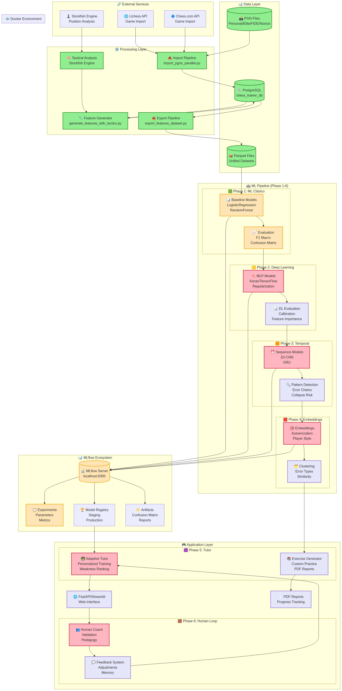

# ♟️ ChessTrainer — Roadmap Técnico y Plan de Desarrollo (desde v0.1.102-67b6ca6)

ChessTrainer es una plataforma de análisis y entrenamiento ajedrecístico basada en **Machine Learning y Deep Learning**, cuyo objetivo no es “evaluar jugadas” sino **mejorar efectivamente el nivel del jugador** mediante diagnóstico, entrenamiento personalizado y seguimiento del progreso.

---

## 🎯 Objetivo General

- Detectar errores reales en partidas.
- Identificar patrones de debilidad y fortaleza.
- Generar ejercicios y ejemplos concretos para entrenar.
- Medir si el entrenamiento produce mejoras.
- Integrar criterio humano (entrenadores) sin perder consistencia técnica.

---

## 🧠 Principios de diseño

- **ML/DL no reemplaza al entrenador humano**: lo asiste.
- **GPT no decide**: solo explica lo que el sistema ya decidió.
- **Cada capa del sistema debe funcionar por sí sola**.
- **Si se quita la UI o GPT, el core debe seguir siendo útil**.
- El valor está en **qué entrenar**, no en cómo se explica.

---

## 🗺️ Roadmap por Fases

### 🟩 FASE 1 — Clasificación de errores por jugada (ML clásico)

**Objetivo**  
Responder: *¿esta jugada fue buena o mala, y en qué grado?*

**Input**
- Features por jugada (material, rey, score, tags tácticos, apertura).

**Modelos**
- Logistic Regression L2 (baseline principal).
- Logistic Regression L1 (selección de features).
- Opcionales: RandomForest / GradientBoosting.

**Output**
- `error_label ∈ {brilliant, good, inaccuracy, mistake, blunder}`
- `confidence`

**Métricas**
- F1 macro (principal).
- Matriz de confusión (especial foco en mistake ↔ blunder).

**Estado**
- 🟡 Diseño definido / datasets disponibles  
- ⏳ Implementación / ejecución baseline

**Criterio de avance**
- Modelo reproducible y estable.
- Confusión grave (good ↔ blunder) muy baja.

---

### 🟨 FASE 2 — Deep Learning tabular (MLP)

**Objetivo**  
Aprender combinaciones no lineales que ML clásico no capta.

**Modelos**
- MLP Keras (2–3 capas).
- Regularización fuerte:
  - L2
  - AdamW (weight decay)
  - Dropout
  - Label smoothing

**Input**
- Mismas features que Fase 1.

**Métricas**
- ΔF1 macro vs ML.
- Reducción de errores graves.
- Calibración (ECE).

**Estado**
- 🔵 Pendiente (solo se implementa si ML queda corto).

**Criterio de avance**
- DL debe superar claramente a ML o reducir errores críticos.
- Si no, se mantiene ML como base.

---

### 🟧 FASE 3 — Análisis temporal (errores en cadena)

**Objetivo**  
Responder: *¿esta jugada forma parte de un colapso o patrón negativo?*

**Input**
- Ventanas de N jugadas (3–7).
- Features temporales:
  - score_cp_diff
  - errores consecutivos
  - presión de tiempo
  - tendencias

**Modelos**
- 1D-CNN o GRU.

**Output**
- Riesgo de colapso.
- Detección de rachas malas.

**Métricas**
- Recall de errores graves en secuencia.
- Delay de detección.

**Estado**
- 🔵 Pendiente (fase de alto valor).

**Criterio de avance**
- Detecta patrones que no se ven en jugadas aisladas.

---

### 🟥 FASE 4 — Embeddings y similitud (estilo / recomendación)

**Objetivo**  
Responder: *¿a qué se parece este error / este jugador?*

**Modelos**
- Autoencoder / embedding MLP.

**Output**
- Vector latente (embedding).

**Uso**
- Clustering de errores.
- Similitud para ejercicios.
- Base para inferencia de estilo de juego.

**Métricas**
- Silhouette score.
- Coherencia temática de clusters.

**Estado**
- 🔵 Pendiente (fase estructural para personalización).

**Criterio de avance**
- Clusters útiles para entrenamiento, no solo visuales.

---

### 🟪 FASE 5 — Tutor adaptativo y reportes

**Objetivo**  
Convertir predicciones en **entrenamiento accionable**.

**Componentes**
- Ranking de debilidades.
- Portafolio de ejercicios personalizados.
- Reglas pedagógicas.
- Reporte PDF por jugador.

**Outputs**
- Plan de entrenamiento.
- Estadísticas por fase del juego.
- Progreso y regresión.

**Métricas**
- Reducción de errores repetidos.
- Tendencia de mejora.
- Retención del aprendizaje.

**Estado**
- 🟡 Diseño conceptual definido.

**Criterio de avance**
- El jugador mejora mediblemente.

---

### 🟫 FASE 6 — Intervención de entrenadores humanos (Human-in-the-loop)

**Objetivo**  
Permitir que entrenadores evalúen prácticas y ajusten el plan.

**Qué puede hacer el entrenador**
- Validar diagnóstico.
- Ajustar dificultad.
- Definir foco pedagógico.
- Agregar justificaciones.

**Qué NO hace**
- Reemplazar Stockfish.
- Reentrenar el modelo base directamente.

**Valor**
- Portafolios personalizados.
- Memoria pedagógica del alumno.
- Base para aprendizaje del sistema a futuro.

**Estado**
- 🟣 Planeado (funcionalidad avanzada / B2B).

---

## 📊 Tracking y reproducibilidad

- MLflow como framework central:
  - datasets
  - parámetros
  - métricas
  - artefactos (CM, reportes, modelos)

---

## 🏁 Estado Actual del Proyecto (Actualizado: 14 febrero 2026 - 22:30)

### 🌐 Infraestructura Web (🟢 Sprint 1 COMPLETADO)

**Estado: 🟢 100% Operativo - React + FastAPI + PostgreSQL**

✅ **Completado: Sprint 1 - Database Browser + Authentication**
- ✅ **Frontend React + Vite:** Aplicación SPA moderna con routing
- ✅ **Backend FastAPI:** API REST con validación automática (OpenAPI/Swagger)
- ✅ **Sistema de Autenticación JWT:** 
  - Endpoints: `/auth/register`, `/auth/login`, `/auth/me`
  - Token-based authentication con refresh automático
  - Role-Based Access Control (RBAC) implementado
- ✅ **3 Roles configurados:**
  - `admin`: Acceso completo + gestión de usuarios
  - `analyst`: Acceso a todas las partidas
  - `user`: Solo partidas propias (filtrado por `imported_by`)
- ✅ **Database Browser funcional:**
  - Paginación por rol (admin/analyst: 237,250 games, user: 33 games)
  - Campo `imported_by` en modelo `Game`
  - Migración Alembic aplicada (`006_add_imported_by_to_games.py`)
- ✅ **Testing completo:**
  - 3 usuarios de prueba creados y validados
  - Script `create_test_users.py` funcional
  - Documentación de pruebas: `docs/TESTING_AUTHENTICATION.md`

**Stack Tecnológico Web:**
| Componente           | Tecnología          | Puerto | Estado      |
| -------------------- | ------------------- | ------ | ----------- |
| **Frontend**         | React 18 + Vite     | 5173   | 🟢 Operativo |
| **Backend API**      | FastAPI + Uvicorn   | 8000   | 🟢 Operativo |
| **Database**         | PostgreSQL 13       | 5432   | 🟢 Operativo |
| **Authentication**   | JWT (PyJWT)         | -      | 🟢 Operativo |
| **ORM/Migrations**   | SQLAlchemy + Alembic| -      | 🟢 Operativo |

**Arquitectura API:**
```
src/api/
├── main.py                 # FastAPI app + CORS
├── routers/
│   ├── auth.py             # Authentication endpoints
│   ├── games.py            # Game CRUD + filtrado por rol
│   └── chess.py            # Chess analysis (en desarrollo)
├── models/
│   └── user.py             # User model + roles
└── dependencies.py         # JWT verification + current_user
```

**Métricas del Sistema:**
- **Total games en DB:** 237,250 partidas
- **Games con importación:** 33 partidas por usuario `user`
- **Usuarios registrados:** 3 (admin, analyst, user)
- **Commits Sprint 1:** 11 commits organizados (v0.1.124-bdf6732)

**Repositorio:**
- **Branch:** `feature/frontend-sprint1-database-browser`
- **Version:** v0.1.124-bdf6732
- **Documentación técnica:** `docs/TESTING_AUTHENTICATION.md`
- **Documentación funcional:** `docs/ROADMAP_FUNCTIONAL_CHESS_TRAINER.md`

---

### 📊 Análisis del Estado de las Fases

#### 🟩 **FASE 1 — Clasificación de errores por jugada (ML clásico)**
**Estado: 🟢 85% Completo - Progreso significativo en etiquetado**

✅ **Completado:**
- ✅ Base de datos PostgreSQL funcionando (11,676 partidas)
- ✅ Generación de features implementada (19,947 records)
- ✅ Pipeline de features + análisis táctico (`generate_features_with_tactics.py`)
- ✅ **NUEVO**: Sistema de etiquetado táctico automático operativo
- ✅ **NUEVO**: Pipeline de procesamiento en lotes funcionando (100-200 juegos/lote)
- ✅ **NUEVO**: Análisis con Stockfish 17 + NNUE a profundidad 8
- ✅ Modelos básicos implementados (`chess_error_predictor.py`)
- ✅ MLflow tracking configurado (`mlflow_utils.py`)
- ✅ Notebooks de análisis disponibles

🚀 **Progreso Reciente:**
- ✅ **Etiquetado masivo completado:** 3,790 features etiquetadas (19.0% del total)
- ✅ **Análisis táctico profundo:** Detección de discovered_attack, pin, fork patterns
- ✅ **Sistema estable:** Procesamiento a 400-500k nps con multipv=3
- ⏳ **En proceso:** Completando las 16,157 features restantes (81% pendiente)

⚠️ **Issues restantes:**
- 🟡 **Etiquetado en progreso:** 16,157 features por procesar (proceso activo)
- ❌ **Baseline no establecido:** No hay modelo entrenado y validado
- ❌ **Métricas no implementadas:** Sin F1 macro ni matriz de confusión sistemática

**Distribución actual de datos (19.0% etiquetado):**
```
| error_label            | count  | status     |
| ---------------------- | ------ | ---------- |
| 16157  🟡 SIN ETIQUETAR |        | En proceso |
| good                   | ~1,600 | ✅ Activo   |
| mistake                | ~800   | ✅ Activo   |
| blunder                | ~700   | ✅ Activo   |
| inaccuracy             | ~690   | ✅ Activo   |
```

#### 🟨 **FASE 2 — Deep Learning tabular (MLP)**
**Estado: 🔵 0% - Pendiente (correcto según roadmap)**

#### 🟧 **FASE 3 — Análisis temporal**
**Estado: 🔵 0% - Pendiente (correcto)**

#### 🟥 **FASE 4 — Embeddings y similitud**
**Estado: 🔵 0% - Pendiente (correcto)**

#### 🟪 **FASE 5 — Tutor adaptativo**
**Estado: 🔵 5% - Solo diseño conceptual**

#### 🟫 **FASE 6 — Intervención humana**
**Estado: 🔵 0% - Planeado para futuro**

---

## 🎯 Plan de Acción para Completar FASE 1

### **Paso 1: Completar etiquetado masivo** 🚀
**Prioridad: EN PROGRESO - 81% restante**

✅ **Logrado:** Sistema de etiquetado táctico funcionando
- ✅ Pipeline automático con Stockfish 17 + NNUE
- ✅ Procesamiento estable en lotes de 100-200 juegos
- ✅ 3,790 features etiquetadas (19.0% del total)

🎯 **Acción inmediata:**
- ⏳ **Continuar procesamiento:** 16,157 features restantes
- ⚡ **Optimizar velocidad:** Escalar a lotes de 300-500 juegos si es estable
- 📊 **Monitorear progreso:** Verificar distribución balanceada cada 1,000 features

**ETA para completar:** 2-3 días con proceso continuo

### **Paso 2: Implementar baseline reproducible** ⚙️
**Prioridad: ALTA - Listo para iniciar con datos actuales**

**Archivos a crear/modificar:**
- `src/ml/phase1_baseline.py` - **CREAR** con subset actual de 3,790 features
- `src/ml/phase1_evaluation.py` - **CREAR** para métricas sistemáticas

**Modelos a implementar:**
- Logistic Regression L2 (baseline principal)
- Logistic Regression L1 (selección features)
- RandomForest (opcional, para comparar)

**Dataset estrategia:**
- **Inmediato:** Usar 3,790 features etiquetadas para baseline MVP
- **Final:** Modelo completo con 19,947 features cuando termine etiquetado

### **Paso 3: Pipeline de evaluación sistemática** 📈

**Métricas requeridas por roadmap:**
- F1 macro (métrica principal)
- Matriz de confusión detallada
- Análisis específico de confusión `mistake ↔ blunder`

### **Paso 4: MLflow experiment tracking** 📊

Configurar experimentos reproducibles con:
- Parámetros del modelo
- Métricas de evaluación
- Matriz de confusión como artifact
- Model registry

---

## 🛠️ Cronograma Actualizado (Próximas 1-2 semanas)

### **Esta Semana: Completar Fase 1 (29 dic 2025 - 5 ene 2026)**
1. ⏳ **Continuar etiquetado masivo:** Completar las 16,157 features restantes (ETA: 2-3 días)
2. 🚀 **Implementar baseline MVP:** Usar 3,790 features actuales para modelo inicial
3. 📊 **Configurar MLflow experiments:** Tracking sistemático de modelos

### **Semana Siguiente: Validación y optimización (6-12 ene 2026)**
1. ✅ **Modelo final completo:** Con dataset 100% etiquetado (19,947 features)
2. 📈 **Evaluación exhaustiva:** F1 macro + análisis de confusión  
3. 🎯 **Validar criterio de avance:** Confusión grave < 5%, modelo estable

### **Prioridades Inmediatas (próximas 24-48 horas):**
1. **Monitorear progreso de etiquetado:** Verificar que el proceso continúe estable
2. **Crear baseline scripts:** `phase1_baseline.py` con subset actual
3. **Preparar evaluación:** `phase1_evaluation.py` para métricas sistémáticas

**Criterio de éxito para avanzar a Fase 2:**
- ✅ Dataset completamente etiquetado (19,947 features) 
- ✅ Modelo reproducible y estable 
- ✅ Confusión grave (good ↔ blunder) < 5%
- ✅ F1 macro > 0.70 como baseline mínimo

---

## 🧩 Arquitectura del sistema

🎯 Características del diagrama:

**Web Application Layer (🟢 Operativo - Sprint 1)**
- React 18 + Vite SPA
- FastAPI REST API
- JWT Authentication
- Role-Based Access Control

**Data Layer** - PGN files, PostgreSQL, Parquet exports
**Processing Layer** - Import, feature generation, tactical analysis
**ML Pipeline** - Las 6 fases del roadmap claramente separadas
**MLflow Ecosystem** - Tracking, experiments, model registry
**Application Layer** - Tutor adaptativo, human-in-the-loop
**External Services** - Stockfish, Lichess, Chess.com



🎨 Código de colores:

- 🟢 Verde: Componentes operativos y completados
- 🟡 Naranja: En progreso/configurados
- 🔴 Rojo: Críticos/necesitan atención
- 🟣 Púrpura: Planeados para el futuro
  
📊 Información adicional:

Flujo de datos principal paso a paso
Estado actual de cada componente
Stack tecnológico con estado de implementación


### 🔄 Flujo de Datos Principal

1. **Ingesta:** PGN files → Import Pipeline → PostgreSQL
2. **Procesamiento:** Feature Generation + Tactical Analysis → Database
3. **ML Pipeline:** Export → Parquet → Model Training → MLflow
4. **Web Application (🟢 NUEVO):** FastAPI → Database → React Frontend
5. **Aplicación:** Model Registry → Tutor Adaptativo → Reports

### 🏗️ Componentes Clave

#### **Web Application Layer (🟢 Operativo - NUEVO Sprint 1)**
- **Frontend React + Vite:** SPA con routing, auth context, protected routes
- **FastAPI Backend:** REST API con OpenAPI docs automáticas
- **JWT Authentication:** Token-based auth + role middleware
- **Database Browser:** Paginación + filtrado por rol
- **3 Roles RBAC:** admin, analyst, user con permisos diferenciados

#### **Data Layer (🟢 Operativo)**
- **PostgreSQL:** 237,250 partidas, 19,947 features, 3 usuarios
- **Parquet Export:** Datasets unificados para ML
- **Sources:** Personal, Elite, FIDE, Stockfish, Novice

#### **Processing Layer (🟢 Operativo)**
- **Parallel Import:** Procesamiento eficiente de PGNs
- **Feature Engineering:** 16+ features por jugada
- **Tactical Analysis:** Integración con Stockfish

#### **ML Pipeline (🟡 En desarrollo)**
- **Phase 1:** Baseline models implementados, métricas pendientes
- **Phases 2-4:** Arquitectura definida, implementación pendiente
- **MLflow:** Configurado, experimentos por establecer

#### **Application Layer (🟡 En desarrollo)**
- **Database Browser:** 🟢 Completado (Sprint 1)
- **Chess Board Interactive:** 🔜 Siguiente (Funcionalidad 3.1)
- **Tutor Adaptativo:** 🔴 Diseño conceptual definido
- **Human-in-the-loop:** 🔴 Funcionalidad avanzada B2B

### 🔧 Stack Tecnológico

| Componente           | Tecnología          | Estado          |
| -------------------- | ------------------- | --------------- |
| **Frontend**         | React 18 + Vite     | 🟢 Operativo     |
| **Backend API**      | FastAPI + Uvicorn   | 🟢 Operativo     |
| **Authentication**   | JWT (PyJWT)         | 🟢 Operativo     |
| **Database**         | PostgreSQL 13       | 🟢 Operativo     |
| **ORM/Migrations**   | SQLAlchemy + Alembic| 🟢 Operativo     |
| **ML Framework**     | scikit-learn, Keras | 🟡 Configurado   |
| **Tracking**         | MLflow              | 🟡 Configurado   |
| **Engine**           | Stockfish 17 + NNUE | 🟢 Integrado     |
| **Containerization** | Docker Compose      | 🟢 Operativo     |

---

## 🚀 Próximos Pasos (Post Sprint 1)

### **Sprint 2: Chess Board Interactivo (FUNCIONALIDAD 3.1)**
**Prioridad: ALTA - Próximo desarrollo**

**Componentes técnicos:**
- `ChessBoard.jsx` - Integración con Chess.js
- `GameLoader.jsx` - Load games from PostgreSQL API
- `MoveHistory.jsx` - Navegación de movimientos
- `LogViewer.jsx` - Sistema de logs base (eventos de tablero)

**Backend requerido:**
- Endpoint `/games/{id}/moves` - Obtener movimientos de partida
- Endpoint `/games/{id}/position` - Cargar posición específica

**Tiempo estimado:** 2-3 semanas

### **Sprint 3: Stockfish Integration (FUNCIONALIDAD 3.2)**
**Prioridad: ALTA**

**Componentes técnicos:**
- Backend WebSocket para comunicación con Stockfish
- API `/analysis/position` - Análisis de posición FEN
- API `/analysis/move` - Evaluación de movimiento
- Frontend: Display de evaluaciones en tiempo real

**Tiempo estimado:** 2-3 semanas

---

## 📚 Referencias de Documentación

- **Roadmap Funcional:** `docs/ROADMAP_FUNCTIONAL_CHESS_TRAINER.md`
- **Testing Guide:** `docs/TESTING_AUTHENTICATION.md`
- **MLflow Guide:** `docs/MLFLOW_COMPLETE_GUIDE.md`
- **Preprocessing Guide:** `docs/ML_PREPROCESSING_GUIDE.md`

---

_Última actualización: 14 de Febrero, 2026_  
_Version: v0.1.124-bdf6732_  
_Sprint 1 completado - Sprint 2 planificado_

