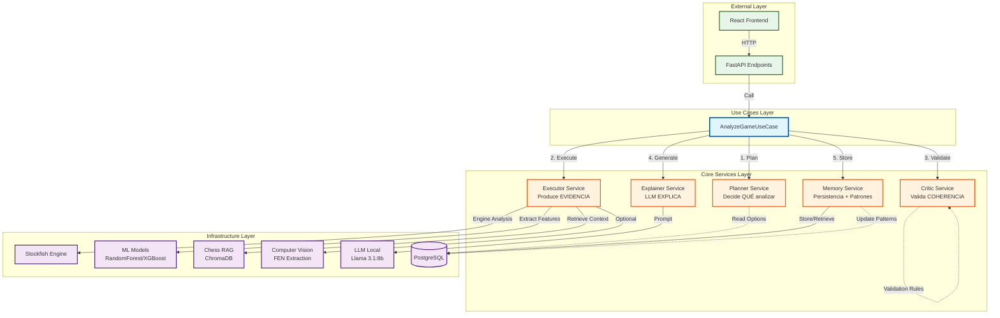
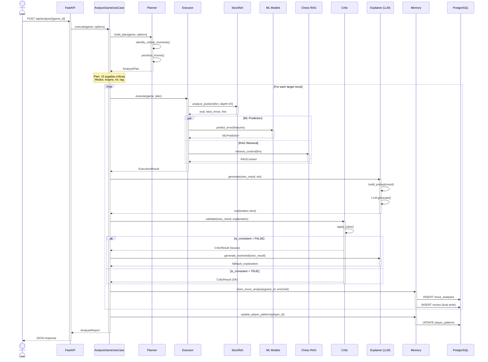
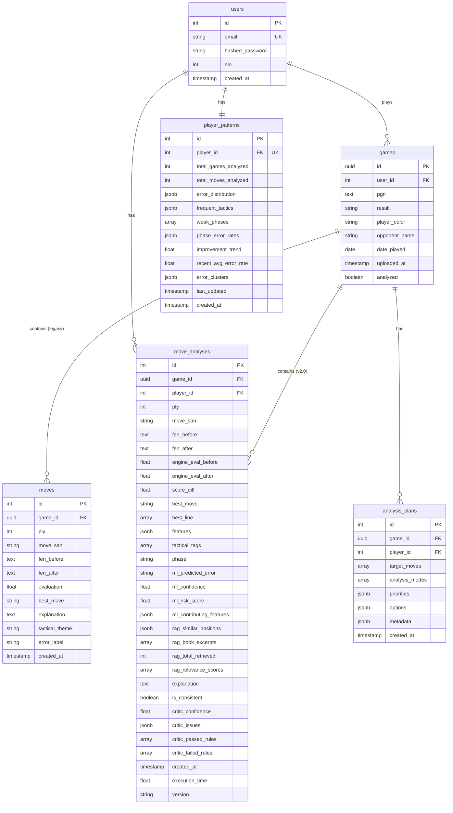
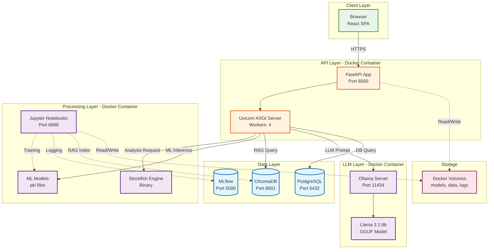
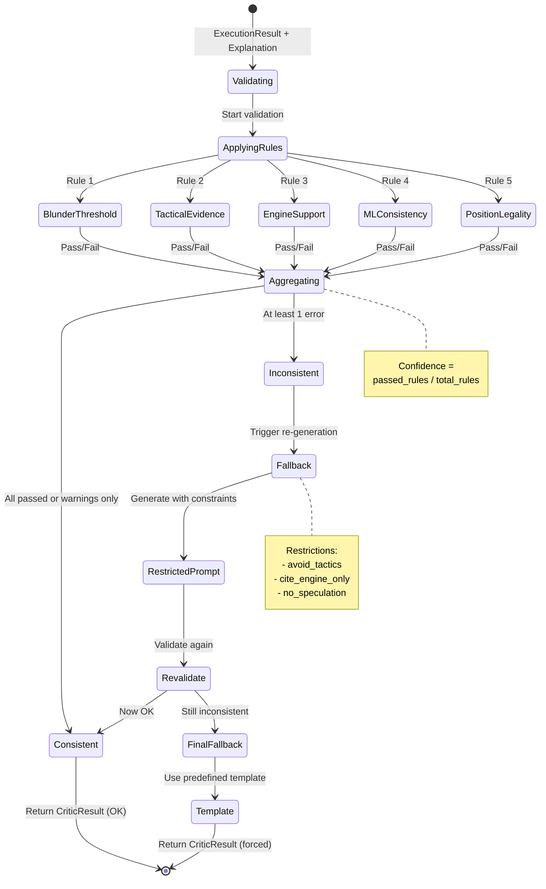
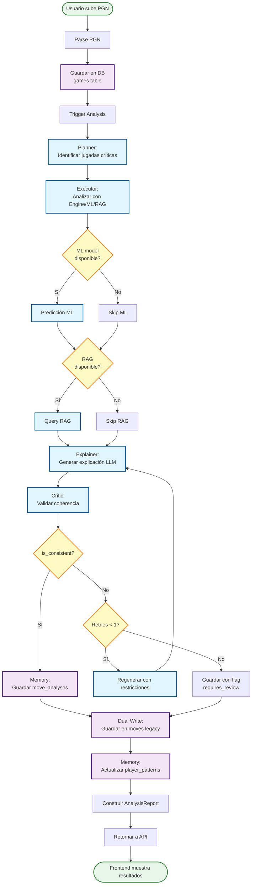
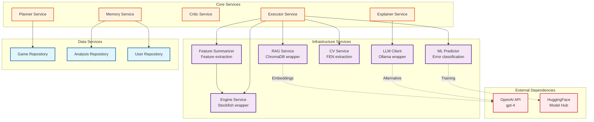

# 04-orchestration-planner-executor-critic-memory

Consolidated architecture-module document.
Canonical module document under docs/ai_chess_coach.

## Unified Content


---


# Phase 0 - Detailed Technical Specification

**Date:** Marzo 25, 2026  
**Version:** 1.0  
**Status:** In Development  
**Issue:** [#85](https://github.com/cmessoftware/chessinsightai/issues/85)

---

## Objective

Define the complete technical specification of the Orchestrated Architecture components (Planner/Executor/Critic/Memory) before starting implementation.

This document establishes:
- Interfaces and contracts for each component
- Critic validation rules
- Data schemas
- Design patterns to use

---

## 1. Componentes del Sistema

### 1.1 Planner

**Responsibility:** Decides WHAT to analyze and HOW to analyze it.

#### Interface

```python
class PlannerService:
    """
    Game analysis planning service.
    
    Responsibilities:
    - Identify critical moves
    - Prioritize analysis
    - Define execution modes (engine/ml/rag/cv)
    """
    
    def build_plan(
        self, 
        game: Game, 
        options: AnalysisOptions
    ) -> AnalysisPlan:
        """
        Builds an analysis plan for a game.
        
        Args:
            game: Game to analyze
            options: Analysis options (depth, modes, ELO adaptation)
            
        Returns:
            AnalysisPlan with target moves and execution modes
        """
        pass
```

#### Data Model

```python
@dataclass
class AnalysisOptions:
    """Analysis configuration options."""
    depth: int = 20  # Stockfish depth
    enable_ml: bool = True
    enable_rag: bool = True
    enable_cv: bool = False
    elo_threshold: int = None  # Player ELO for adaptation
    focus_mode: str = "critical"  # critical | full | tactical | positional
    
@dataclass
class AnalysisPlan:
    """Analysis plan generated by the Planner."""
    game_id: str
    target_moves: List[int]  # Indices of moves to analyze
    analysis_modes: List[str]  # ["engine", "features", "ml", "rag"]
    priorities: Dict[int, str]  # {move_index: "high" | "medium" | "low"}
    metadata: Dict[str, Any]  # Additional information
```

#### Prioritization Algorithm

**Criteria for selecting critical moves:**

1. **Evaluation Swing (High priority)**
   - Evaluation change > 100 cp → `high`
   - Evaluation change 50-100 cp → `medium`
   - Evaluation change 20-50 cp → `low`

2. **Material Change (High priority)**
   - Quality loss ≥ 3 → `high`
   - Quality loss 1-2 → `medium`

3. **Tactical Moves (Medium priority)**
   - Fork, pin, skewer → `medium`
   - Discovered attack → `medium`

4. **Game Phases**
   - Opening (moves 1-15): check for inaccuracies
   - Middlegame (moves 16-40): focus on tactics
   - Endgame (moves 40+): technical precision

**Implementation Example:**

```python
def _identify_critical_moments(self, game: Game) -> List[int]:
    """
    Identifies critical moves using multiple criteria.
    
    Returns:
        List of critical move indices sorted by priority
    """
    critical_moves = []
    
    for i, move in enumerate(game.moves):
        score = 0
        
        # Criterio 1: Eval swing
        eval_swing = abs(move.eval_after - move.eval_before)
        if eval_swing > 100:
            score += 10
        elif eval_swing > 50:
            score += 5
            
        # Criterio 2: Material loss
        if move.material_change < -200:  # Piece loss
            score += 8
            
        # Criterio 3: Tactical tags
        if move.tactical_tags:
            score += 3
            
        # Criterio 4: Error label (si existe)
        if hasattr(move, 'error_label'):
            error_weights = {
                'blunder': 10,
                'mistake': 7,
                'inaccuracy': 4
            }
            score += error_weights.get(move.error_label, 0)
            
        if score >= 5:  # Threshold to consider critical
            critical_moves.append((i, score))
    
    # Sort by descending score and return top N
    critical_moves.sort(key=lambda x: x[1], reverse=True)
    return [idx for idx, _ in critical_moves[:20]]  # Max 20 moves
```

---

### 1.2 Executor

**Responsibility:** Produces objective EVIDENCE using multiple sources.

#### Interface

```python
class ExecutorService:
    """
    Analysis execution service.
    
    Orchestrates evidence production from multiple sources:
    - Stockfish (engine)
    - Feature extraction
    - ML models
    - RAG retrieval
    - Computer Vision (FEN extraction)
    """
    
    def __init__(
        self,
        engine_service: AnalysisService,
        feature_summarizer: FeatureSummarizer,
        ml_predictor: ChessErrorPredictor,
        rag_service: ChessRAG,
        cv_service: Optional[CVService] = None
    ):
        self.engine = engine_service
        self.features = feature_summarizer
        self.ml = ml_predictor
        self.rag = rag_service
        self.cv = cv_service
        
    def execute(
        self, 
        game: Game, 
        plan: AnalysisPlan
    ) -> List[ExecutionResult]:
        """
        Executes the analysis plan and produces evidence.
        
        Args:
            game: Game to analyze
            plan: Plan generated by Planner
            
        Returns:
            List of ExecutionResult with evidence for each move
        """
        pass
```

#### Data Model

```python
@dataclass
class ExecutionResult:
    """Execution result for a single move analysis."""
    
    # Identification
    game_id: str
    ply: int  # Move index (0-based)
    move_san: str  # Algebraic notation (e.g., "Nf3")
    fen_before: str
    fen_after: str
    
    # Engine Evaluation
    engine_eval_before: float  # Centipawns
    engine_eval_after: float
    score_diff: float  # eval_after - eval_before
    best_move: str  # Best move according to engine
    best_line: List[str]  # Principal variation
    
    # Extracted Features
    features: Dict[str, float]  # {feature_name: value}
    tactical_tags: List[str]  # ["fork", "pin", etc.]
    phase: str  # "opening" | "middlegame" | "endgame"
    
    # ML Prediction
    ml_prediction: Optional[MLPrediction] = None
    
    # RAG Context
    rag_context: Optional[RAGContext] = None
    
    # Metadata
    timestamp: datetime
    execution_time: float  # Segundos
    
@dataclass
class MLPrediction:
    """ML model prediction."""
    predicted_error: str  # "good" | "inaccuracy" | "mistake" | "blunder"
    confidence: float  # 0.0 - 1.0
    risk_score: float  # 0.0 - 1.0
    contributing_features: List[Tuple[str, float]]  # [(feature, impact), ...]
    
@dataclass
class RAGContext:
    """Context retrieved from RAG."""
    similar_positions: List[Dict]  # Similar positions with metadata
    book_excerpts: List[str]  # Relevant book excerpts
    player_patterns: List[Dict]  # Historical player patterns
    total_retrieved: int
    relevance_scores: List[float]
```

#### Parallel Execution Implementation

```python
async def execute(self, game: Game, plan: AnalysisPlan) -> List[ExecutionResult]:
    """
    Executes analysis with parallelization for efficiency.
    
    Strategy:
    1. Engine + Features: Sequential (Features depend on Engine)
    2. ML + RAG: Parallel (independent)
    """
    results = []
    
    for move_idx in plan.target_moves:
        # Step 1: Engine analysis (blocking)
        engine_result = await self.engine.analyze_position(
            game.get_fen_at(move_idx),
            depth=plan.options.depth
        )
        
        # Step 2: Feature extraction (depends on engine)
        features = self.features.extract_features(
            move_idx,
            engine_result
        )
        
        # Step 3: ML + RAG in parallel
        ml_task = self._run_ml_prediction(features) if "ml" in plan.analysis_modes else None
        rag_task = self._run_rag_retrieval(game.get_fen_at(move_idx)) if "rag" in plan.analysis_modes else None
        
        ml_result, rag_result = await asyncio.gather(ml_task, rag_task)
        
        # Step 4: Assemble result
        result = ExecutionResult(
            game_id=game.id,
            ply=move_idx,
            move_san=game.moves[move_idx].san,
            fen_before=game.get_fen_at(move_idx),
            fen_after=game.get_fen_at(move_idx + 1),
            engine_eval_before=engine_result.eval_before,
            engine_eval_after=engine_result.eval_after,
            score_diff=engine_result.eval_after - engine_result.eval_before,
            best_move=engine_result.best_move,
            best_line=engine_result.principal_variation,
            features=features,
            tactical_tags=engine_result.tactical_tags,
            phase=self._determine_phase(move_idx),
            ml_prediction=ml_result,
            rag_context=rag_result,
            timestamp=datetime.now(),
            execution_time=0.0  # Calculado
        )
        
        results.append(result)
    
    return results
```

---

### 1.3 Critic

**Responsibility:** Validates CONSISTENCY of results before generating explanations.

#### Interface

```python
class CriticService:
    """
    Consistency validation service.
    
    Applies programmatic rules to detect:
    - Logical inconsistencies
    - Unsupported explanations
    - Contradictory predictions
    """
    
    def __init__(self, rules: List[ValidationRule]):
        self.rules = rules
        
    def validate(
        self,
        execution_result: ExecutionResult,
        explanation: Optional[str] = None
    ) -> CriticResult:
        """
        Validates consistency of the execution result.
        
        Args:
            execution_result: Result from the Executor
            explanation: Generated explanation (optional, for post-LLM validation)
            
        Returns:
            CriticResult with is_consistent, issues, confidence
        """
        pass
```

#### Data Model

```python
@dataclass
class CriticResult:
    """Critic validation result."""
    is_consistent: bool
    confidence: float  # 0.0 - 1.0
    issues: List[ValidationIssue]
    passed_rules: List[str]  # Names of rules that passed
    failed_rules: List[str]  # Names of rules that failed
    
@dataclass
class ValidationIssue:
    """Issue detected by the Critic."""
    rule_name: str
    severity: str  # "error" | "warning" | "info"
    message: str
    context: Dict[str, Any]  # Additional information for debugging
```

#### Validation Rules

**1. Rule: BlunderScoreThreshold**

```python
class BlunderScoreThresholdRule(ValidationRule):
    """
    Cannot have a 'blunder' with a low score_diff.
    
    Logic:
    - Si ml_prediction.predicted_error == "blunder"
    - Entonces abs(score_diff) debe ser >= 200 cp
    """
    
    def validate(self, result: ExecutionResult) -> ValidationIssue:
        if not result.ml_prediction:
            return None
            
        if result.ml_prediction.predicted_error == "blunder":
            if abs(result.score_diff) < 200:
                return ValidationIssue(
                    rule_name="BlunderScoreThreshold",
                    severity="error",
                    message=f"ML predice blunder pero score_diff es solo {result.score_diff} cp (esperado >=200)",
                    context={
                        "score_diff": result.score_diff,
                        "ml_confidence": result.ml_prediction.confidence
                    }
                )
        return None
```

**2. Rule: TacticalEvidenceRequired**

```python
class TacticalEvidenceRequiredRule(ValidationRule):
    """
    Cannot mention a tactic without evidence in tactical_tags.
    
    Logic:
    - Si explanation contiene palabras tácticas (fork, pin, skewer, etc.)
    - Entonces tactical_tags debe contener al menos una tag
    """
    
    TACTICAL_KEYWORDS = [
        "fork", "horquilla", "pin", "clavada", "skewer",
        "discovered attack", "double attack", "sacrifice"
    ]
    
    def validate(self, result: ExecutionResult, explanation: str = None) -> ValidationIssue:
        if not explanation:
            return None
            
        # Search for tactical keywords in explanation
        mentioned_tactics = [
            kw for kw in self.TACTICAL_KEYWORDS 
            if kw.lower() in explanation.lower()
        ]
        
        if mentioned_tactics and not result.tactical_tags:
            return ValidationIssue(
                rule_name="TacticalEvidenceRequired",
                severity="warning",
                message=f"Explicación menciona tácticas {mentioned_tactics} pero tactical_tags está vacío",
                context={
                    "mentioned": mentioned_tactics,
                    "tactical_tags": result.tactical_tags
                }
            )
        return None
```

**3. Rule: EngineSupportRequired**

```python
class EngineSupportRequiredRule(ValidationRule):
    """
    Every explanation must be supported by engine evaluation.
    
    Logic:
    - Si explanation menciona "mejor jugada" o "debería"
    - Entonces debe citar best_move del engine
    """
    
    def validate(self, result: ExecutionResult, explanation: str = None) -> ValidationIssue:
        if not explanation:
            return None
            
        suggests_alternative = any(kw in explanation.lower() for kw in [
            "mejor jugada", "debería", "en su lugar", "mejor era"
        ])
        
        if suggests_alternative and result.best_move not in explanation:
            return ValidationIssue(
                rule_name="EngineSupportRequired",
                severity="error",
                message="Explicación sugiere alternativa sin mencionar best_move del engine",
                context={
                    "best_move": result.best_move,
                    "explanation_snippet": explanation[:200]
                }
            )
        return None
```

**4. Rule: MLEngineConsistency**

```python
class MLEngineConsistencyRule(ValidationRule):
    """
    ML prediction must be consistent with engine evaluation.
    
    Consistency matrix:
    
    | score_diff | ml_prediction | consistent? |
    | ---------- | ------------- | ----------- |
    | < -200     | blunder       | ✅           |
    | < -100     | mistake       | ✅           |
    | < -50      | inaccuracy    | ✅           |
    | >= -50     | good          | ✅           |
    | < -200     | good          | ❌ ERROR     |
    | >= -50     | blunder       | ❌ ERROR     |
    """
    
    CONSISTENCY_MATRIX = {
        "blunder": {"min_diff": -10000, "max_diff": -200},
        "mistake": {"min_diff": -200, "max_diff": -100},
        "inaccuracy": {"min_diff": -100, "max_diff": -50},
        "good": {"min_diff": -50, "max_diff": 10000}
    }
    
    def validate(self, result: ExecutionResult) -> ValidationIssue:
        if not result.ml_prediction:
            return None
            
        predicted = result.ml_prediction.predicted_error
        score_diff = result.score_diff
        
        bounds = self.CONSISTENCY_MATRIX[predicted]
        
        if not (bounds["min_diff"] <= score_diff <= bounds["max_diff"]):
            return ValidationIssue(
                rule_name="MLEngineConsistency",
                severity="warning",
                message=f"ML predice '{predicted}' pero score_diff={score_diff} está fuera de rango esperado [{bounds['min_diff']}, {bounds['max_diff']}]",
                context={
                    "ml_prediction": predicted,
                    "score_diff": score_diff,
                    "expected_range": bounds,
                    "ml_confidence": result.ml_prediction.confidence
                }
            )
        return None
```

**5. Rule: PositionLegalityCheck**

```python
class PositionLegalityCheckRule(ValidationRule):
    """
    Verifies that FEN positions are legal.
    
    Uses python-chess for validation.
    """
    
    def validate(self, result: ExecutionResult) -> ValidationIssue:
        import chess
        
        try:
            board_before = chess.Board(result.fen_before)
            board_after = chess.Board(result.fen_after)
            
            if not board_before.is_valid() or not board_after.is_valid():
                return ValidationIssue(
                    rule_name="PositionLegalityCheck",
                    severity="error",
                    message="Posición FEN ilegal detectada",
                    context={
                        "fen_before": result.fen_before,
                        "fen_after": result.fen_after
                    }
                )
        except ValueError as e:
            return ValidationIssue(
                rule_name="PositionLegalityCheck",
                severity="error",
                message=f"FEN inválido: {str(e)}",
                context={"error": str(e)}
            )
        
        return None
```

#### Fallback Strategy

When the Critic detects inconsistencies:

```python
if not critic_result.is_consistent:
    # Option 1: Generate restricted explanation (no tactics, engine only)
    explanation = explainer.generate_restricted(
        execution_result,
        restrictions={
            "avoid_tactics": True,
            "cite_engine_only": True,
            "no_speculation": True
        }
    )
    
    # Option 2: Mark for manual review
    execution_result.metadata["requires_review"] = True
    execution_result.metadata["critic_issues"] = critic_result.issues
    
    # Option 3: Use predefined template
    explanation = f"Jugada {result.move_san}. Evaluación cambió {result.score_diff} cp. Mejor era {result.best_move}."
```

---

### 1.4 Memory

**Responsibility:** Persistence and accumulated learning.

#### Interface

```python
class MemoryService:
    """
    Player persistence and pattern service.
    
    Responsibilities:
    - Store per-move analysis
    - Aggregate player patterns
    - Error clustering
    - Provide history for personalization
    """
    
    def __init__(self, db: Database):
        self.db = db
        
    def store_move_analysis(
        self,
        game_id: str,
        enriched_result: EnrichedResult
    ) -> None:
        """Stores move analysis with all metadata."""
        pass
        
    def update_player_patterns(
        self,
        player_id: int,
        analysis_results: List[EnrichedResult]
    ) -> None:
        """
        Updates aggregated player patterns.
        
        Calculates:
        - Error type frequency
        - Recurring tactical themes
        - Weak game phases
        - Temporal trends
        """
        pass
        
    def get_player_patterns(
        self,
        player_id: int,
        lookback_days: int = 30
    ) -> PlayerPatterns:
        """Retrieves player patterns from the last N days."""
        pass
```

#### Data Model

```python
@dataclass
class EnrichedResult:
    """Result enriched with explanation and critique."""
    execution_result: ExecutionResult
    explanation: str
    critic_result: CriticResult
    metadata: Dict[str, Any]
    
@dataclass
class PlayerPatterns:
    """Aggregated patterns for a player."""
    player_id: int
    total_games_analyzed: int
    total_moves_analyzed: int
    
    # Error distribution
    error_distribution: Dict[str, float]  # {"blunder": 0.05, "mistake": 0.12, ...}
    
    # Recurring tactical themes
    frequent_tactics: List[Tuple[str, int]]  # [("fork", 23), ("pin", 15), ...]
    
    # Weak phases
    weak_phases: List[str]  # ["opening", "endgame"]
    phase_error_rates: Dict[str, float]  # {"opening": 0.15, "middlegame": 0.08, ...}
    
    # Temporal trends
    improvement_trend: float  # -1.0 (worsening) to +1.0 (improving)
    recent_avg_error_rate: float
    
    # Clustering
    error_clusters: List[ErrorCluster]
    
@dataclass
class ErrorCluster:
    """Cluster of similar errors."""
    cluster_id: int
    description: str  # "Errors in rook endgames"
    size: int  # Number of errors in cluster
    representative_positions: List[str]  # Example FENs
    recurrence_frequency: float  # 0.0 - 1.0
```

#### Database Schema

```sql
-- Move analysis table (new)
CREATE TABLE move_analyses (
    id SERIAL PRIMARY KEY,
    game_id UUID NOT NULL,
    player_id INT NOT NULL,
    ply INT NOT NULL,
    move_san VARCHAR(10) NOT NULL,
    
    -- Execution Result
    fen_before TEXT NOT NULL,
    fen_after TEXT NOT NULL,
    engine_eval_before FLOAT,
    engine_eval_after FLOAT,
    score_diff FLOAT,
    best_move VARCHAR(10),
    best_line TEXT[],
    features JSONB,
    tactical_tags TEXT[],
    phase VARCHAR(20),
    
    -- ML Prediction
    ml_predicted_error VARCHAR(20),
    ml_confidence FLOAT,
    ml_risk_score FLOAT,
    ml_contributing_features JSONB,
    
    -- RAG Context
    rag_similar_positions JSONB,
    rag_book_excerpts TEXT[],
    rag_total_retrieved INT,
    
    -- Explanation
    explanation TEXT,
    
    -- Critic Result
    is_consistent BOOLEAN,
    critic_confidence FLOAT,
    critic_issues JSONB,
    
    -- Metadata
    created_at TIMESTAMP DEFAULT NOW(),
    execution_time FLOAT,
    version VARCHAR(20),  -- Architecture version (v2.0, v2.1, etc.)
    
    FOREIGN KEY (game_id) REFERENCES games(id),
    FOREIGN KEY (player_id) REFERENCES users(id),
    INDEX idx_player_created (player_id, created_at),
    INDEX idx_game_ply (game_id, ply)
);

-- Player patterns table (new)
CREATE TABLE player_patterns (
    id SERIAL PRIMARY KEY,
    player_id INT NOT NULL UNIQUE,
    
    -- Aggregated statistics
    total_games_analyzed INT DEFAULT 0,
    total_moves_analyzed INT DEFAULT 0,
    error_distribution JSONB,  -- {"blunder": 0.05, "mistake": 0.12, ...}
    
    -- Tactics
    frequent_tactics JSONB,  -- [{"tactic": "fork", "count": 23}, ...]
    
    -- Phases
    weak_phases TEXT[],
    phase_error_rates JSONB,
    
    -- Trends
    improvement_trend FLOAT,
    recent_avg_error_rate FLOAT,
    
    -- Clustering (serialized)
    error_clusters JSONB,
    
    -- Timestamps
    last_updated TIMESTAMP DEFAULT NOW(),
    
    FOREIGN KEY (player_id) REFERENCES users(id)
);
```

---

### 1.5 Explainer (LLM)

**Responsibility:** Generate natural language explanation ONLY from evidence.

#### Interface

```python
class ExplanationService:
    """
    Servicio de generación de explicaciones con LLM.
    
    El LLM NO decide, solo EXPLICA evidencia del Executor.
    """
    
    def __init__(
        self,
        llm_client: AsyncOllama,  # O AsyncOpenAI
        model: str = "llama3.1:8b"
    ):
        self.llm = llm_client
        self.model = model
        
    def generate(
        self,
        execution_result: ExecutionResult,
        player_elo: Optional[int] = None
    ) -> str:
        """
        Genera explicación pedagógica basada en evidencia.
        
        Args:
            execution_result: Evidencia del Executor
            player_elo: ELO del jugador para adaptar lenguaje
            
        Returns:
            Natural language explanation
        """
        pass
        
    def generate_restricted(
        self,
        execution_result: ExecutionResult,
        restrictions: Dict[str, bool]
    ) -> str:
        """
        Genera explicación restrictiva cuando Critic detecta problemas.
        
        Restrictions:
        - avoid_tactics: No mencionar tácticas
        - cite_engine_only: Solo citar evaluación del engine
        - no_speculation: Evitar especulación
        """
        pass
```

#### Prompt Engineering

```python
def _build_prompt(
    self,
    execution_result: ExecutionResult,
    player_elo: int
) -> str:
    """
    Construye prompt estructurado para LLM.
    
    Estructura:
    1. Contexto de posición (FEN)
    2. Evidencia objetiva (engine + ML + RAG)
    3. Instrucciones pedagógicas (adaptadas a ELO)
    4. Formato de salida esperado
    """
    
    # Adaptación por ELO
    if player_elo < 1600:
        complexity = "básico"
        forbidden_terms = ["zugzwang", "profilaxis", "tempo"]
    elif player_elo < 2000:
        complexity = "intermedio"
        forbidden_terms = []
    else:
        complexity = "avanzado"
        forbidden_terms = []
    
    prompt = f"""
Eres un entrenador de ajedrez pedagógico. Analiza la siguiente jugada y genera una explicación clara.

# EVIDENCIA OBJETIVA (NO INVENTES NADA)

**Posición:**
- FEN antes: {execution_result.fen_before}
- Jugada: {execution_result.move_san}
- FEN después: {execution_result.fen_after}

**Evaluación (Stockfish depth {self.depth}):**
- Evaluación antes: {execution_result.engine_eval_before} cp
- Evaluación después: {execution_result.engine_eval_after} cp
- Cambio: {execution_result.score_diff} cp
- Mejor jugada: {execution_result.best_move}
- Línea principal: {' '.join(execution_result.best_line[:5])}

**Características (ML features):**
{json.dumps(execution_result.features, indent=2)}

**Predicción ML:**
- Clasificación: {execution_result.ml_prediction.predicted_error}
- Confianza: {execution_result.ml_prediction.confidence:.2f}
- Factores clave: {execution_result.ml_prediction.contributing_features[:3]}

**Contexto de libros (RAG):**
{chr(10).join(execution_result.rag_context.book_excerpts[:2]) if execution_result.rag_context else "No disponible"}

# INSTRUCCIONES

1. Nivel de complejidad: {complexity}
2. NO uses estos términos: {', '.join(forbidden_terms)}
3. CITA siempre la evidencia objetiva (evaluación, best_move)
4. NO especules sobre intenciones del jugador
5. NO menciones tácticas si no hay tactical_tags

# FORMATO DE SALIDA

Genera un párrafo de 3-5 oraciones que:
- Describa la jugada jugada
- Explique por qué es buena/mala según evaluación
- Sugiera alternativa si aplica (citando best_move)
- Use lenguaje pedagógico apropiado para ELO {player_elo}

# EXPLICACIÓN:
"""
    
    return prompt
```

---

## 2. Use Case Principal: AnalyzeGameUseCase

### Diagrama de Secuencia

```
Usuario → API → AnalyzeGameUseCase
                      ↓
                 [1] Planner.build_plan()
                      ↓
                 [2] Executor.execute()  (paralelo: engine + ML + RAG)
                      ↓
                 [3] FOR cada resultado:
                      ├─ [3a] Explainer.generate()
                      ├─ [3b] Critic.validate()
                      ├─ [3c] IF not consistent:
                      │       └─ Explainer.generate_restricted()
                      └─ [3d] Memory.store_move_analysis()
                      ↓
                 [4] Memory.update_player_patterns()
                      ↓
                 [5] Return enriched results
```

### Implementación Completa

```python
class AnalyzeGameUseCase:
    """
    Caso de uso principal: análisis completo de partida.
    """
    
    def __init__(
        self,
        planner: PlannerService,
        executor: ExecutorService,
        critic: CriticService,
        memory: MemoryService,
        explainer: ExplanationService
    ):
        self.planner = planner
        self.executor = executor
        self.critic = critic
        self.memory = memory
        self.explainer = explainer
    
    async def execute(
        self,
        game: Game,
        options: AnalysisOptions
    ) -> AnalysisReport:
        """
        Ejecuta análisis completo con arquitectura orquestada.
        
        Returns:
            AnalysisReport con resultados enriquecidos
        """
        
        # FASE 1: PLANIFICACIÓN
        logger.info(f"[Planner] Construyendo plan para game {game.id}")
        plan = self.planner.build_plan(game, options)
        logger.info(f"[Planner] Plan: {len(plan.target_moves)} jugadas críticas")
        
        # FASE 2: EJECUCIÓN (produce evidencia)
        logger.info(f"[Executor] Ejecutando análisis con modos: {plan.analysis_modes}")
        execution_results = await self.executor.execute(game, plan)
        logger.info(f"[Executor] Completado: {len(execution_results)} resultados")
        
        # FASE 3: EXPLICACIÓN + CRÍTICA
        enriched_results = []
        
        for exec_result in execution_results:
            # 3a: Generar explicación inicial
            logger.debug(f"[Explainer] Generando explicación para ply {exec_result.ply}")
            explanation = await self.explainer.generate(
                exec_result,
                player_elo=game.player.elo
            )
            
            # 3b: Validar con Critic
            logger.debug(f"[Critic] Validando ply {exec_result.ply}")
            critique = self.critic.validate(exec_result, explanation)
            
            # 3c: Fallback si hay inconsistencias
            if not critique.is_consistent:
                logger.warning(f"[Critic] Inconsistencias detectadas en ply {exec_result.ply}: {critique.issues}")
                
                # Re-generar con restricciones
                explanation = await self.explainer.generate_restricted(
                    exec_result,
                    restrictions={
                        "avoid_tactics": any(i.rule_name == "TacticalEvidenceRequired" for i in critique.issues),
                        "cite_engine_only": True,
                        "no_speculation": True
                    }
                )
                
                # Re-validar
                critique = self.critic.validate(exec_result, explanation)
                
                if not critique.is_consistent:
                    # Fallback final: template simple
                    logger.error(f"[Critic] Fallback a template para ply {exec_result.ply}")
                    explanation = self._generate_fallback_explanation(exec_result)
            
            # 3d: Crear resultado enriquecido
            enriched = EnrichedResult(
                execution_result=exec_result,
                explanation=explanation,
                critic_result=critique,
                metadata={
                    "plan_priority": plan.priorities.get(exec_result.ply),
                    "version": "v2.0-orchestrated"
                }
            )
            
            enriched_results.append(enriched)
            
            # 3e: Guardar en Memory
            logger.debug(f"[Memory] Almacenando análisis para ply {exec_result.ply}")
            self.memory.store_move_analysis(game.id, enriched)
        
        # FASE 4: ACTUALIZAR PATRONES DEL JUGADOR
        logger.info(f"[Memory] Actualizando patrones del jugador {game.player_id}")
        await self.memory.update_player_patterns(game.player_id, enriched_results)
        
        # FASE 5: CONSTRUIR REPORTE FINAL
        report = AnalysisReport(
            game_id=game.id,
            player_id=game.player_id,
            total_moves_analyzed=len(enriched_results),
            enriched_results=enriched_results,
            player_patterns=await self.memory.get_player_patterns(game.player_id),
            metadata={
                "plan": plan,
                "execution_summary": self._summarize_execution(enriched_results)
            }
        )
        
        logger.info(f"[UseCase] Análisis completado: {report.total_moves_analyzed} jugadas")
        return report
    
    def _generate_fallback_explanation(self, result: ExecutionResult) -> str:
        """Template simple cuando todo falla."""
        return (
            f"Jugada {result.move_san}. "
            f"La evaluación cambió {result.score_diff:+.0f} centipawns. "
            f"Stockfish sugiere {result.best_move} como mejor alternativa."
        )
    
    def _summarize_execution(self, results: List[EnrichedResult]) -> Dict:
        """Resume ejecución para metadata."""
        return {
            "total_consistent": sum(1 for r in results if r.critic_result.is_consistent),
            "avg_confidence": np.mean([r.critic_result.confidence for r in results]),
            "error_distribution": Counter([
                r.execution_result.ml_prediction.predicted_error 
                for r in results 
                if r.execution_result.ml_prediction
            ])
        }
```

---

## 3. Patrones de Diseño Utilizados

### 3.1 Strategy Pattern
- **Aplicado en:** Executor
- **Razón:** Diferentes estrategias de análisis (engine/ml/rag/cv) intercambiables

### 3.2 Chain of Responsibility
- **Aplicado en:** Critic (ValidationRules)
- **Razón:** Cadena de reglas de validación aplicadas secuencialmente

### 3.3 Builder Pattern
- **Aplicado en:** Planner
- **Razón:** Construcción compleja de AnalysisPlan con múltiples opciones

### 3.4 Repository Pattern
- **Aplicado en:** Memory
- **Razón:** Abstracción de persistencia de datos

### 3.5 Facade Pattern
- **Aplicado en:** AnalyzeGameUseCase
- **Razón:** Simplifica interacción con subsistemas complejos (Planner/Executor/Critic/Memory)

---

## 4. Métricas de Calidad

### 4.1 Métricas del Critic

```python
@dataclass
class CriticMetrics:
    """Métricas de validación del Critic."""
    validation_pass_rate: float  # % de resultados que pasan validación
    avg_confidence: float  # Confianza promedio
    false_positive_rate: float  # % de rechazos incorrectos (requiere ground truth)
    rule_trigger_frequency: Dict[str, int]  # {rule_name: count}
```

**Objetivos (Phase 2):**
- `validation_pass_rate` ≥ 95%
- `avg_confidence` ≥ 0.85
- `false_positive_rate` ≤ 2%

### 4.2 Métricas del Executor

```python
@dataclass
class ExecutorMetrics:
    """Métricas de ejecución."""
    avg_execution_time: float  # Segundos por jugada
    parallelization_speedup: float  # Factor de mejora vs secuencial
    ml_availability: float  # % de veces que ML está disponible
    rag_retrieval_rate: float  # % de veces que RAG retorna resultados
```

**Objetivos (Phase 1):**
- `avg_execution_time` ≤ 5s por jugada
- `parallelization_speedup` ≥ 1.5x
- `ml_availability` ≥ 99%
- `rag_retrieval_rate` ≥ 80%

### 4.3 Métricas del Explainer

```python
@dataclass
class ExplainerMetrics:
    """Métricas de generación LLM."""
    avg_generation_time: float  # Segundos
    hallucination_rate: float  # % detectado por Critic
    elo_adaptation_accuracy: float  # Complejidad apropiada para ELO
```

**Objetivos (Phase 3):**
- `avg_generation_time` ≤ 3s
- `hallucination_rate` ≤ 5% (detectado por Critic)
- `elo_adaptation_accuracy` ≥ 90% (evaluación manual)

---

## 5. Testing Strategy

### 5.1 Unit Tests

```python
# test_critic_service.py
def test_blunder_score_threshold_rule():
    """Verifica que regla de blunder detecta inconsistencias."""
    result = ExecutionResult(
        score_diff=-50,  # Demasiado bajo para blunder
        ml_prediction=MLPrediction(
            predicted_error="blunder",
            confidence=0.95
        )
    )
    
    rule = BlunderScoreThresholdRule()
    issue = rule.validate(result)
    
    assert issue is not None
    assert issue.severity == "error"
    assert "score_diff" in issue.message.lower()
```

### 5.2 Integration Tests

```python
# test_analyze_game_usecase.py
@pytest.mark.asyncio
async def test_full_analysis_pipeline():
    """Test completo del flujo Planner → Executor → Critic → Memory."""
    
    # Setup
    game = create_test_game()
    options = AnalysisOptions(focus_mode="critical")
    
    # Execute
    use_case = AnalyzeGameUseCase(
        planner=PlannerService(),
        executor=ExecutorService(...),
        critic=CriticService([...]),
        memory=MemoryService(db),
        explainer=ExplanationService(...)
    )
    
    report = await use_case.execute(game, options)
    
    # Assertions
    assert len(report.enriched_results) > 0
    assert all(r.critic_result.is_consistent for r in report.enriched_results)
    
    # Verify Memory storage
    stored = db.query(MoveAnalysis).filter_by(game_id=game.id).all()
    assert len(stored) == len(report.enriched_results)
```

### 5.3 E2E Tests

```python
# test_api_orchestrated_analysis.py
def test_api_analyze_game_orchestrated(client):
    """Test E2E desde API hasta DB."""
    
    # Upload game
    response = client.post("/api/chess/upload", files={"file": pgn_file})
    game_id = response.json()["game_id"]
    
    # Analyze
    response = client.post(f"/api/analysis/orchestrated/{game_id}", json={
        "depth": 20,
        "enable_ml": True,
        "enable_rag": True
    })
    
    assert response.status_code == 200
    report = response.json()
    
    # Verify structure
    assert "enriched_results" in report
    assert all("critic_result" in r for r in report["enriched_results"])
    assert all("explanation" in r for r in report["enriched_results"])
```

---

## 6. Versionado y Migración

### 6.1 Versionado de Análisis

Todos los análisis incluyen campo `version`:

```python
"version": "v2.0-orchestrated"
```

**Permite:**
- Coexistencia de análisis legacy (v1.x) con nuevos (v2.x)
- Consultas filtradas por versión
- Rollback si es necesario

### 6.2 Compatibilidad con API Legacy

Adapter para mantener compatibilidad con frontend:

```python
class LegacyAPIAdapter:
    """
    Adapta nuevo formato (orchestrated) a formato legacy esperado por frontend.
    """
    
    @staticmethod
    def to_legacy_format(report: AnalysisReport) -> Dict:
        """
        Convierte AnalysisReport (v2.0) a formato v1.0.
        
        Frontend espera:
        {
            "game_id": "...",
            "moves": [
                {
                    "ply": 10,
                    "evaluation": -50,
                    "explanation": "...",
                    "best_move": "Nf3"
                }
            ]
        }
        """
        return {
            "game_id": report.game_id,
            "moves": [
                {
                    "ply": r.execution_result.ply,
                    "evaluation": r.execution_result.score_diff,
                    "explanation": r.explanation,
                    "best_move": r.execution_result.best_move,
                    "is_validated": r.critic_result.is_consistent
                }
                for r in report.enriched_results
            ],
            "metadata": {
                "version": "v2.0",
                "total_analyzed": report.total_moves_analyzed
            }
        }
```

---

## 7. Próximos Pasos (Phase 1)

1. ✅ **Completar esta especificación técnica**
2. ⏭️ **Crear schemas JSON** (siguiente documento)
3. ⏭️ **Definir plan de migración DB** (siguiente documento)
4. ⏭️ **Implementar Planner + Executor básicos**
5. ⏭️ **Implementar Memory básica**
6. ⏭️ **Crear tests unitarios**

---

**Documento creado:** Marzo 25, 2026  
**Autor:** AI Assistant + sergiosal  
**Revisión:** Pendiente  
**Estado:** DRAFT v1.0


---


# Fase 0 - Diagramas de Arquitectura

**Date:** Marzo 25, 2026  
**Version:** 1.0  
**Status:** In Development  
**Issue:** [#85](https://github.com/cmessoftware/chessinsightai/issues/85)

---

## Objective

Visualizar la Arquitectura Orquestada mediante diagramas técnicos que faciliten la comprensión del sistema y la implementación de las siguientes fases.

**Tipos de diagramas:**
1. Diagrama de Componentes (Alto nivel)
2. Diagrama de Secuencia (Flujo AnalyzeGameUseCase)
3. Diagrama de Flujo de Datos
4. Diagrama de Base de Datos
5. Diagrama de Despliegue

---

## 1. Diagrama de Componentes (Alto Nivel)



**Leyenda:**
- **Sólido (→):** Dependencia directa / flujo de datos
- **Punteado (-.->):** Consulta / lectura sin modificación
- **Colores:**
  - 🔵 Azul: Use Cases
  - 🟠 Naranja: Servicios Core
  - 🟣 Púrpura: Infraestructura
  - 🟢 Verde: External Layer

---

## 2. Diagrama de Secuencia (AnalyzeGameUseCase)



---

## 3. Diagrama de Flujo de Datos (Data Flow)

```mermaid
graph LR
    subgraph Input
        Game[Game<br/>PGN + Metadata]
        Options[AnalysisOptions<br/>depth, modes, ELO]
    end
    
    subgraph "Planner"
        P1[Identify Critical<br/>Moments]
        P2[Prioritize Moves]
        P3[Define Modes]
    end
    
    subgraph "Executor"
        E1[Engine Analysis]
        E2[Feature Extraction]
        E3[ML Prediction]
        E4[RAG Retrieval]
    end
    
    subgraph "Critic"
        C1[Apply Validation<br/>Rules]
        C2[Check Consistency]
        C3[Generate Issues]
    end
    
    subgraph "Explainer"
        X1[Build Prompt]
        X2[LLM Generate]
        X3[Adapt to ELO]
    end
    
    subgraph Output
        Report[AnalysisReport<br/>EnrichedResults]
        DB1[(move_analyses)]
        DB2[(player_patterns)]
    end
    
    %% Flow
    Game --> P1
    Options --> P1
    P1 --> P2
    P2 --> P3
    P3 -->|AnalysisPlan| E1
    
    E1 -->|Engine Data| E2
    E2 -->|Features| E3
    E1 -.->|Position| E4
    
    E3 -->|ExecutionResult| C1
    E4 -->|ExecutionResult| C1
    
    C1 --> C2
    C2 --> C3
    
    E3 -->|ExecutionResult| X1
    X1 --> X2
    Options -.->|ELO| X3
    X2 --> X3
    
    C3 -->|CriticResult| Report
    X3 -->|Explanation| Report
    
    Report --> DB1
    Report --> DB2
    
    %% Styling
    classDef input fill:#e8f5e9,stroke:#2e7d32
    classDef process fill:#fff3e0,stroke:#e65100
    classDef output fill:#e1f5ff,stroke:#01579b
    
    class Game,Options input
    class P1,P2,P3,E1,E2,E3,E4,C1,C2,C3,X1,X2,X3 process
    class Report,DB1,DB2 output
```



---

## 4. Diagrama de Base de Datos (Schema v2.0)



**Relaciones Clave:**
- `users` → `games` (1:N)
- `users` → `move_analyses` (1:N)
- `users` ↔ `player_patterns` (1:1)
- `games` → `moves` (1:N, legacy)
- `games` → `move_analyses` (1:N, v2.0)

**Índices Importantes:**
- `move_analyses`: `(game_id, ply)`, `(player_id, created_at DESC)`, `(version)`
- `player_patterns`: `(player_id)` UNIQUE

---

## 5. Diagrama de Despliegue (Deployment)



**Puertos Expuestos:**
- `8000`: FastAPI (producción)
- `8888`: Jupyter Notebooks (desarrollo)
- `5432`: PostgreSQL
- `8001`: ChromaDB
- `5000`: MLflow
- `11434`: Ollama

---

## 6. Diagrama de Estados del Critic



---

## 7. Diagrama de Ciclo de Vida de Análisis



---

## 8. Diagrama de Migración de Base de Datos

```mermaid
graph TB
    subgraph "Estado Inicial (v1.0)"
        Legacy[Tabla moves<br/>ACTIVA]
    end
    
    subgraph "Phase 1: Agregar Tablas (Día 1)"
        F1A[Ejecutar Alembic migration]
        F1B[Crear move_analyses]
        F1C[Crear player_patterns]
        F1D[Legacy sigue funcionando]
    end
    
    subgraph "Phase 2: Dual Write (Semana 1-2)"
        F2A[Flag: ENABLE_DUAL_WRITE=true]
        F2B[Escribir en move_analyses]
        F2C[Escribir en moves legacy]
        F2D[100% redundancia]
    end
    
    subgraph "Phase 3: Dual Read (Semana 3-4)"
        F3A[Flag: PREFER_VERSION=v2.0]
        F3B[Leer de move_analyses]
        F3C[Fallback a moves si vacío]
        F3D[Frontend sin cambios]
    end
    
    subgraph "Fase 4: Migración Histórica (Semana 5-6)"
        F4A[Script: migrate_legacy_to_v2.py]
        F4B[Lotes de 1000 registros]
        F4C[Adaptar formato legacy]
        F4D[Marcar: version='v1.0-migrated']
    end
    
    subgraph "Fase 5: Deprecar (Mes 4)"
        F5A[Verificar: 0 lecturas en moves]
        F5B[Renombrar: moves_legacy_deprecated]
        F5C[Exportar backup CSV]
        F5D[DROP después de 90 días]
    end
    
    subgraph "Estado Final (v2.0)"
        NewDB[Solo move_analyses<br/>ACTIVA]
    end
    
    Legacy --> F1A
    F1A --> F1B
    F1B --> F1C
    F1C --> F1D
    
    F1D --> F2A
    F2A --> F2B
    F2B --> F2C
    F2C --> F2D
    
    F2D --> F3A
    F3A --> F3B
    F3B --> F3C
    F3C --> F3D
    
    F3D --> F4A
    F4A --> F4B
    F4B --> F4C
    F4C --> F4D
    
    F4D --> F5A
    F5A --> F5B
    F5B --> F5C
    F5C --> F5D
    
    F5D --> NewDB
    
    %% Styling
    classDef legacy fill:#ffcdd2,stroke:#c62828,stroke-width:2px
    classDef migration fill:#fff9c4,stroke:#f57f17,stroke-width:2px
    classDef new fill:#c8e6c9,stroke:#2e7d32,stroke-width:2px
    
    class Legacy legacy
    class F1A,F1B,F1C,F1D,F2A,F2B,F2C,F2D,F3A,F3B,F3C,F3D,F4A,F4B,F4C,F4D,F5A,F5B,F5C,F5D migration
    class NewDB new
```



**Cronograma:**
- ⏱️ Phase 1: 1 día (bajo riesgo)
- ⏱️ Phase 2: 1-2 semanas (bajo riesgo)
- ⏱️ Phase 3: 1-2 semanas (medio riesgo)
- ⏱️ Fase 4: 2 semanas (alto riesgo, opcional)
- ⏱️ Fase 5: 3-4 meses después (muy alto riesgo)

---

## 9. Diagrama de Dependencias de Servicios



**Dependencias Externas:**
- **OpenAI API:** Embeddings para RAG (opcional: usar sentence-transformers local)
- **HuggingFace:** Pre-trained models para fine-tuning (Fase 4)

**Dependencias Internas:**
- Executor tiene más dependencias (Engine, Features, ML, RAG, CV)
- Planner es independiente (solo lee opciones)
- Critic no tiene dependencias infraestructurales (solo reglas)

---

## 10. Diagrama de Feature Flags y Rollback

```mermaid
graph LR
    subgraph "Production Environment"
        Env[.env file]
    end
    
    subgraph "Feature Flags"
        F1[ENABLE_ORCHESTRATED_ANALYSIS<br/>true/false]
        F2[ENABLE_DUAL_WRITE<br/>true/false]
        F3[PREFER_VERSION<br/>v1.0/v2.0]
        F4[ENABLE_LEGACY_MIGRATION<br/>true/false]
    end
    
    subgraph "API Behavior"
        Route[/api/analysis endpoint]
    end
    
    subgraph "Version Selection"
        V1[Legacy Flow<br/>LLMAnalysisService]
        V2[Orchestrated Flow<br/>AnalyzeGameUseCase]
    end
    
    subgraph "Database Writes"
        W1[Write to moves only]
        W2[Write to both tables]
        W3[Write to move_analyses only]
    end
    
    subgraph "Database Reads"
        R1[Read from moves only]
        R2[Read v2.0, fallback v1.0]
        R3[Read from move_analyses only]
    end
    
    Env --> F1
    Env --> F2
    Env --> F3
    Env --> F4
    
    F1 -->|true| Route
    F1 -->|false| Route
    
    Route -->|F1=true| V2
    Route -->|F1=false| V1
    
    V2 --> CheckF2{F2?}
    CheckF2 -->|true| W2
    CheckF2 -->|false| W3
    
    V1 --> W1
    
    Route --> CheckF3{F3?}
    CheckF3 -->|v2.0| R2
    CheckF3 -->|v1.0| R1
    
    %% Rollback path
    V2 -.->|Error| Rollback[Rollback Steps]
    Rollback --> SetF1False[Set F1=false]
    SetF1False --> RestartAPI[Restart API]
    RestartAPI --> V1
    
    %% Styling
    classDef config fill:#fff9c4,stroke:#f57f17,stroke-width:2px
    classDef flag fill:#e1f5ff,stroke:#01579b,stroke-width:2px
    classDef version fill:#f3e5f5,stroke:#4a148c,stroke-width:2px
    classDef db fill:#c8e6c9,stroke:#2e7d32,stroke-width:2px
    classDef rollback fill:#ffcdd2,stroke:#c62828,stroke-width:2px,stroke-dasharray: 5 5
    
    class Env config
    class F1,F2,F3,F4 flag
    class V1,V2,Route version
    class W1,W2,W3,R1,R2,R3 db
    class Rollback,SetF1False,RestartAPI rollback
```

**Rollback en Producción:**
1. Detectar error en v2.0
2. `export ENABLE_ORCHESTRATED_ANALYSIS=false`
3. `systemctl restart chess_trainer_api`
4. Sistema vuelve a v1.0 (legacy)
5. Datos NO se pierden (dual write los protege)

---

## Resumen de Diagramas

| Diagrama              | Propósito                     | Audiencia        |
| --------------------- | ----------------------------- | ---------------- |
| **1. Componentes**    | Vista general de arquitectura | Todos            |
| **2. Secuencia**      | Flujo detallado del use case  | Desarrolladores  |
| **3. Flujo de Datos** | Transformación de datos       | Arquitectos      |
| **4. Base de Datos**  | Schema y relaciones           | DBAs, Backend    |
| **5. Despliegue**     | Infraestructura Docker        | DevOps           |
| **6. Estados Critic** | Validación y fallbacks        | Desarrolladores  |
| **7. Ciclo de Vida**  | Proceso end-to-end            | Product Managers |
| **8. Migración DB**   | Estrategia de migración       | DBAs, Tech Leads |
| **9. Dependencias**   | Servicios y relaciones        | Arquitectos      |
| **10. Feature Flags** | Control y rollback            | DevOps, SRE      |

---

## Next Steps

1. ✅ **Diagramas de arquitectura creados**
2. ⏭️ **Revisar con equipo técnico**
3. ⏭️ **Actualizar README.md con enlaces a diagramas**
4. ⏭️ **Cerrar Issue #85 (Fase 0 completa)**
5. ⏭️ **Comenzar Phase 1: Implementación**

---

**Documento creado:** Marzo 25, 2026  
**Autor:** AI Assistant + sergiosal  
**Herramientas:** Mermaid.js  
**Estado:** DRAFT v1.0


---


# Fase 0 - Plan de Migración de Base de Datos

**Date:** Marzo 25, 2026  
**Version:** 1.0  
**Status:** In Development  
**Issue:** [#85](https://github.com/cmessoftware/chessinsightai/issues/85)

---

## Objective

Definir la estrategia de migración de base de datos para soportar la Arquitectura Orquestada sin romper compatibilidad con el sistema legacy.

**Principios:**
1. **Coexistencia:** Ambas arquitecturas (v1.0 legacy + v2.0 orchestrated) funcionan simultáneamente
2. **Migración gradual:** No big-bang, migración progresiva
3. **Rollback seguro:** Posibilidad de revertir sin pérdida de datos
4. **Zero downtime:** API sigue funcionando durante migración

---

## 1. Schema Actual (Legacy v1.0)

### Tablas Existentes

```sql
-- Tabla de partidas
CREATE TABLE games (
    id UUID PRIMARY KEY DEFAULT gen_random_uuid(),
    user_id INTEGER REFERENCES users(id),
    pgn TEXT NOT NULL,
    result VARCHAR(10),  -- "1-0", "0-1", "1/2-1/2"
    player_color VARCHAR(10),  -- "white", "black"
    opponent_name VARCHAR(255),
    date_played DATE,
    uploaded_at TIMESTAMP DEFAULT NOW(),
    analyzed BOOLEAN DEFAULT FALSE,
    INDEX idx_user_analyzed (user_id, analyzed)
);

-- Tabla de jugadas (legacy)
CREATE TABLE moves (
    id SERIAL PRIMARY KEY,
    game_id UUID REFERENCES games(id) ON DELETE CASCADE,
    ply INTEGER NOT NULL,  -- Índice de jugada (0-based)
    move_san VARCHAR(10) NOT NULL,
    fen_before TEXT,
    fen_after TEXT,
    evaluation FLOAT,  -- Evaluación en centipawns
    best_move VARCHAR(10),
    explanation TEXT,  -- Generado por LLM (legacy)
    tactical_theme VARCHAR(50),
    error_label VARCHAR(20),  -- "good", "inaccuracy", "mistake", "blunder"
    created_at TIMESTAMP DEFAULT NOW(),
    INDEX idx_game_ply (game_id, ply)
);

-- Tabla de usuarios
CREATE TABLE users (
    id SERIAL PRIMARY KEY,
    email VARCHAR(255) UNIQUE NOT NULL,
    hashed_password VARCHAR(255) NOT NULL,
    elo INTEGER,
    created_at TIMESTAMP DEFAULT NOW()
);
```

### Problemas del Schema Legacy

1. **Falta de versionado:** No hay campo `version` para diferenciar análisis v1.0 vs v2.0
2. **Datos no estructurados:** `explanation` es texto plano sin metadata
3. **Sin crítica:** No hay registro de validación/coherencia
4. **Sin features ML:** No se guardan features extraídos
5. **Sin RAG context:** No se guarda qué documentos se recuperaron
6. **Sin patrones de jugador:** No hay agregación histórica

---

## 2. Schema Nuevo (v2.0 Orchestrated)

### Nuevas Tablas

```sql
-- ========================================
-- TABLA 1: move_analyses (Nueva)
-- Reemplaza moves pero con mucho más detalle
-- ========================================

CREATE TABLE move_analyses (
    id SERIAL PRIMARY KEY,
    game_id UUID NOT NULL REFERENCES games(id) ON DELETE CASCADE,
    player_id INTEGER NOT NULL REFERENCES users(id),
    ply INTEGER NOT NULL,
    move_san VARCHAR(10) NOT NULL,
    
    -- ===== Execution Result =====
    fen_before TEXT NOT NULL,
    fen_after TEXT NOT NULL,
    engine_eval_before FLOAT,
    engine_eval_after FLOAT,
    score_diff FLOAT,
    best_move VARCHAR(10),
    best_line TEXT[],  -- Array de jugadas
    
    -- Features (JSON)
    features JSONB,  -- {"king_safety": 0.3, "material_balance": 0.0, ...}
    tactical_tags TEXT[],  -- Array: ["fork", "pin", ...]
    phase VARCHAR(20),  -- "opening" | "middlegame" | "endgame"
    
    -- ===== ML Prediction =====
    ml_predicted_error VARCHAR(20),  -- "good" | "inaccuracy" | "mistake" | "blunder"
    ml_confidence FLOAT CHECK (ml_confidence >= 0 AND ml_confidence <= 1),
    ml_risk_score FLOAT CHECK (ml_risk_score >= 0 AND ml_risk_score <= 1),
    ml_contributing_features JSONB,  -- [{"feature_name": "...", "impact": 0.5}, ...]
    
    -- ===== RAG Context =====
    rag_similar_positions JSONB,  -- Array de posiciones similares recuperadas
    rag_book_excerpts TEXT[],  -- Extractos de libros
    rag_total_retrieved INTEGER DEFAULT 0,
    rag_relevance_scores FLOAT[],  -- Scores de relevancia
    
    -- ===== Explanation =====
    explanation TEXT NOT NULL,  -- Generado por LLM
    
    -- ===== Critic Result =====
    is_consistent BOOLEAN NOT NULL,
    critic_confidence FLOAT CHECK (critic_confidence >= 0 AND critic_confidence <= 1),
    critic_issues JSONB,  -- [{"rule_name": "...", "severity": "error", ...}, ...]
    critic_passed_rules TEXT[],
    critic_failed_rules TEXT[],
    
    -- ===== Metadata =====
    created_at TIMESTAMP DEFAULT NOW(),
    execution_time FLOAT,  -- Segundos
    version VARCHAR(20) DEFAULT 'v2.0',  -- Clave para filtrar
    
    -- ===== Indexes =====
    INDEX idx_game_ply (game_id, ply),
    INDEX idx_player_created (player_id, created_at DESC),
    INDEX idx_version (version),
    INDEX idx_ml_prediction (ml_predicted_error),
    INDEX idx_critic_consistent (is_consistent),
    
    -- ===== Constraints =====
    UNIQUE (game_id, ply, version),  -- Evita duplicados
    CHECK (ply >= 0)
);

-- ========================================
-- TABLA 2: player_patterns (Nueva)
-- Patrones agregados por jugador
-- ========================================

CREATE TABLE player_patterns (
    id SERIAL PRIMARY KEY,
    player_id INTEGER NOT NULL UNIQUE REFERENCES users(id) ON DELETE CASCADE,
    
    -- ===== Estadísticas Agregadas =====
    total_games_analyzed INTEGER DEFAULT 0,
    total_moves_analyzed INTEGER DEFAULT 0,
    
    -- Distribución de errores (JSON)
    error_distribution JSONB,  -- {"good": 0.72, "inaccuracy": 0.18, ...}
    
    -- ===== Tácticas =====
    frequent_tactics JSONB,  -- [{"tactic": "fork", "count": 23}, ...]
    
    -- ===== Fases =====
    weak_phases TEXT[],  -- ["opening", "endgame"]
    phase_error_rates JSONB,  -- {"opening": 0.12, "middlegame": 0.08, ...}
    
    -- ===== Tendencias =====
    improvement_trend FLOAT CHECK (improvement_trend >= -1 AND improvement_trend <= 1),
    recent_avg_error_rate FLOAT CHECK (recent_avg_error_rate >= 0 AND recent_avg_error_rate <= 1),
    
    -- ===== Clustering (serializado) =====
    error_clusters JSONB,  -- [{"cluster_id": 1, "description": "...", ...}, ...]
    
    -- ===== Timestamps =====
    last_updated TIMESTAMP DEFAULT NOW(),
    created_at TIMESTAMP DEFAULT NOW(),
    
    -- ===== Indexes =====
    INDEX idx_player_updated (player_id, last_updated DESC)
);

-- ========================================
-- TABLA 3: analysis_plans (Nueva - opcional)
-- Historial de planes de análisis
-- ========================================

CREATE TABLE analysis_plans (
    id SERIAL PRIMARY KEY,
    game_id UUID NOT NULL REFERENCES games(id) ON DELETE CASCADE,
    player_id INTEGER NOT NULL REFERENCES users(id),
    
    target_moves INTEGER[],  -- Array de índices de jugadas
    analysis_modes TEXT[],  -- ["engine", "ml", "rag"]
    priorities JSONB,  -- {"5": "high", "12": "medium", ...}
    
    options JSONB,  -- AnalysisOptions completo
    metadata JSONB,
    
    created_at TIMESTAMP DEFAULT NOW(),
    
    INDEX idx_game_created (game_id, created_at DESC)
);
```

---

## 3. Estrategia de Migración

### Phase 1: AGREGAR (No modificar legacy)

**Objetivo:** Nuevas tablas coexisten con las antiguas.

```sql
-- Ejecutar migraciones Alembic
alembic revision --autogenerate -m "Add orchestrated architecture tables"
alembic upgrade head
```

**Cambios:**
- ✅ Crear `move_analyses`
- ✅ Crear `player_patterns`
- ✅ Crear `analysis_plans` (opcional)
- ✅ NO tocar tabla `moves` (legacy)
- ✅ NO tocar tabla `games`

**Resultado:**
```
games (legacy)
moves (legacy) ← Sigue funcionando
users (legacy)
---
move_analyses (new) ← v2.0 escribe aquí
player_patterns (new)
analysis_plans (new)
```

---

### Phase 2: DUAL WRITE (Escribir en ambas)

**Objetivo:** Nuevos análisis se guardan en AMBAS tablas para mantener compatibilidad.

#### Código de Dual Write

```python
class MemoryService:
    """
    Memory service con dual write.
    """
    
    async def store_move_analysis(
        self,
        game_id: UUID,
        enriched_result: EnrichedResult,
        enable_dual_write: bool = True  # Feature flag
    ) -> None:
        """
        Guarda análisis en nueva tabla (move_analyses).
        
        Si dual_write=True, también guarda en tabla legacy (moves).
        """
        
        # 1. Guardar en nueva tabla (v2.0)
        await self._store_in_move_analyses(game_id, enriched_result)
        
        # 2. Dual write: también guardar en tabla legacy
        if enable_dual_write:
            await self._store_in_moves_legacy(game_id, enriched_result)
    
    async def _store_in_move_analyses(
        self,
        game_id: UUID,
        result: EnrichedResult
    ) -> None:
        """Inserción en nueva tabla."""
        exec_result = result.execution_result
        ml_pred = exec_result.ml_prediction
        rag_ctx = exec_result.rag_context
        critic = result.critic_result
        
        query = """
        INSERT INTO move_analyses (
            game_id, player_id, ply, move_san,
            fen_before, fen_after,
            engine_eval_before, engine_eval_after, score_diff,
            best_move, best_line,
            features, tactical_tags, phase,
            ml_predicted_error, ml_confidence, ml_risk_score, ml_contributing_features,
            rag_similar_positions, rag_book_excerpts, rag_total_retrieved, rag_relevance_scores,
            explanation,
            is_consistent, critic_confidence, critic_issues, critic_passed_rules, critic_failed_rules,
            execution_time, version
        ) VALUES (
            $1, $2, $3, $4,
            $5, $6,
            $7, $8, $9,
            $10, $11,
            $12, $13, $14,
            $15, $16, $17, $18,
            $19, $20, $21, $22,
            $23,
            $24, $25, $26, $27, $28,
            $29, $30
        )
        """
        
        await self.db.execute(
            query,
            game_id, exec_result.player_id, exec_result.ply, exec_result.move_san,
            exec_result.fen_before, exec_result.fen_after,
            exec_result.engine_eval_before, exec_result.engine_eval_after, exec_result.score_diff,
            exec_result.best_move, exec_result.best_line,
            json.dumps(exec_result.features), exec_result.tactical_tags, exec_result.phase,
            ml_pred.predicted_error if ml_pred else None,
            ml_pred.confidence if ml_pred else None,
            ml_pred.risk_score if ml_pred else None,
            json.dumps(ml_pred.contributing_features) if ml_pred else None,
            json.dumps(rag_ctx.similar_positions) if rag_ctx else None,
            rag_ctx.book_excerpts if rag_ctx else None,
            rag_ctx.total_retrieved if rag_ctx else 0,
            rag_ctx.relevance_scores if rag_ctx else None,
            result.explanation,
            critic.is_consistent, critic.confidence,
            json.dumps([issue.dict() for issue in critic.issues]),
            critic.passed_rules, critic.failed_rules,
            exec_result.execution_time, "v2.0"
        )
    
    async def _store_in_moves_legacy(
        self,
        game_id: UUID,
        result: EnrichedResult
    ) -> None:
        """
        Inserción en tabla legacy (moves).
        
        Mapeo:
        - evaluation: score_diff
        - best_move: best_move
        - explanation: explanation
        - error_label: ml_predicted_error
        - tactical_theme: primer tactical_tag
        """
        exec_result = result.execution_result
        ml_pred = exec_result.ml_prediction
        
        query = """
        INSERT INTO moves (
            game_id, ply, move_san,
            fen_before, fen_after,
            evaluation, best_move,
            explanation,
            tactical_theme, error_label
        ) VALUES (
            $1, $2, $3,
            $4, $5,
            $6, $7,
            $8,
            $9, $10
        )
        """
        
        await self.db.execute(
            query,
            game_id, exec_result.ply, exec_result.move_san,
            exec_result.fen_before, exec_result.fen_after,
            exec_result.score_diff, exec_result.best_move,
            result.explanation,
            exec_result.tactical_tags[0] if exec_result.tactical_tags else None,
            ml_pred.predicted_error if ml_pred else "good"
        )
```

**Ventajas:**
- Frontend legacy sigue funcionando sin cambios
- Datos disponibles en ambos formatos
- Rollback fácil (apagar dual write)

**Desventajas:**
- Duplicación de datos (temporal)
- Overhead de escritura ~2x

---

### Phase 3: DUAL READ (Leer de nueva con fallback a legacy)

**Objetivo:** API lee de nueva tabla, si falla/vacío, lee de legacy.

```python
class AnalysisRepository:
    """
    Repositorio con dual read.
    """
    
    async def get_move_analysis(
        self,
        game_id: UUID,
        ply: int,
        prefer_version: str = "v2.0"  # Feature flag
    ) -> Optional[EnrichedResult]:
        """
        Lee análisis de jugada.
        
        Strategy:
        1. Intentar leer de move_analyses (v2.0)
        2. Si no existe, leer de moves (legacy) y adaptar
        """
        
        if prefer_version == "v2.0":
            # Intentar nueva tabla
            result = await self._read_from_move_analyses(game_id, ply)
            if result:
                return result
            
            # Fallback: leer de legacy
            logger.info(f"No encontrado en v2.0, fallback a legacy para game {game_id}, ply {ply}")
            return await self._read_from_moves_legacy(game_id, ply)
        
        else:
            # Legacy first
            return await self._read_from_moves_legacy(game_id, ply)
    
    async def _read_from_moves_legacy(
        self,
        game_id: UUID,
        ply: int
    ) -> Optional[EnrichedResult]:
        """
        Lee de tabla legacy y adapta a formato nuevo.
        
        Limitaciones:
        - No hay features
        - No hay RAG context
        - No hay critic result (asumimos is_consistent=True)
        """
        query = """
        SELECT * FROM moves
        WHERE game_id = $1 AND ply = $2
        """
        
        row = await self.db.fetchrow(query, game_id, ply)
        if not row:
            return None
        
        # Adaptar a ExecutionResult (con datos limitados)
        exec_result = ExecutionResult(
            game_id=game_id,
            ply=row["ply"],
            move_san=row["move_san"],
            fen_before=row["fen_before"],
            fen_after=row["fen_after"],
            engine_eval_before=0.0,  # No disponible en legacy
            engine_eval_after=0.0,
            score_diff=row["evaluation"],
            best_move=row["best_move"],
            best_line=[],
            features={},  # Vacío
            tactical_tags=[row["tactical_theme"]] if row["tactical_theme"] else [],
            phase="middlegame",  # Asumido
            ml_prediction=MLPrediction(
                predicted_error=row["error_label"] or "good",
                confidence=0.5,  # Mock
                risk_score=0.5,
                contributing_features=[]
            ),
            rag_context=None,  # No disponible
            timestamp=row["created_at"],
            execution_time=0.0
        )
        
        # Critic result mock (asumimos consistente)
        critic_result = CriticResult(
            is_consistent=True,
            confidence=1.0,
            issues=[],
            passed_rules=["LegacyData"],
            failed_rules=[]
        )
        
        return EnrichedResult(
            execution_result=exec_result,
            explanation=row["explanation"],
            critic_result=critic_result,
            metadata={"source": "legacy", "version": "v1.0"}
        )
```

---

### Fase 4: MIGRACIÓN HISTÓRICA (Opcional)

**Objetivo:** Migrar análisis antiguos de `moves` a `move_analyses`.

#### Script de Migración

```python
# scripts/migrate_legacy_to_v2.py

import asyncio
from src.api.db import get_db
from uuid import UUID

async def migrate_legacy_analyses():
    """
    Migra análisis legacy (tabla moves) a nueva tabla (move_analyses).
    
    ADVERTENCIA:
    - Datos incompletos (sin features, RAG, etc.)
    - Solo migrar si es crítico mantener historial
    """
    
    db = await get_db()
    
    # 1. Contar registros legacy
    count_query = "SELECT COUNT(*) FROM moves WHERE id NOT IN (SELECT legacy_move_id FROM move_analyses WHERE legacy_move_id IS NOT NULL)"
    total = await db.fetchval(count_query)
    
    print(f"Total de análisis legacy a migrar: {total}")
    
    # 2. Migrar en lotes
    batch_size = 1000
    offset = 0
    
    while offset < total:
        print(f"Migrando lote {offset} - {offset + batch_size}...")
        
        query = """
        SELECT * FROM moves
        WHERE id NOT IN (SELECT legacy_move_id FROM move_analyses WHERE legacy_move_id IS NOT NULL)
        ORDER BY id
        LIMIT $1 OFFSET $2
        """
        
        rows = await db.fetch(query, batch_size, offset)
        
        for row in rows:
            # Adaptar y insertar
            await _insert_legacy_as_v2(db, row)
        
        offset += batch_size
        await asyncio.sleep(0.1)  # Rate limiting
    
    print("Migración completada!")

async def _insert_legacy_as_v2(db, legacy_row):
    """Inserta registro legacy en move_analyses."""
    
    query = """
    INSERT INTO move_analyses (
        game_id, player_id, ply, move_san,
        fen_before, fen_after,
        score_diff, best_move,
        explanation,
        ml_predicted_error,
        is_consistent, critic_confidence,
        version,
        legacy_move_id
    ) VALUES (
        $1, (SELECT user_id FROM games WHERE id = $1), $2, $3,
        $4, $5,
        $6, $7,
        $8,
        $9,
        TRUE, 1.0,
        'v1.0-migrated',
        $10
    )
    ON CONFLICT (game_id, ply, version) DO NOTHING
    """
    
    await db.execute(
        query,
        legacy_row["game_id"],
        legacy_row["ply"],
        legacy_row["move_san"],
        legacy_row["fen_before"],
        legacy_row["fen_after"],
        legacy_row["evaluation"],
        legacy_row["best_move"],
        legacy_row["explanation"],
        legacy_row["error_label"] or "good",
        legacy_row["id"]  # Guardar referencia al original
    )

if __name__ == "__main__":
    asyncio.run(migrate_legacy_analyses())
```

**Ejecutar:**
```bash
python scripts/migrate_legacy_to_v2.py
```

---

### Fase 5: DEPRECAR LEGACY (Futuro)

**Objetivo:** Eventualmente eliminar tabla `moves` legacy.

**Criterios para deprecación:**
1. ✅ 100% de nuevos análisis usan v2.0
2. ✅ Frontend migrado a nuevos endpoints
3. ✅ Migración histórica completada (o datos legacy archivados)
4. ✅ 60 días sin lecturas de tabla `moves`

**Script de Deprecación:**

```sql
-- 1. Renombrar tabla legacy (no eliminar aún)
ALTER TABLE moves RENAME TO moves_legacy_deprecated;

-- 2. Eliminar índices
DROP INDEX IF EXISTS idx_game_ply ON moves_legacy_deprecated;

-- 3. Archivar en cold storage (opcional)
-- Exportar a CSV/Parquet para backup
COPY moves_legacy_deprecated TO '/backups/moves_legacy_20260401.csv' CSV HEADER;

-- 4. Eliminar después de período de gracia (90 días)
-- DROP TABLE moves_legacy_deprecated;
```

---

## 4. Alembic Migrations

### Migration 1: Add Orchestrated Tables

```python
# alembic/versions/2026_03_25_add_orchestrated_tables.py

"""Add orchestrated architecture tables

Revision ID: abc123def456
Revises: previous_revision
Create Date: 2026-03-25 10:00:00.000000

"""
from alembic import op
import sqlalchemy as sa
from sqlalchemy.dialects import postgresql

# revision identifiers
revision = 'abc123def456'
down_revision = 'previous_revision'
branch_labels = None
depends_on = None

def upgrade():
    # Create move_analyses table
    op.create_table(
        'move_analyses',
        sa.Column('id', sa.Integer(), nullable=False),
        sa.Column('game_id', postgresql.UUID(as_uuid=True), nullable=False),
        sa.Column('player_id', sa.Integer(), nullable=False),
        sa.Column('ply', sa.Integer(), nullable=False),
        sa.Column('move_san', sa.String(length=10), nullable=False),
        sa.Column('fen_before', sa.Text(), nullable=False),
        sa.Column('fen_after', sa.Text(), nullable=False),
        sa.Column('engine_eval_before', sa.Float(), nullable=True),
        sa.Column('engine_eval_after', sa.Float(), nullable=True),
        sa.Column('score_diff', sa.Float(), nullable=True),
        sa.Column('best_move', sa.String(length=10), nullable=True),
        sa.Column('best_line', postgresql.ARRAY(sa.Text()), nullable=True),
        sa.Column('features', postgresql.JSONB(astext_type=sa.Text()), nullable=True),
        sa.Column('tactical_tags', postgresql.ARRAY(sa.Text()), nullable=True),
        sa.Column('phase', sa.String(length=20), nullable=True),
        sa.Column('ml_predicted_error', sa.String(length=20), nullable=True),
        sa.Column('ml_confidence', sa.Float(), nullable=True),
        sa.Column('ml_risk_score', sa.Float(), nullable=True),
        sa.Column('ml_contributing_features', postgresql.JSONB(astext_type=sa.Text()), nullable=True),
        sa.Column('rag_similar_positions', postgresql.JSONB(astext_type=sa.Text()), nullable=True),
        sa.Column('rag_book_excerpts', postgresql.ARRAY(sa.Text()), nullable=True),
        sa.Column('rag_total_retrieved', sa.Integer(), nullable=True),
        sa.Column('rag_relevance_scores', postgresql.ARRAY(sa.Float()), nullable=True),
        sa.Column('explanation', sa.Text(), nullable=False),
        sa.Column('is_consistent', sa.Boolean(), nullable=False),
        sa.Column('critic_confidence', sa.Float(), nullable=True),
        sa.Column('critic_issues', postgresql.JSONB(astext_type=sa.Text()), nullable=True),
        sa.Column('critic_passed_rules', postgresql.ARRAY(sa.Text()), nullable=True),
        sa.Column('critic_failed_rules', postgresql.ARRAY(sa.Text()), nullable=True),
        sa.Column('created_at', sa.TIMESTAMP(), server_default=sa.text('now()'), nullable=True),
        sa.Column('execution_time', sa.Float(), nullable=True),
        sa.Column('version', sa.String(length=20), server_default='v2.0', nullable=True),
        sa.ForeignKeyConstraint(['game_id'], ['games.id'], ondelete='CASCADE'),
        sa.ForeignKeyConstraint(['player_id'], ['users.id'], ),
        sa.PrimaryKeyConstraint('id'),
        sa.UniqueConstraint('game_id', 'ply', 'version', name='uq_game_ply_version')
    )
    op.create_index('idx_game_ply', 'move_analyses', ['game_id', 'ply'])
    op.create_index('idx_player_created', 'move_analyses', ['player_id', sa.text('created_at DESC')])
    op.create_index('idx_version', 'move_analyses', ['version'])
    op.create_index('idx_ml_prediction', 'move_analyses', ['ml_predicted_error'])
    op.create_index('idx_critic_consistent', 'move_analyses', ['is_consistent'])
    
    # Create player_patterns table
    op.create_table(
        'player_patterns',
        sa.Column('id', sa.Integer(), nullable=False),
        sa.Column('player_id', sa.Integer(), nullable=False),
        sa.Column('total_games_analyzed', sa.Integer(), server_default='0', nullable=True),
        sa.Column('total_moves_analyzed', sa.Integer(), server_default='0', nullable=True),
        sa.Column('error_distribution', postgresql.JSONB(astext_type=sa.Text()), nullable=True),
        sa.Column('frequent_tactics', postgresql.JSONB(astext_type=sa.Text()), nullable=True),
        sa.Column('weak_phases', postgresql.ARRAY(sa.Text()), nullable=True),
        sa.Column('phase_error_rates', postgresql.JSONB(astext_type=sa.Text()), nullable=True),
        sa.Column('improvement_trend', sa.Float(), nullable=True),
        sa.Column('recent_avg_error_rate', sa.Float(), nullable=True),
        sa.Column('error_clusters', postgresql.JSONB(astext_type=sa.Text()), nullable=True),
        sa.Column('last_updated', sa.TIMESTAMP(), server_default=sa.text('now()'), nullable=True),
        sa.Column('created_at', sa.TIMESTAMP(), server_default=sa.text('now()'), nullable=True),
        sa.ForeignKeyConstraint(['player_id'], ['users.id'], ondelete='CASCADE'),
        sa.PrimaryKeyConstraint('id'),
        sa.UniqueConstraint('player_id', name='uq_player_patterns')
    )
    op.create_index('idx_player_updated', 'player_patterns', ['player_id', sa.text('last_updated DESC')])

def downgrade():
    op.drop_index('idx_player_updated', table_name='player_patterns')
    op.drop_table('player_patterns')
    
    op.drop_index('idx_critic_consistent', table_name='move_analyses')
    op.drop_index('idx_ml_prediction', table_name='move_analyses')
    op.drop_index('idx_version', table_name='move_analyses')
    op.drop_index('idx_player_created', table_name='move_analyses')
    op.drop_index('idx_game_ply', table_name='move_analyses')
    op.drop_table('move_analyses')
```

**Ejecutar:**
```bash
alembic upgrade head
```

---

## 5. Feature Flags para Control

### Configuration

```python
# src/api/config.py

from pydantic import BaseSettings

class Settings(BaseSettings):
    """Configuración de la aplicación."""
    
    # Feature flags para migración
    ENABLE_ORCHESTRATED_ANALYSIS: bool = True
    ENABLE_DUAL_WRITE: bool = True  # Escribir en ambas tablas
    PREFER_VERSION: str = "v2.0"  # "v1.0" | "v2.0"
    ENABLE_LEGACY_MIGRATION: bool = False  # Migración histórica
    
    # Database
    DATABASE_URL: str
    
    class Config:
        env_file = ".env"

settings = Settings()
```

### Usage en Endpoints

```python
from fastapi import APIRouter, Depends
from src.api.config import settings

router = APIRouter()

@router.post("/api/analysis/{game_id}")
async def analyze_game(game_id: UUID):
    """
    Endpoint de análisis con feature flags.
    """
    
    if settings.ENABLE_ORCHESTRATED_ANALYSIS:
        # Usar nueva arquitectura v2.0
        return await analyze_game_orchestrated(game_id)
    else:
        # Usar arquitectura legacy v1.0
        return await analyze_game_legacy(game_id)
```

---

## 6. Rollback Plan

### Escenario: Problemas en v2.0

**Pasos:**

1. **Desactivar orchestrated analysis:**
   ```bash
   export ENABLE_ORCHESTRATED_ANALYSIS=false
   # Restart API
   systemctl restart chess_trainer_api
   ```

2. **Verificar que legacy sigue funcionando:**
   ```bash
   curl http://localhost:8000/api/analysis/legacy/{game_id}
   ```

3. **Revisar logs de errores:**
   ```bash
   tail -f logs/api.log | grep ERROR
   ```

4. **Si es crítico, rollback DB:**
   ```bash
   alembic downgrade -1  # Elimina tablas nuevas
   ```

**Datos NO se pierden:**
- Dual write garantiza que datos están en ambas tablas
- Rollback de Alembic no elimina datos, solo tablas vacías

---

## 7. Testing de Migración

### Test 1: Dual Write

```python
@pytest.mark.asyncio
async def test_dual_write_creates_in_both_tables():
    """Verifica que dual write funciona."""
    
    # Setup
    game = create_test_game()
    enriched = create_test_enriched_result()
    
    memory = MemoryService(db, enable_dual_write=True)
    
    # Execute
    await memory.store_move_analysis(game.id, enriched)
    
    # Assert: existe en move_analyses (v2.0)
    v2_row = await db.fetchrow(
        "SELECT * FROM move_analyses WHERE game_id = $1 AND ply = $2",
        game.id, enriched.execution_result.ply
    )
    assert v2_row is not None
    assert v2_row["version"] == "v2.0"
    
    # Assert: existe en moves (legacy)
    legacy_row = await db.fetchrow(
        "SELECT * FROM moves WHERE game_id = $1 AND ply = $2",
        game.id, enriched.execution_result.ply
    )
    assert legacy_row is not None
    assert legacy_row["explanation"] == enriched.explanation
```

### Test 2: Dual Read con Fallback

```python
@pytest.mark.asyncio
async def test_dual_read_fallback_to_legacy():
    """Verifica que dual read funciona con fallback."""
    
    # Setup: solo existe en legacy
    game = create_test_game()
    await db.execute(
        "INSERT INTO moves (game_id, ply, move_san, evaluation, explanation) VALUES ($1, $2, $3, $4, $5)",
        game.id, 10, "Nf3", -50, "Explicación legacy"
    )
    
    # Execute
    repo = AnalysisRepository(db, prefer_version="v2.0")
    result = await repo.get_move_analysis(game.id, 10)
    
    # Assert: retorna datos adaptados de legacy
    assert result is not None
    assert result.metadata["source"] == "legacy"
    assert result.explanation == "Explicación legacy"
```

---

## 8. Cronograma de Migración

| Fase                            | Duración        | Descripción                          | Rollback Risk |
| ------------------------------- | --------------- | ------------------------------------ | ------------- |
| **Phase 1: Agregar tablas**      | 1 día           | Crear move_analyses, player_patterns | Bajo ✅        |
| **Phase 2: Dual write**          | 1 semana        | Escribir en ambas tablas             | Bajo ✅        |
| **Phase 3: Dual read**           | 1 semana        | Leer de v2.0 con fallback            | Medio ⚠️       |
| **Fase 4: Migración histórica** | 2 semanas       | Migrar datos legacy (opcional)       | Alto ⛔        |
| **Fase 5: Deprecar legacy**     | 3 meses después | Eliminar tabla moves                 | Muy Alto ⛔    |

---

## 9. Monitoring y Alertas

### Métricas Clave

```python
from prometheus_client import Counter, Histogram

# Contadores
dual_write_success = Counter('dual_write_success_total', 'Dual writes exitosos')
dual_write_failure = Counter('dual_write_failure_total', 'Dual writes fallidos', ['table'])

dual_read_v2 = Counter('dual_read_v2_total', 'Lecturas de v2.0')
dual_read_legacy = Counter('dual_read_legacy_fallback_total', 'Fallbacks a legacy')

# Histogramas
migration_duration = Histogram('migration_batch_duration_seconds', 'Duración de lotes de migración')
```

### Alertas

```yaml
# prometheus/alerts.yml

groups:
  - name: migration
    interval: 30s
    rules:
      - alert: HighDualWriteFailureRate
        expr: rate(dual_write_failure_total[5m]) > 0.05
        for: 5m
        annotations:
          summary: "Alta tasa de fallos en dual write (>5%)"
          description: "Revisar logs de base de datos"
      
      - alert: HighLegacyFallbackRate
        expr: rate(dual_read_legacy_fallback_total[5m]) / rate(dual_read_v2_total[5m]) > 0.3
        for: 10m
        annotations:
          summary: "Muchos fallbacks a legacy (>30%)"
          description: "Posible problema con migración o v2.0"
```

---

## Next Steps

1. ✅ **Plan de migración definido**
2. ⏭️ **Crear migration Alembic**
3. ⏭️ **Implementar dual write en MemoryService**
4. ⏭️ **Implementar dual read en AnalysisRepository**
5. ⏭️ **Tests de migración**

---

**Documento creado:** Marzo 25, 2026  
**Autor:** AI Assistant + sergiosal  
**Estado:** DRAFT v1.0


---


# Architecture Orquestada - Documentación Técnica

**Proyecto:** ChessInsightAI  
**Version:** 2.0  
**Date:** Marzo 2026  
**Issue Principal:** [#85](https://github.com/cmessoftware/chessinsightai/issues/85)

---

## 📚 Índice de Documentación

### Fase 0: Documentación Técnica (ACTUAL)

| Documento                                                                  | Descripción                                                                                                                     | Estado       |
| -------------------------------------------------------------------------- | ------------------------------------------------------------------------------------------------------------------------------- | ------------ |
| [04-orchestration-planner-executor-critic-memory.md](./04-orchestration-planner-executor-critic-memory.md) | Especificación completa de componentes (Planner, Executor, Critic, Memory, Explainer), reglas de validación, patrones de diseño | ✅ DRAFT v1.0 |
| [04-orchestration-planner-executor-critic-memory.md](./04-orchestration-planner-executor-critic-memory.md) | Schemas JSON y Pydantic models de todas las interfaces entre módulos                                                            | ✅ DRAFT v1.0 |
| [04-orchestration-planner-executor-critic-memory.md](./04-orchestration-planner-executor-critic-memory.md) | Estrategia de migración de base de datos con dual write/read, rollback plan                                                     | ✅ DRAFT v1.0 |
| [04-orchestration-planner-executor-critic-memory.md](./04-orchestration-planner-executor-critic-memory.md) | 10 diagramas Mermaid: componentes, secuencia, flujo de datos, DB, despliegue, feature flags                                     | ✅ DRAFT v1.0 |

### Fases Futuras (Pendientes)

| Fase       | Objetivo                                    | Issue                                                          | Estado        |
| ---------- | ------------------------------------------- | -------------------------------------------------------------- | ------------- |
| **Phase 1** | Implementar Planner + Executor + Memory     | [#86](https://github.com/cmessoftware/chessinsightai/issues/86) | ⏳ Por iniciar |
| **Phase 2** | Implementar Critic con reglas programáticas | [#87](https://github.com/cmessoftware/chessinsightai/issues/87) | ⏳ Por iniciar |
| **Phase 3** | Integrar Explainer con LLM local            | [#88](https://github.com/cmessoftware/chessinsightai/issues/88) | ⏳ Por iniciar |
| **Fase 4** | Fine-tuning con LoRA                        | [#89](https://github.com/cmessoftware/chessinsightai/issues/89) | ⏳ Por iniciar |
| **Fase 5** | Optimización y monitoreo                    | [#90](https://github.com/cmessoftware/chessinsightai/issues/90) | ⏳ Por iniciar |

---

## 🎯 Arquitectura Orquestada

### Problema que Resuelve

El sistema legacy (v1.0) tiene un servicio monolítico (`LLMAnalysisService`) que:
- ❌ Mezcla decisiones con generación de texto
- ❌ Usa LLM para análisis táctico (lento, costoso, inestable)
- ❌ No valida coherencia de explicaciones
- ❌ No aprende de errores históricos

### Solución Propuesta

**Patrón Orquestado:** Separación de responsabilidades en 5 componentes:

```
┌─────────────────────────────────────────────────────────────┐
│                    ANALYZE GAME USE CASE                    │
└─────────────────────────────────────────────────────────────┘
                              │
        ┌─────────────────────┼─────────────────────┐
        │                     │                     │
        ▼                     ▼                     ▼
   ┌─────────┐          ┌──────────┐         ┌─────────┐
   │ PLANNER │          │ EXECUTOR │         │  CRITIC │
   │         │──plan──▶ │          │──result▶│         │
   │ Decide  │          │ Evidencia│         │ Valida  │
   │ QUÉ     │          │ objetiva │         │ Coheren │
   └─────────┘          └──────────┘         └─────────┘
                             ▲                     │
                             │                     ▼
                        ┌─────────┐         ┌───────────┐
                        │  MEMORY │         │ EXPLAINER │
                        │         │         │           │
                        │ Patrones│◀────────│ LLM solo  │
                        │ jugador │         │ EXPLICA   │
                        └─────────┘         └───────────┘
```

**Responsabilidades:**

1. **Planner:** Decide QUÉ analizar (jugadas críticas, modos)
2. **Executor:** Produce EVIDENCIA (Stockfish + ML + RAG + CV)
3. **Critic:** Valida COHERENCIA (reglas programáticas)
4. **Explainer:** Genera explicación LLM SOLO con evidencia
5. **Memory:** Persistencia + aprendizaje acumulado

---

## 🔑 Principios de Diseño

### 1. LLM Solo Explica, No Decide

❌ **Monolithic (v1.0):**
```python
# LLM hace TODO
prompt = "Analiza esta posición y determina si hay táctica..."
llm_response = await llm.generate(prompt)
```

✅ **Orchestrated (v2.0):**
```python
# Engine + ML deciden, LLM solo explica
tactical_tags = executor.detect_tactics(position)  # Sin LLM
explanation = explainer.generate(tactical_tags)    # LLM usa evidencia
```

### 2. Validación Programática Antes de LLM

```python
# SIEMPRE validar coherencia ANTES de mostrar al usuario
critic_result = critic.validate(execution_result, explanation)

if not critic_result.is_consistent:
    # Re-generar con restricciones o usar template
    explanation = explainer.generate_restricted(execution_result)
```

### 3. Coexistencia con Legacy

- ✅ Nuevas tablas (`move_analyses`, `player_patterns`)
- ✅ Dual write (escribir en v1.0 y v2.0)
- ✅ Dual read (leer v2.0, fallback a v1.0)
- ✅ Versionado (`version` field)

---

## 📊 Componentes Principales

### Planner Service

**Input:** Game + AnalysisOptions  
**Output:** AnalysisPlan (jugadas objetivo, modos, prioridades)

**Algoritmo de priorización:**
- Eval swing > 100 cp → `high`
- Material loss ≥ 3 → `high`
- Tactical tags → `medium`
- Fase del juego (opening/middlegame/endgame)

**Ver:** [04-orchestration-planner-executor-critic-memory.md - Sección 1.1](./04-orchestration-planner-executor-critic-memory.md#11-planner-planificador)

---

### Executor Service

**Input:** Game + AnalysisPlan  
**Output:** ExecutionResult[] (evidencia de múltiples fuentes)

**Fuentes de evidencia:**
1. **Engine (Stockfish):** Evaluación, best_move, línea principal
2. **Features:** king_safety, material_balance, center_control
3. **ML:** Predicción de error (RandomForest/XGBoost)
4. **RAG:** Posiciones similares, extractos de libros
5. **CV (opcional):** Extracción FEN desde imagen

**Paralelización:**
- Engine + Features: Secuencial (Features dependen de Engine)
- ML + RAG: Paralelo (independientes)

**Ver:** [04-orchestration-planner-executor-critic-memory.md - Sección 1.2](./04-orchestration-planner-executor-critic-memory.md#12-executor-ejecutor)

---

### Critic Service

**Input:** ExecutionResult + Explanation (opcional)  
**Output:** CriticResult (is_consistent, issues, confidence)

**Reglas Implementadas (Phase 2):**

| Regla                        | Descripción                                        | Severidad |
| ---------------------------- | -------------------------------------------------- | --------- |
| **BlunderScoreThreshold**    | Blunder requiere \|score_diff\| ≥ 200 cp           | ERROR     |
| **TacticalEvidenceRequired** | Mención de táctica requiere tactical_tags          | WARNING   |
| **EngineSupportRequired**    | Sugerencia de alternativa requiere citar best_move | ERROR     |
| **MLEngineConsistency**      | ML prediction debe alinearse con score_diff        | WARNING   |
| **PositionLegalityCheck**    | FEN debe ser legal (python-chess)                  | ERROR     |

**Estrategia de fallback:**
- Si `is_consistent=False` → Re-generar con restricciones
- Si re-generación falla → Template simple

**Ver:** [04-orchestration-planner-executor-critic-memory.md - Sección 1.3](./04-orchestration-planner-executor-critic-memory.md#13-critic-crítico)

---

### Memory Service

**Responsabilidades:**
1. Guardar análisis por jugada (`move_analyses` table)
2. Actualizar patrones de jugador (`player_patterns` table)
3. Clustering de errores
4. Proveer historial para personalización

**Player Patterns:**
- Distribución de errores (blunders: 5%, mistakes: 12%, etc.)
- Tácticas frecuentes (fork: 23 veces, pin: 15 veces)
- Fases débiles (endgame con 25% error rate)
- Tendencia de mejora (-1: empeorando, +1: mejorando)

**Ver:** [04-orchestration-planner-executor-critic-memory.md - Sección 1.4](./04-orchestration-planner-executor-critic-memory.md#14-memory-memoria)

---

### Explainer Service

**Input:** ExecutionResult + player_elo  
**Output:** Explicación pedagógica (string)

**Adaptación por ELO:**
- < 1600: Básico, evitar términos avanzados (zugzwang, profilaxis)
- 1600-2000: Intermedio
- > 2000: Avanzado

**Prompt Engineering:**
- ✅ CITAR evidencia (evaluación, best_move, ML prediction)
- ✅ NO especular sobre intenciones
- ✅ NO mencionar tácticas sin tactical_tags
- ✅ Formato: 3-5 oraciones pedagógicas

**Ver:** [04-orchestration-planner-executor-critic-memory.md - Sección 1.5](./04-orchestration-planner-executor-critic-memory.md#15-explainer-explicador-llm)

---

## 🔄 Use Case: AnalyzeGameUseCase

**Flujo completo:**

```python
async def execute(game: Game, options: AnalysisOptions) -> AnalysisReport:
    # 1. PLANIFICACIÓN
    plan = planner.build_plan(game, options)
    
    # 2. EJECUCIÓN (paralelo)
    execution_results = await executor.execute(game, plan)
    
    # 3. EXPLICACIÓN + CRÍTICA (por cada jugada)
    enriched_results = []
    for exec_result in execution_results:
        # 3a: Generar explicación
        explanation = await explainer.generate(exec_result, game.player.elo)
        
        # 3b: Validar coherencia
        critique = critic.validate(exec_result, explanation)
        
        # 3c: Fallback si inconsistente
        if not critique.is_consistent:
            explanation = await explainer.generate_restricted(exec_result)
            critique = critic.validate(exec_result, explanation)
        
        # 3d: Enriquecer y guardar
        enriched = EnrichedResult(exec_result, explanation, critique)
        enriched_results.append(enriched)
        memory.store_move_analysis(game.id, enriched)
    
    # 4. ACTUALIZAR PATRONES
    await memory.update_player_patterns(game.player_id, enriched_results)
    
    # 5. CONSTRUIR REPORTE
    return AnalysisReport(...)
```

**Ver:** [04-orchestration-planner-executor-critic-memory.md - Sección 2](./04-orchestration-planner-executor-critic-memory.md#2-use-case-principal-analyzegameusecase)

---

## 📐 Schemas JSON

**Todos los contratos entre módulos están definidos con:**
- JSON Schema (estándar)
- Pydantic Models (validación en runtime)
- OpenAPI (documentación auto-generada)

**Schemas principales:**

| Schema            | Input/Output                | Descripción                                          |
| ----------------- | --------------------------- | ---------------------------------------------------- |
| `AnalysisOptions` | Input                       | Opciones de análisis (depth, enable_ml, focus_mode)  |
| `AnalysisPlan`    | Planner → Executor          | Plan de análisis (jugadas, modos, prioridades)       |
| `ExecutionResult` | Executor → Critic/Explainer | Evidencia objetiva (engine + ML + RAG)               |
| `CriticResult`    | Critic → UseCase            | Validación (is_consistent, issues)                   |
| `EnrichedResult`  | UseCase → Memory            | Resultado final (execution + explanation + critique) |
| `AnalysisReport`  | UseCase → API               | Reporte completo para frontend                       |

**Ver:** [04-orchestration-planner-executor-critic-memory.md](./04-orchestration-planner-executor-critic-memory.md)

---

## 🗄️ Migración de Base de Datos

**Estrategia:** Coexistencia + Dual Write/Read

### Fases de Migración

| Fase | Acción                                                     | Duración        | Risk       |
| ---- | ---------------------------------------------------------- | --------------- | ---------- |
| 1    | **Agregar tablas nuevas** (move_analyses, player_patterns) | 1 día           | Bajo ✅     |
| 2    | **Dual write** (escribir en v1.0 + v2.0)                   | 1 semana        | Bajo ✅     |
| 3    | **Dual read** (leer v2.0, fallback a v1.0)                 | 1 semana        | Medio ⚠️    |
| 4    | **Migración histórica** (opcional)                         | 2 semanas       | Alto ⛔     |
| 5    | **Deprecar legacy** (eliminar tabla `moves`)               | 3 meses después | Muy Alto ⛔ |

### Nuevas Tablas

**move_analyses:**
- Todos los campos de ExecutionResult + CriticResult
- JSONB para features, ML prediction, RAG context
- Arrays para tactical_tags, best_line, critic_issues
- Campo `version` para diferenciar v1.0 vs v2.0

**player_patterns:**
- Agregaciones por jugador (error distribution, frequent tactics)
- Clustering de errores
- Tendencias de mejora
- Auto-actualizado por Memory Service

**Ver:** [04-orchestration-planner-executor-critic-memory.md](./04-orchestration-planner-executor-critic-memory.md)

---

## 🧪 Testing Strategy

### Unit Tests
- Cada regla del Critic (BlunderScoreThreshold, TacticalEvidenceRequired, etc.)
- Pydantic validation (schemas válidos e inválidos)
- Planner priorization logic

### Integration Tests
- Flujo completo Planner → Executor → Critic → Memory
- Dual write (verifica inserción en ambas tablas)
- Dual read con fallback

### E2E Tests
- API endpoint → UseCase → DB
- Verificación de versionado
- Frontend legacy con datos v2.0

**Ver:** [04-orchestration-planner-executor-critic-memory.md - Sección 5](./04-orchestration-planner-executor-critic-memory.md#5-testing-strategy)

---

## 📈 Métricas de Éxito

### Fase 0 (Documentación)
- ✅ Especificación técnica completa
- ✅ Schemas JSON definidos y validados
- ✅ Plan de migración con rollback

### Phase 1 (Implementación Básica)
- `avg_execution_time` ≤ 5s por jugada
- `parallelization_speedup` ≥ 1.5x
- `ml_availability` ≥ 99%
- `rag_retrieval_rate` ≥ 80%

### Phase 2 (Critic)
- `validation_pass_rate` ≥ 95%
- `avg_confidence` ≥ 0.85
- `false_positive_rate` ≤ 2%

### Phase 3 (Explainer)
- `avg_generation_time` ≤ 3s
- `hallucination_rate` ≤ 5%
- `elo_adaptation_accuracy` ≥ 90%

**Ver:** [04-orchestration-planner-executor-critic-memory.md - Sección 4](./04-orchestration-planner-executor-critic-memory.md#4-métricas-de-calidad)

---

## 🚀 Próximos Pasos

### Fase 0 (ACTUAL)
1. ✅ Especificación técnica
2. ✅ Schemas JSON
3. ✅ Plan de migración
4. ⏭️ **Revisar documentos con equipo**
5. ⏭️ **Crear diagramas de arquitectura (Mermaid)**
6. ⏭️ **Cerrar Issue #85**

### Phase 1 (Next)
1. Crear migration Alembic
2. Implementar Planner service
3. Implementar Executor service (con paralelización)
4. Implementar Memory service (dual write)
5. Tests unitarios
6. **Merge a `main`**

---

## References

- Architecture module index: [docs/ai_chess_coach/2-architecture/00-modules-index.md](../00-modules-index.md)
- AI Chess Coach documentation root: [docs/ai_chess_coach/README.md](../../README.md)

---

**Last Updated:** March 25, 2026  
**Maintained by:** sergiosal + AI Assistant  
**Branch:** `feature/orchestrated-architecture-phase0-docs`


