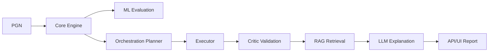

# Consolidated Architecture

## Principle

LLM never decides. LLM only explains evidence.

## Evidence Sources

- Stockfish
- ML
- RAG
- validation rules

## Logical Flow

## Layered View

| Layer | Responsibility |
| --- | --- |
| core-engine | deterministic chess analysis |
| ml | prediction and ranking models |
| orchestration | execution order and safeguards |
| rag-llm | grounded natural language explanations |
| api/ui | user-facing contracts and rendering |
| observability/devops/testing | reliability and operations |
