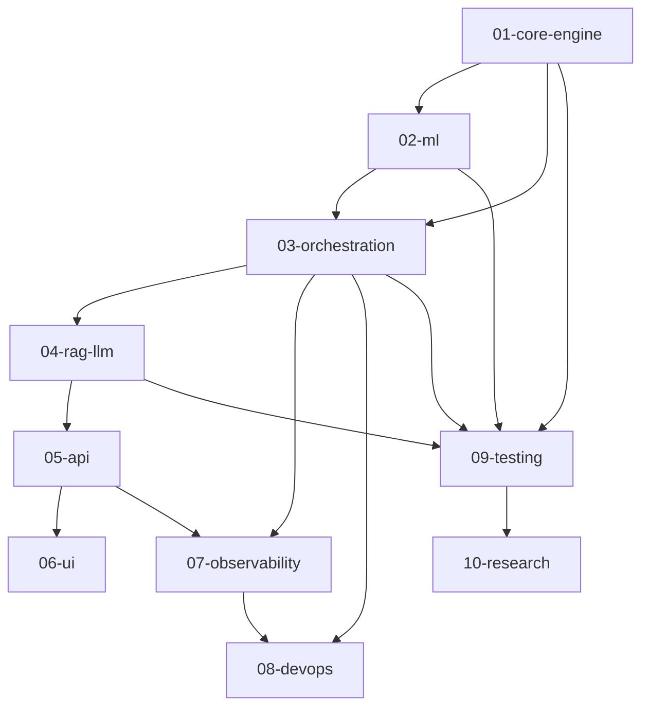

# Module Dependency Document

## Domain Dependencies

## Policy

- Higher-level domains cannot bypass critical validation in orchestration.
- RAG/LLM can consume evidence but cannot mutate engine truth.
- Testing dependencies are mandatory before phase closure.
