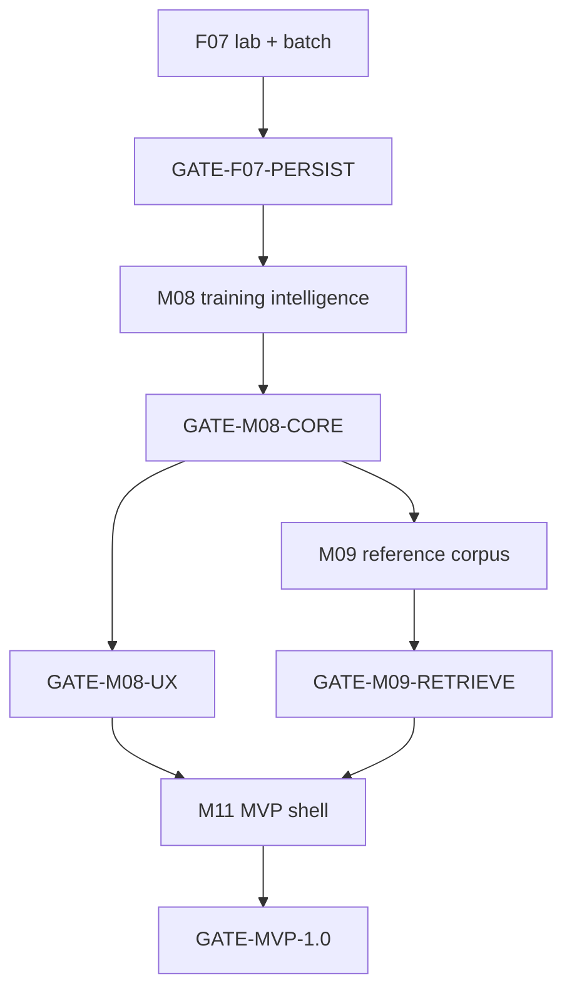

# Module 08+ MVP Product Roadmap — ChessInsight (React + Vite + FastAPI)

> **Punto de entrada global (estado + mapa de todos los roadmaps):** [00_roadmap_index.md](./00_roadmap_index.md)

## Objective

Deliver the **production MVP** defined in [6.6.7](./00-ai_enginner_course_roadmap.md) (longitudinal player diagnosis + actionable training), operationalized by:

- [prompt-cursor-01-debilidades-y-puzzles-1.md](./prompt-cursor-01-debilidades-y-puzzles-1.md) — themes, weakness ranking, personalized puzzles, React UI
- [prompt-cursor-02-base-indexada-de-partidas.md](./prompt-cursor-02-base-indexada-de-partidas.md) — licensed reference corpus, model-game retrieval

**Out of scope for this epic:** the standalone [LS01](../lichess_statistics/01_module_implementation_plan.md) portable tool (SQLite CLI). It may **export** into product ingest later; it is not the MVP core.

**Engine of record per position:** [07_module_implementation_plan.md](./07_module_implementation_plan.md) (`F07-*` in `docs/ai_chess_coach_course/analysis/`). Module 08 **persists and exposes** that evidence in PostgreSQL; it does not replace F07 logic with ad-hoc aggregators.

**Last status update:** 2026-09-23 (roadmap created; no F08 items started).

### Current progress

| Area | Status | Notes |
|---|---|---|
| F07 P0 lab slice | ✅ Done | Import, eval loss, criticality, MultiPV, comparison, review pack — see 07 plan table |
| 6.6 GATE | 🟡 Partial | HITL / product reset not closed; see **GATE-MVP-PRAGMATIC** below |
| Product ingest | ✅ Done | `src/modules/player_ingest.py` → PostgreSQL `games` |
| FastAPI shell | 🟡 Partial | `src/api/` routers (import, analysis, exercises stub) |
| React + Vite | 🟡 Partial | `ChessinsightBoard.jsx`; no weaknesses/puzzle pages |
| M08 Training intelligence (F08-001+) | ⬜ Todo | This document |
| M09 Reference corpus (F09-001+) | ⬜ Todo | Blocked on stable `theme_code` v1 |
| M10 Knowledge RAG (legacy 7.2) | 🔒 Todo | After GATE-7.1; not merged with M09 |
| M11 MVP shell pages | 🟡 In progress | **Priority:** Module 07 end-user slice (§13) before full M08 weakness UI |
| F07 branches 017–023 | ✅ Done on branch stack | **Merge to `main`** before product implementation (locked) |

## Principles

- One catalog id per git branch: **`feature/08_<id>_<short_slug>`** (example: `feature/08_003_theme_outcome_model`). Same rule for M09: **`feature/09_<id>_<slug>`**.
- Do not bundle multiple F08/F09 ids on one branch (see [.cursor/rules/roadmap-branches.mdc](../../.cursor/rules/roadmap-branches.mdc)).
- Theme labels require **structured evidence** (`detector`, `detector_version`, `evidence` JSON). LLM may explain or break ties only — never sole label source (Prompt 01).
- UI reads **precomputed** rankings and puzzles; no Stockfish on interactive request paths.
- Reuse `coaching/diagnosis/detectors/` and `analysis/*` before writing parallel detectors.
- **React + Vite** for product UI; Streamlit only for internal/admin if ever needed (Prompt 02 UI target is React, not Streamlit).
- Reference corpus (M09): no Mega Database / CT-ART ingestion; CC0 and audited sources only (Prompt 02).

## Locked decisions (2026-09-23)

| Topic | Decision |
|---|---|
| MVP stack | PostgreSQL + SQLAlchemy + FastAPI + React (Vite) |
| Per-position truth | F07 pipeline outputs → persisted rows + JSON evidence |
| Longitudinal + themes | Module **M08** (F08-*), not LS01 SQLite |
| Model games | Module **M09** (F09-*), separate from **M10** textbook RAG (old 7.2) |
| Branch naming | `feature/08_*` / `feature/09_*` from numeric id in this catalog |
| LS01 | Optional export adapter (F08-018); never required for MVP gates |
| Username | **Per game:** match importer handle to PGN `[White]` / `[Black]`; persist on each `module07_*` game row |
| Persistence (interim) | PostgreSQL tables prefixed **`module07_*`**; unify with legacy `games` / F08 stores in a later migration |
| F07 on `main` | **Merge** the stacked `feature/07_*` branches (through F07-023) before building the MVP UI |
| Stockfish job defaults | **Depth 12**, **MultiPV 3**; both overridable per analysis job (env + job payload) |
| Near-term product goal | **End-user MVP UI:** import PGN → analysis queue → decision review (board + review pack + mental model tabs) |

## 1. Module breakdown

| Module | Code prefix | Responsibility | Primary deliverable |
|---|---|---|---|
| **M08** | F08-* | Training intelligence | Themes, opp/success/failure, weakness scores, puzzles, attempts, REST + React |
| **M09** | F09-* | Reference corpus | Licensed sources, canonical positions, signatures, model-game search |
| **M10** | F10-* (doc only) | Knowledge RAG | Chunks/embeddings — **defer**; see [06x_07x_roadmap](./06x_07x_roadmap_modules_and_tasks.md) §7.2 |
| **M11** | F11-* | MVP shell | Import queue, analysis status, navigation, API contracts for frontend |

## 2. Gates

Gates are cumulative unless noted.

| Gate | Meaning | Minimum to pass |
|---|---|---|
| **GATE-F07-PERSIST** | F07 results in product DB | ≥1 real game: critical plies + MultiPV comparison + review-pack-shaped JSON stored per user game |
| **GATE-MVP-PRAGMATIC** | Unblock UI without full 6.6 | ≥5 review packs human-spot-checked; abstention policy documented; no LLM-as-fact in API responses |
| **GATE-M08-CORE** | Prompt 01 core | Taxonomy v1 + detections with evidence + weakness ranking on fixture user + idempotent re-run |
| **GATE-M08-UX** | Prompt 01 UI | React weaknesses table + one puzzle session with attempts persisted |
| **GATE-M09-CORPUS** | Prompt 02 ingest | Approved source + idempotent batch + canonical positions + attribution |
| **GATE-M09-RETRIEVE** | Prompt 02 retrieval | Model-game query for one `theme_code` + Dragon golden case (positive + contrast) |
| **GATE-7.1** (unchanged) | Diagnosis quality | From 06x doc — required before **M10** RAG |
| **GATE-MVP-1.0** | Shippable demo | M11 pages + M08-UX + player ingest + batch analysis job |



## 3. Dependencies on F07 and 6.x

| F08/F09 item | Requires (F07 or other) |
|---|---|
| F08-001 | F07-001, F07-003, F07-005 (DTO shapes) |
| F08-002 | F07-006, F07-012, F07-013, F07-014, F07-019 |
| F08-003 | F08-002 + detectors (reuse coaching tactical) |
| F08-004 | F08-003 |
| F08-005 | F08-004 |
| F08-006–008 | F08-005 |
| F08-009–011 | F08-006, F07-035 JSON contract |
| F08-012–014 | F08-008 |
| F08-015–017 | F08-012 |
| F09-005 | F08-001 (`theme_code` registry) |
| F09-006–008 | F09-003, F09-004, F08-004 (user weakness as query input) |

**Recommended F07 backlog before heavy M08 UI:** F07-038 (golden dataset), F07-036 (player confirmation schema), F08-001 (persistence) in parallel.

## 4. Feature catalog — M08 (F08-*)

### Status legend

| Status | Meaning |
|---|---|
| ⬜ Todo | Not started |
| 🟡 In Progress | Branch open |
| 🧪 In Testing | PR / QA |
| ❌ Canceled | Superseded |
| ✅ Done | Accepted |

### 08.0 — Product persistence bridge (F07 → PostgreSQL)

| ID | Feature | Input | Verifiable output | Priority | Status | Branch slug (example) |
|---|---|---|---|---|---|---|
| F08-001 | Critical decision rows | Analyzed game + player | Table(s): game_id, ply, fen_before, played_move, eval POV, cp_loss, phase, criticality, comparison JSON | P0 | ⬜ | `08_001_critical_decision_store` |
| F08-002 | Batch game analysis job | game_id list, user | Job status; all Relevant+ plies processed idempotently | P0 | ⬜ | `08_002_batch_analysis_job` |
| F08-003 | Review pack attachment | F07-035 payload | Same JSON stored or linked per ply; version field | P1 | ⬜ | `08_003_review_pack_persist` |

### 08.1 — Theme taxonomy and detection

| ID | Feature | Input | Verifiable output | Priority | Status | Branch slug |
|---|---|---|---|---|---|---|
| F08-004 | ThemeDefinition registry | YAML/JSON seed | Versioned tree; stable `theme_code`; localizable labels | P0 | ⬜ | `08_004_theme_registry` |
| F08-005 | Hybrid detector pipeline | FEN + move + MultiPV | `PositionThemeDetection` rows with evidence JSON | P0 | ⬜ | `08_005_theme_detection_pipeline` |
| F08-006 | MVP detector set | Critical plies | pin, fork, remove_defender, skewer, discovered_attack, hanging_piece | P0 | ⬜ | `08_006_mvp_tactical_detectors` |
| F08-007 | Detector idempotency | Re-run labeling | Same ply + detector_version → upsert, no duplicates | P0 | ⬜ | `08_007_detection_idempotency` |

### 08.2 — Opportunity / success / failure

| ID | Feature | Input | Verifiable output | Priority | Status | Branch slug |
|---|---|---|---|---|---|---|
| F08-008 | Theme outcome classifier | Detection + played vs best | `opportunity` \| `success` \| `failure` \| `not_applicable` per theme | P0 | ⬜ | `08_008_theme_outcome_model` |
| F08-009 | Outcome evidence rules | Motor PV + rules | Documented predicates; no outcome without verifiable PV/rule hook | P0 | ⬜ | `08_009_outcome_evidence` |

### 08.3 — Weakness ranking

| ID | Feature | Input | Verifiable output | Priority | Status | Branch slug |
|---|---|---|---|---|---|---|
| F08-010 | UserThemeScore materialization | Outcomes + cp_loss + dates | Score 0–100; beta-binomial or equivalent; winsorized severity | P0 | ⬜ | `08_010_weakness_scoring` |
| F08-011 | Ranking filters | user, period, phase, eco, color | API-ready DTO; trend vs previous period | P1 | ⬜ | `08_011_weakness_filters` |
| F08-012 | Scoring doc + fixtures | Numeric examples | Markdown formula + pytest golden counts | P0 | ⬜ | `08_012_scoring_documentation` |

### 08.4 — Personalized puzzles

| ID | Feature | Input | Verifiable output | Priority | Status | Branch slug |
|---|---|---|---|---|---|---|
| F08-013 | Puzzle generation | failure + clear best move | TrainingPuzzle: fen, solution PV, links game/ply/theme | P0 | ⬜ | `08_013_puzzle_generation` |
| F08-014 | Puzzle validation | Candidate puzzle | Stockfish legality + eval threshold; reject ambiguous | P0 | ⬜ | `08_014_puzzle_validation` |
| F08-015 | Dedup by position hash | Corpus of puzzles | Normalized FEN hash uniqueness | P1 | ⬜ | `08_015_puzzle_dedup` |
| F08-016 | PuzzleAttempt + states | User session | pending → presented → solved/failed; attempts, time | P0 | ⬜ | `08_016_puzzle_attempts` |
| F08-017 | SRS-ready fields | Attempt history | Fields for future spacing; no full SM-2 required in MVP | P2 | ⬜ | `08_017_srs_fields` |

### 08.5 — API and external catalog

| ID | Feature | Input | Verifiable output | Priority | Status | Branch slug |
|---|---|---|---|---|---|---|
| F08-018 | LS01 export adapter | profile JSON / stats export | Optional ingest into F08 tables; mapping doc | P2 | ⬜ | `08_018_ls01_export_adapter` |
| F08-019 | ExternalTrainingResource | Config rows | Chess King / CT-ART **links only**; no embedded content | P2 | ⬜ | `08_019_external_resource_catalog` |
| F08-020 | REST: taxonomy | — | List themes, versions | P0 | ⬜ | `08_020_api_taxonomy` |
| F08-021 | REST: weaknesses + evidence | filters | Paginated ranking + drill-down positions | P0 | ⬜ | `08_021_api_weaknesses` |
| F08-022 | REST: puzzles + attempts | session | Generate queue, POST attempt | P0 | ⬜ | `08_022_api_puzzles` |

### 08.6 — React UI (M08)

| ID | Feature | Input | Verifiable output | Priority | Status | Branch slug |
|---|---|---|---|---|---|---|
| F08-023 | Weaknesses dashboard | API | Sortable table, period selector, phase/eco/color filters | P0 | ⬜ | `08_023_ui_weaknesses` |
| F08-024 | Theme detail view | theme_code | Trend, example positions from own games | P1 | ⬜ | `08_024_ui_theme_detail` |
| F08-025 | Puzzle session page | ChessinsightBoard | Practice flow + external resource link | P0 | ⬜ | `08_025_ui_puzzle_session` |

## 5. Feature catalog — M09 (F09-*)

**Start M09 only after F08-004 freezes `theme_code` v1** (at least MVP tactical set).

### 09.0 — Provenance and import

| ID | Feature | Input | Verifiable output | Priority | Status | Branch slug |
|---|---|---|---|---|---|---|
| F09-001 | GameSource registry | Admin config | License fields; `ingestion_status`; reject unapproved | P0 | ⬜ | `09_001_game_source_registry` |
| F09-002 | ImportBatch + streaming PGN | Approved file | Checkpoints, counts, sha256, idempotent re-import | P0 | ⬜ | `09_002_pgn_import_batch` |
| F09-003 | ReferenceGame dedupe | movetext hash | Duplicate games collapsed; comments stripped per policy | P0 | ⬜ | `09_003_reference_game_dedupe` |
| F09-004 | Quarantine invalid games | Bad PGN | Rejected rows + error report | P1 | ⬜ | `09_004_import_quarantine` |

### 09.1 — Position index

| ID | Feature | Input | Verifiable output | Priority | Status | Branch slug |
|---|---|---|---|---|---|---|
| F09-005 | CanonicalPosition + Zobrist | FEN | 64-bit hash + FEN verify on collision | P0 | ⬜ | `09_005_canonical_position` |
| F09-006 | ReferenceGamePosition | ply linkage | Appearances with optional eval + themes | P0 | ⬜ | `09_006_position_appearances` |
| F09-007 | PostgreSQL indexes | Query plan | Documented indexes for hash, eco, elo, source, theme | P0 | ⬜ | `09_007_position_indexes` |

### 09.2 — Structural similarity

| ID | Feature | Input | Verifiable output | Priority | Status | Branch slug |
|---|---|---|---|---|---|---|
| F09-008 | PositionSignature v1 | FEN | Versioned feature vector (pawns, king, material, …) | P0 | ⬜ | `09_008_position_signature` |
| F09-009 | Similarity search | signature + weights | Top-K similar; explainable distance breakdown | P1 | ⬜ | `09_009_similarity_search` |
| F09-010 | Theme tag on corpus | F08-005 jobs | PositionTheme on reference positions (batch) | P1 | ⬜ | `09_010_corpus_theme_labeling` |

### 09.3 — Model-game retrieval

| ID | Feature | Input | Verifiable output | Priority | Status | Branch slug |
|---|---|---|---|---|---|---|
| F09-011 | ModelGameMatch query | user weakness + filters | Ranked games + `reasons[]` JSON | P0 | ⬜ | `09_011_model_game_query` |
| F09-012 | Ranking formula | Config weights | Documented score: similarity, theme_match, execution_quality, diversity | P0 | ⬜ | `09_012_model_game_ranking` |
| F09-013 | Dragon golden case | theme + eco filter | ≥1 positive g5!, ≥1 contrast premature g5? | P0 | ⬜ | `09_013_dragon_golden_case` |
| F09-014 | Selective Stockfish on candidates | Prefiltered plies | Job-only analysis; store engine version | P1 | ⬜ | `09_014_corpus_engine_jobs` |

### 09.4 — API and React (M09)

| ID | Feature | Input | Verifiable output | Priority | Status | Branch slug |
|---|---|---|---|---|---|---|
| F09-015 | REST: sources + import status | Admin | CRUD sources; batch progress | P1 | ⬜ | `09_015_api_corpus_admin` |
| F09-016 | REST: model games | weakness query | Paginated results + explanation payload | P0 | ⬜ | `09_016_api_model_games` |
| F09-017 | UI: model game browser | API | Board at critical ply; attribution link; contrast badges | P1 | ⬜ | `09_017_ui_model_games` |

## 6. Feature catalog — M11 MVP shell (F11-*)

| ID | Feature | Input | Verifiable output | Priority | Status | Branch slug |
|---|---|---|---|---|---|---|
| F11-001 | OpenAPI contract v1 | M08/M09 routes | Published schema; frontend types | P0 | ⬜ | `11_001_openapi_contract` |
| F11-002 | Import / sync page | player_ingest | Trigger sync; show last ingest report | P0 | ⬜ | `11_002_ui_import_sync` |
| F11-003 | Analysis queue page | F08-002 jobs | Pending / running / failed games | P0 | ⬜ | `11_003_ui_analysis_queue` |
| F11-004 | App shell + nav | Routes | Weaknesses, practice, model games (when ready) | P0 | ⬜ | `11_004_ui_app_shell` |
| F11-005 | Auth boundary | JWT existing | User isolation on all F08/F09 endpoints | P0 | ⬜ | `11_005_auth_isolation_audit` |
| F11-006 | Decision review page | F07 review pack + mental model JSON | Board at ply; Motor vs Mental 1600; candidate list; criticality | P0 | ⬜ | `11_006_ui_decision_review` |

## 7. Suggested sprint order

| Sprint | Focus | Catalog ids |
|---|---|---|
| **S0** | **Module 07 end-user MVP** | Merge F07 → `main`; `module07_*` schema; ingest + jobs; F11-004, F11-002, F11-003, F11-006 |
| S1 | Persist F07 (longitudinal) | F08-001, F08-002, F08-003 |
| S2 | Themes MVP | F08-004, F08-005, F08-006, F08-007 |
| S3 | Outcomes + score | F08-008, F08-009, F08-010, F08-012 |
| S4 | API core | F08-020, F08-021 |
| S5 | Puzzles | F08-013, F08-014, F08-016, F08-022 |
| S6 | React M08 | F08-023, F08-025 |
| S7 | M11 shell | F11-004, F11-002, F11-003, F11-005 |
| S8 | Corpus ingest | F09-001, F09-002, F09-003, F09-005, F09-006 |
| S9 | Retrieval | F09-008, F09-011, F09-012, F09-013, F09-016 |
| S10 | Polish | F08-024, F09-017, F08-011, F11-001 |

## 8. Tests (minimum per module)

| Module | Path pattern | Examples |
|---|---|---|
| M08 | `tests/mvp/test_f08_*.py` | detector evidence, outcome rules, scoring regression, puzzle legality, API auth |
| M09 | `tests/mvp/test_f09_*.py` | idempotent import, zobrist collision check, dragon retrieval, diversity |
| M11 | `tests/mvp/test_f11_*.py` | contract smoke, route guards |

Reuse PGN/FEN fixtures from `docs/ai_chess_coach_course/data/games/` and F07 golden cases when F07-038 exists.

## 9. Documentation deliverables

| ID | Document | When |
|---|---|---|
| F08-D01 | `08_theme_taxonomy_v1.yaml` | With F08-004 |
| F08-D02 | `08_weakness_scoring.md` | With F08-012 |
| F08-D03 | `08_api_contract.md` | With F08-020 |
| F09-D01 | `09_corpus_licenses.md` | With F09-001 |
| F09-D02 | `09_model_game_ranking.md` | With F09-012 |
| F08-D04 | Cross-link from [07_module_implementation_plan.md](./07_module_implementation_plan.md) §10 Product bridge | ✅ Linked |

## 10. Relationship to other roadmaps

| Document | Relationship |
|---|---|
| **[00_roadmap_index.md](./00_roadmap_index.md)** | **Hub:** estado P0/P1, leyenda In Testing, mapa “qué doc abrir” |
| [07_module_implementation_plan.md](./07_module_implementation_plan.md) | Upstream per-position engine (F07) |
| [06x_07x_roadmap_modules_and_tasks.md](./06x_07x_roadmap_modules_and_tasks.md) | 6.6 gates, 7.1 diagnosis, **7.2 RAG → M10** (not M09) |
| [00-ai_enginner_course_roadmap.md](./00-ai_enginner_course_roadmap.md) | Modules 12–13 superseded by **M11** React-first |
| [LS01 plan](../lichess_statistics/01_module_implementation_plan.md) | Side tool; optional F08-018 only |
| Prompt 01 / 02 | Product requirements traceability for M08 / M09 |

## 11. First implementable increment (MVP thin slice)

Goal: one user, few games, visible weakness list, one puzzle — no corpus yet.

Included features:

- [ ] F08-001 — Critical decision store
- [ ] F08-002 — Batch analysis job
- [ ] F08-004 — Theme registry (MVP codes only)
- [ ] F08-005, F08-006 — Detection on critical plies
- [ ] F08-008 — Outcomes
- [ ] F08-010 — Weakness score (simplified weights OK if documented)
- [ ] F08-020, F08-021 — API
- [ ] F08-023 — Weaknesses UI
- [ ] F11-004 — Minimal app shell

Out of scope for first increment:

- M09 entire module
- F08-017 SRS
- F08-019 external catalog
- M10 RAG
- Full CT-ART taxonomy tree

**Completion criterion (GATE-MVP-PRAGMATIC + partial GATE-M08-CORE):** imported games → job → API weakness list matches fixture expectations → React table renders → one puzzle generated from a known blunder ply.

> **Note:** §11 remains the **training-intelligence** MVP (weaknesses + puzzle). The **first shippable UI for beta testers** is §13 (decision review only); S0 precedes S1.

## 12. Commands (when implemented)

```powershell
# Module 08 tests
pytest tests/mvp/test_f08_*.py -q

# Module 09 tests
pytest tests/mvp/test_f09_*.py -q

# F07 regression (stay green)
pytest tests/docs_courses/test_f07_*.py -q

# Module 07 product API smoke (when implemented)
pytest tests/mvp/test_module07_*.py -q
```

---

## 13. Addendum — Module 07 end-user MVP (2026-09-23)

**Objective:** A non-developer can **upload a multi-game PGN**, confirm **which side they played** (username matched per game from headers), **queue Stockfish analysis**, and **step through critical decision points** in the browser with the same evidence the lab produces (F07-017–023 fields, criticality, comparison, mental model).

This slice **does not** require F08 theme detection, weakness scores, or M09 corpus. It **does** require F07 on `main` and PostgreSQL persistence under **`module07_*`** (unification with `games` / F08-001 later).

### 13.1 User journey (acceptance)

1. **Import** — Paste PGN or upload file; parse **all** games (product layer; F07 `import_game_from_file` today reads first game only).
2. **Identify player** — For each game, set or confirm username (must match `[White]` or `[Black]`).
3. **Analyze** — Submit batch; UI shows pending / running / failed (F11-003 pattern).
4. **Review** — Open a game → list of critical plies (threshold from F07 criticality) → **F11-006** detail: `ChessinsightBoard`, played vs candidates, tabs **Motor** (engine/review pack) and **Mental 1600** (`assess_decision_point` output).

**Done when:** one real PGN (e.g. mixed handles) completes end-to-end on staging/local without pytest or notebooks.

### 13.2 Backend (minimal)

| Piece | Responsibility |
|---|---|
| `module07_games` | `id`, user scope, PGN blob or hash, white/black headers, **player_username**, ingest metadata |
| `module07_analysis_jobs` | Status, **depth** (default 12), **multipv** (default 3), error text, timestamps |
| `module07_decision_points` | `game_id`, ply, fen, criticality, **review_pack JSON**, **mental_model JSON** |
| Worker | Off request path: run F07 pipeline → `build_review_pack` + mental model per critical ply; persist rows |
| FastAPI | `/api/v1/module07/ingest`, `.../jobs`, `.../games`, `.../games/{id}/decisions`, `.../decisions/{id}` |

Reuse `docs/ai_chess_coach_course/analysis/*` and `mental_model/` — no duplicate eval logic in `src/`.

### 13.3 Frontend (minimal)

| Page | Catalog | Notes |
|---|---|---|
| App shell + nav | F11-004 | Import, Queue, (placeholder for later Weaknesses) |
| Import | F11-002 | PGN text/file; username; triggers ingest |
| Analysis queue | F11-003 | Poll job status |
| Decision review | **F11-006** | Props per [ui/chessinsight_board/CONTRACT.md](./ui/chessinsight_board/CONTRACT.md) |

Auth: reuse existing JWT; **F11-005** audit can trail S0 if single-user dev mode is gated.

### 13.4 Engineering order

1. Merge **`feature/07_*`** stack into **`main`** (through F07-023).
2. Alembic migration for `module07_*`.
3. Ingest + job enqueue + worker (defaults: depth 12, MultiPV 3).
4. React pages F11-004 → F11-002 → F11-003 → F11-006.
5. Smoke tests `tests/mvp/test_module07_*.py` + keep `test_f07_*` green.

### 13.5 Explicitly out of scope (S0)

- F08-004+ theme registry and weakness ranking UI (§11)
- M09 model games
- LS01 SQLite as source of truth
- Stockfish on interactive GET requests

---

## References

| Artifact | Use |
|---|---|
| [prompt-cursor-01-debilidades-y-puzzles-1.md](./prompt-cursor-01-debilidades-y-puzzles-1.md) | M08 acceptance criteria source |
| [prompt-cursor-02-base-indexada-de-partidas.md](./prompt-cursor-02-base-indexada-de-partidas.md) | M09 acceptance criteria source |
| [ui/chessinsight_board/CONTRACT.md](./ui/chessinsight_board/CONTRACT.md) | Board props for F08-025 / F09-017 |
