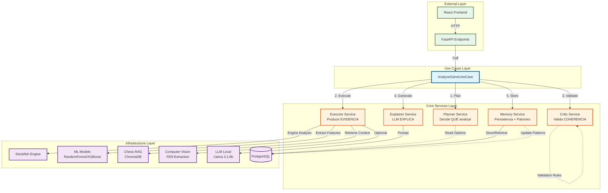
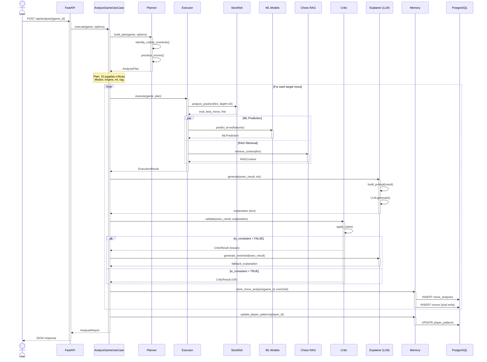
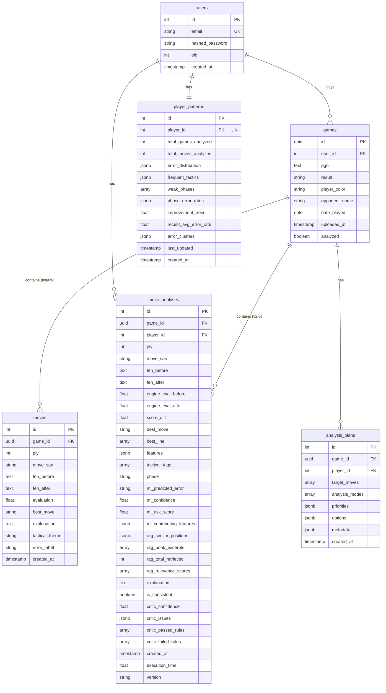
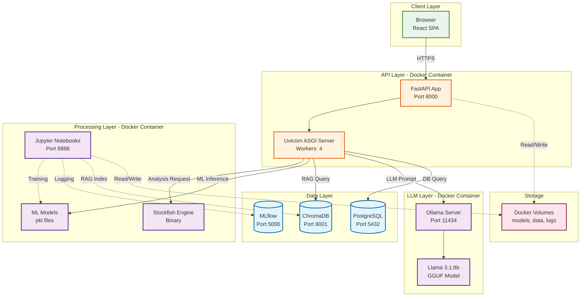
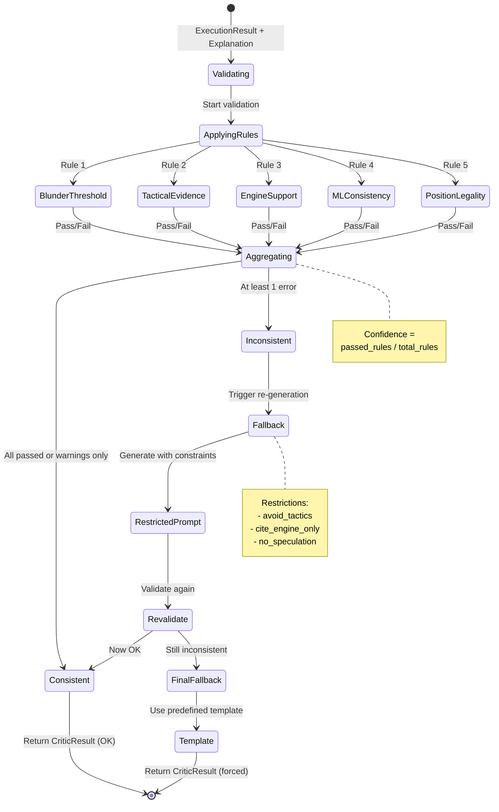
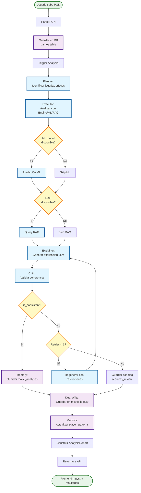
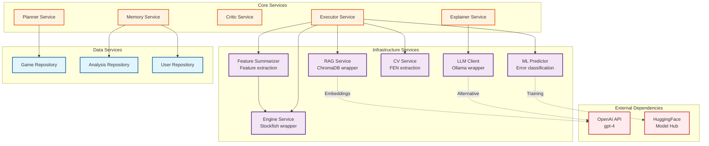

# Fase 0 - Diagramas de Arquitectura

**Fecha:** Marzo 25, 2026  
**Versión:** 1.0  
**Estado:** En Desarrollo  
**Issue:** [#85](https://github.com/cmessoftware/chess_trainer/issues/85)

---

## Objetivo

Visualizar la Arquitectura Orquestada mediante diagramas técnicos que faciliten la comprensión del sistema y la implementación de las siguientes fases.

**Tipos de diagramas:**
1. Diagrama de Componentes (Alto nivel)
2. Diagrama de Secuencia (Flujo AnalyzeGameUseCase)
3. Diagrama de Flujo de Datos
4. Diagrama de Base de Datos
5. Diagrama de Despliegue

---

## 1. Diagrama de Componentes (Alto Nivel)



**Leyenda:**
- **Sólido (→):** Dependencia directa / flujo de datos
- **Punteado (-.->):** Consulta / lectura sin modificación
- **Colores:**
  - 🔵 Azul: Use Cases
  - 🟠 Naranja: Servicios Core
  - 🟣 Púrpura: Infraestructura
  - 🟢 Verde: External Layer

---

## 2. Diagrama de Secuencia (AnalyzeGameUseCase)



---

## 3. Diagrama de Flujo de Datos (Data Flow)

```mermaid
graph LR
    subgraph Input
        Game[Game<br/>PGN + Metadata]
        Options[AnalysisOptions<br/>depth, modes, ELO]
    end
    
    subgraph "Planner"
        P1[Identify Critical<br/>Moments]
        P2[Prioritize Moves]
        P3[Define Modes]
    end
    
    subgraph "Executor"
        E1[Engine Analysis]
        E2[Feature Extraction]
        E3[ML Prediction]
        E4[RAG Retrieval]
    end
    
    subgraph "Critic"
        C1[Apply Validation<br/>Rules]
        C2[Check Consistency]
        C3[Generate Issues]
    end
    
    subgraph "Explainer"
        X1[Build Prompt]
        X2[LLM Generate]
        X3[Adapt to ELO]
    end
    
    subgraph Output
        Report[AnalysisReport<br/>EnrichedResults]
        DB1[(move_analyses)]
        DB2[(player_patterns)]
    end
    
    %% Flow
    Game --> P1
    Options --> P1
    P1 --> P2
    P2 --> P3
    P3 -->|AnalysisPlan| E1
    
    E1 -->|Engine Data| E2
    E2 -->|Features| E3
    E1 -.->|Position| E4
    
    E3 -->|ExecutionResult| C1
    E4 -->|ExecutionResult| C1
    
    C1 --> C2
    C2 --> C3
    
    E3 -->|ExecutionResult| X1
    X1 --> X2
    Options -.->|ELO| X3
    X2 --> X3
    
    C3 -->|CriticResult| Report
    X3 -->|Explanation| Report
    
    Report --> DB1
    Report --> DB2
    
    %% Styling
    classDef input fill:#e8f5e9,stroke:#2e7d32
    classDef process fill:#fff3e0,stroke:#e65100
    classDef output fill:#e1f5ff,stroke:#01579b
    
    class Game,Options input
    class P1,P2,P3,E1,E2,E3,E4,C1,C2,C3,X1,X2,X3 process
    class Report,DB1,DB2 output
```



---

## 4. Diagrama de Base de Datos (Schema v2.0)



**Relaciones Clave:**
- `users` → `games` (1:N)
- `users` → `move_analyses` (1:N)
- `users` ↔ `player_patterns` (1:1)
- `games` → `moves` (1:N, legacy)
- `games` → `move_analyses` (1:N, v2.0)

**Índices Importantes:**
- `move_analyses`: `(game_id, ply)`, `(player_id, created_at DESC)`, `(version)`
- `player_patterns`: `(player_id)` UNIQUE

---

## 5. Diagrama de Despliegue (Deployment)



**Puertos Expuestos:**
- `8000`: FastAPI (producción)
- `8888`: Jupyter Notebooks (desarrollo)
- `5432`: PostgreSQL
- `8001`: ChromaDB
- `5000`: MLflow
- `11434`: Ollama

---

## 6. Diagrama de Estados del Critic



---

## 7. Diagrama de Ciclo de Vida de Análisis



---

## 8. Diagrama de Migración de Base de Datos

```mermaid
graph TB
    subgraph "Estado Inicial (v1.0)"
        Legacy[Tabla moves<br/>ACTIVA]
    end
    
    subgraph "Fase 1: Agregar Tablas (Día 1)"
        F1A[Ejecutar Alembic migration]
        F1B[Crear move_analyses]
        F1C[Crear player_patterns]
        F1D[Legacy sigue funcionando]
    end
    
    subgraph "Fase 2: Dual Write (Semana 1-2)"
        F2A[Flag: ENABLE_DUAL_WRITE=true]
        F2B[Escribir en move_analyses]
        F2C[Escribir en moves legacy]
        F2D[100% redundancia]
    end
    
    subgraph "Fase 3: Dual Read (Semana 3-4)"
        F3A[Flag: PREFER_VERSION=v2.0]
        F3B[Leer de move_analyses]
        F3C[Fallback a moves si vacío]
        F3D[Frontend sin cambios]
    end
    
    subgraph "Fase 4: Migración Histórica (Semana 5-6)"
        F4A[Script: migrate_legacy_to_v2.py]
        F4B[Lotes de 1000 registros]
        F4C[Adaptar formato legacy]
        F4D[Marcar: version='v1.0-migrated']
    end
    
    subgraph "Fase 5: Deprecar (Mes 4)"
        F5A[Verificar: 0 lecturas en moves]
        F5B[Renombrar: moves_legacy_deprecated]
        F5C[Exportar backup CSV]
        F5D[DROP después de 90 días]
    end
    
    subgraph "Estado Final (v2.0)"
        NewDB[Solo move_analyses<br/>ACTIVA]
    end
    
    Legacy --> F1A
    F1A --> F1B
    F1B --> F1C
    F1C --> F1D
    
    F1D --> F2A
    F2A --> F2B
    F2B --> F2C
    F2C --> F2D
    
    F2D --> F3A
    F3A --> F3B
    F3B --> F3C
    F3C --> F3D
    
    F3D --> F4A
    F4A --> F4B
    F4B --> F4C
    F4C --> F4D
    
    F4D --> F5A
    F5A --> F5B
    F5B --> F5C
    F5C --> F5D
    
    F5D --> NewDB
    
    %% Styling
    classDef legacy fill:#ffcdd2,stroke:#c62828,stroke-width:2px
    classDef migration fill:#fff9c4,stroke:#f57f17,stroke-width:2px
    classDef new fill:#c8e6c9,stroke:#2e7d32,stroke-width:2px
    
    class Legacy legacy
    class F1A,F1B,F1C,F1D,F2A,F2B,F2C,F2D,F3A,F3B,F3C,F3D,F4A,F4B,F4C,F4D,F5A,F5B,F5C,F5D migration
    class NewDB new
```



**Cronograma:**
- ⏱️ Fase 1: 1 día (bajo riesgo)
- ⏱️ Fase 2: 1-2 semanas (bajo riesgo)
- ⏱️ Fase 3: 1-2 semanas (medio riesgo)
- ⏱️ Fase 4: 2 semanas (alto riesgo, opcional)
- ⏱️ Fase 5: 3-4 meses después (muy alto riesgo)

---

## 9. Diagrama de Dependencias de Servicios



**Dependencias Externas:**
- **OpenAI API:** Embeddings para RAG (opcional: usar sentence-transformers local)
- **HuggingFace:** Pre-trained models para fine-tuning (Fase 4)

**Dependencias Internas:**
- Executor tiene más dependencias (Engine, Features, ML, RAG, CV)
- Planner es independiente (solo lee opciones)
- Critic no tiene dependencias infraestructurales (solo reglas)

---

## 10. Diagrama de Feature Flags y Rollback

```mermaid
graph LR
    subgraph "Production Environment"
        Env[.env file]
    end
    
    subgraph "Feature Flags"
        F1[ENABLE_ORCHESTRATED_ANALYSIS<br/>true/false]
        F2[ENABLE_DUAL_WRITE<br/>true/false]
        F3[PREFER_VERSION<br/>v1.0/v2.0]
        F4[ENABLE_LEGACY_MIGRATION<br/>true/false]
    end
    
    subgraph "API Behavior"
        Route[/api/analysis endpoint]
    end
    
    subgraph "Version Selection"
        V1[Legacy Flow<br/>LLMAnalysisService]
        V2[Orchestrated Flow<br/>AnalyzeGameUseCase]
    end
    
    subgraph "Database Writes"
        W1[Write to moves only]
        W2[Write to both tables]
        W3[Write to move_analyses only]
    end
    
    subgraph "Database Reads"
        R1[Read from moves only]
        R2[Read v2.0, fallback v1.0]
        R3[Read from move_analyses only]
    end
    
    Env --> F1
    Env --> F2
    Env --> F3
    Env --> F4
    
    F1 -->|true| Route
    F1 -->|false| Route
    
    Route -->|F1=true| V2
    Route -->|F1=false| V1
    
    V2 --> CheckF2{F2?}
    CheckF2 -->|true| W2
    CheckF2 -->|false| W3
    
    V1 --> W1
    
    Route --> CheckF3{F3?}
    CheckF3 -->|v2.0| R2
    CheckF3 -->|v1.0| R1
    
    %% Rollback path
    V2 -.->|Error| Rollback[Rollback Steps]
    Rollback --> SetF1False[Set F1=false]
    SetF1False --> RestartAPI[Restart API]
    RestartAPI --> V1
    
    %% Styling
    classDef config fill:#fff9c4,stroke:#f57f17,stroke-width:2px
    classDef flag fill:#e1f5ff,stroke:#01579b,stroke-width:2px
    classDef version fill:#f3e5f5,stroke:#4a148c,stroke-width:2px
    classDef db fill:#c8e6c9,stroke:#2e7d32,stroke-width:2px
    classDef rollback fill:#ffcdd2,stroke:#c62828,stroke-width:2px,stroke-dasharray: 5 5
    
    class Env config
    class F1,F2,F3,F4 flag
    class V1,V2,Route version
    class W1,W2,W3,R1,R2,R3 db
    class Rollback,SetF1False,RestartAPI rollback
```

**Rollback en Producción:**
1. Detectar error en v2.0
2. `export ENABLE_ORCHESTRATED_ANALYSIS=false`
3. `systemctl restart chess_trainer_api`
4. Sistema vuelve a v1.0 (legacy)
5. Datos NO se pierden (dual write los protege)

---

## Resumen de Diagramas

| Diagrama | Propósito | Audiencia |
|----------|-----------|-----------|
| **1. Componentes** | Vista general de arquitectura | Todos |
| **2. Secuencia** | Flujo detallado del use case | Desarrolladores |
| **3. Flujo de Datos** | Transformación de datos | Arquitectos |
| **4. Base de Datos** | Schema y relaciones | DBAs, Backend |
| **5. Despliegue** | Infraestructura Docker | DevOps |
| **6. Estados Critic** | Validación y fallbacks | Desarrolladores |
| **7. Ciclo de Vida** | Proceso end-to-end | Product Managers |
| **8. Migración DB** | Estrategia de migración | DBAs, Tech Leads |
| **9. Dependencias** | Servicios y relaciones | Arquitectos |
| **10. Feature Flags** | Control y rollback | DevOps, SRE |

---

## Próximos Pasos

1. ✅ **Diagramas de arquitectura creados**
2. ⏭️ **Revisar con equipo técnico**
3. ⏭️ **Actualizar README.md con enlaces a diagramas**
4. ⏭️ **Cerrar Issue #85 (Fase 0 completa)**
5. ⏭️ **Comenzar Fase 1: Implementación**

---

**Documento creado:** Marzo 25, 2026  
**Autor:** AI Assistant + sergiosal  
**Herramientas:** Mermaid.js  
**Estado:** DRAFT v1.0
