# CHESS TRAINER - Machine Learning Theoretical Framework

## 📚 Prediction Methods in Chess Trainer

### 1. Linear Regression
**Theory**: Models the relationship between a dependent variable and independent variables using a straight line.

**Application in Chess Trainer**:
- **Accuracy prediction**: `accuracy = β0 + β1*elo + β2*time_per_move + β3*opening_accuracy`
- **Score difference prediction**: Estimate evaluation change between moves

**Use cases**:
```python
# Example: Predict accuracy based on player characteristics
features = ['elo_standardized', 'avg_time_per_move', 'games_played', 'opening_preparation']
target = 'game_accuracy'
```

### 2. Logistic Regression
**Theory**: Uses the logistic function to model the probability of a binary event.

**Application in Chess Trainer**:
- **Error label prediction**: P(error_type) = 1 / (1 + e^-(β0 + β1*x1 + ... + βn*xn))
- **Win prediction**: P(win) based on game features

**Use cases**:
```python
# Example: Predict whether a move will be an error
features = ['position_complexity', 'time_pressure', 'material_balance', 'king_safety']
target = 'is_blunder'  # 0: No error, 1: Error
```

### 3. K-Nearest Neighbors (KNN)
**Theory**: Classifies based on the k nearest observations in feature space.

> "Show me your neighbors, and I'll tell you who you are"


**Application in Chess Trainer**:
- **Opening recommendation**: Find similar players and their successful openings
- **Tactical pattern identification**: Search similar positions and best continuations

**Use cases**:
```python
# Example: Recommend openings based on similar players
features = ['elo_standardized', 'aggressive_style', 'tactical_rating', 'endgame_skill']
# Find 5 most similar players and their preferred openings
```

### 4. K-Means Clustering
**Theory**: Groups data into k clusters by minimizing the sum of intra-cluster squared distances.

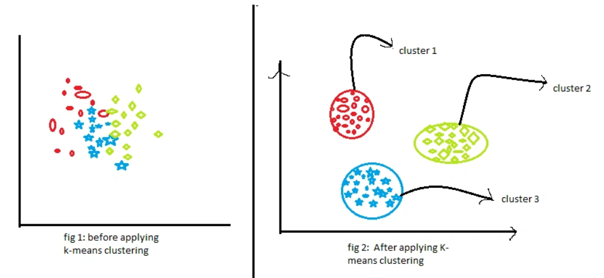

**Application in Chess Trainer**:
- **Playing-style segmentation**: Group players with similar characteristics
- **Error-pattern analysis**: Identify common error profiles

**Use cases**:
```python
# Example: Identify playing styles
features = ['aggression_score', 'positional_play', 'tactical_sharpness', 'time_management']
# Output clusters like "Aggressive", "Positional", "Tactical", "Balanced"
```

### 5. Naive Bayes
**Theory**: Applies Bayes' theorem assuming conditional independence among features.

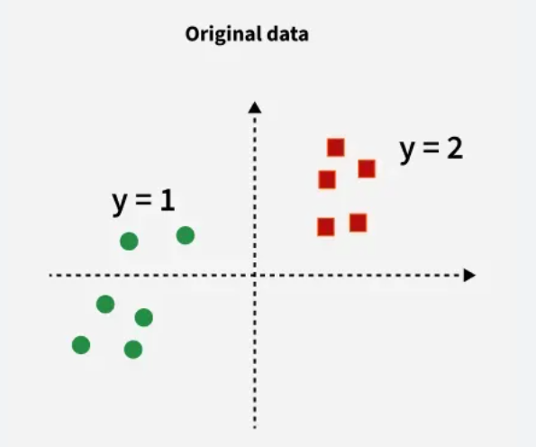
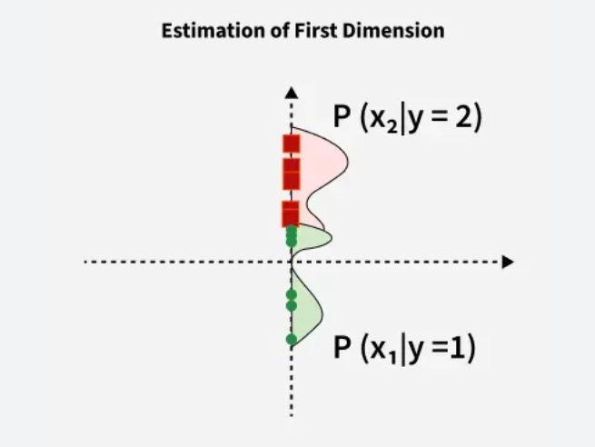
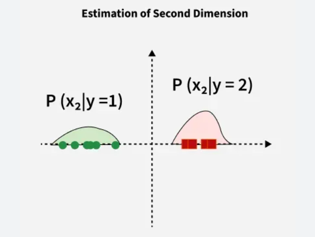
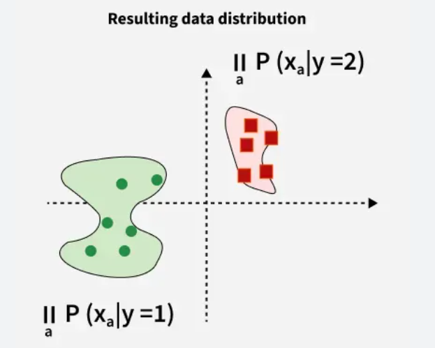

**Application in Chess Trainer**:
- **Game-phase classification**: Determine opening, middlegame, or endgame
- **Opening pattern detection**: Classify opening family from early moves

**Use cases**:
```python
# Example: Classify game phase
features = ['pieces_on_board', 'castling_rights', 'pawn_structure', 'move_number']
target = 'game_phase'  # 'opening', 'middlegame', 'endgame'
```

### 6. Random Forest
**Theory**: Ensemble of decision trees that votes for the most popular prediction.

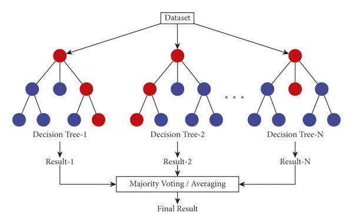

**Application in Chess Trainer**:
- **Multi-class error type prediction**: Distinguish blunder, mistake, inaccuracy
- **Feature-importance analysis**: Identify the most predictive variables

**Use cases**:
```python
# Example: Predict error type
features = ['time_pressure', 'position_complexity', 'material_imbalance', 'king_exposure']
target = 'error_type'  # 'blunder', 'mistake', 'inaccuracy', 'good_move'
```

### 7. Support Vector Machines (SVM)
**Theory**: Finds the optimal hyperplane separating classes while maximizing margin.

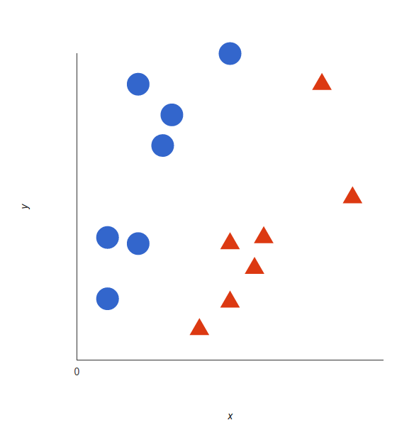

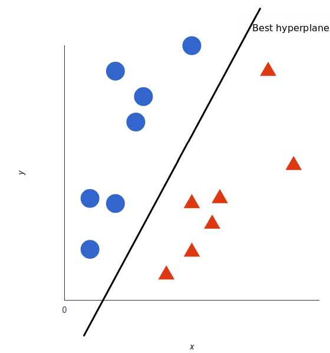
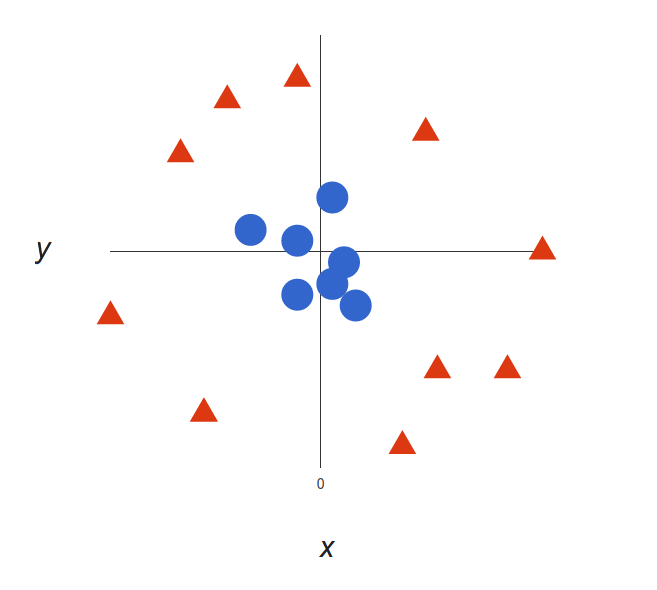
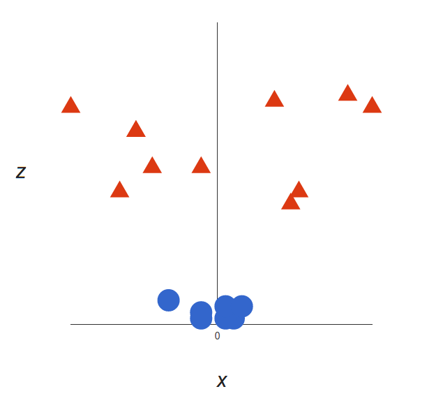
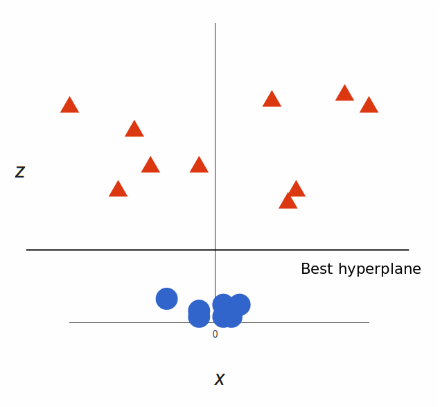
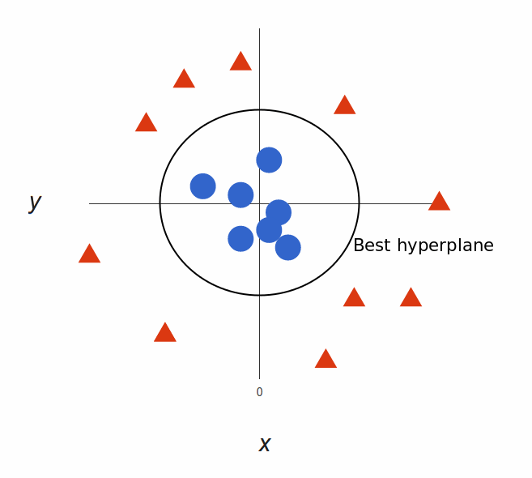

**Application in Chess Trainer**:
- **Player-level classification**: Based on recurring playing patterns
- **Anomaly detection**: Detect unusual or suspicious games

### 8. Neural Networks (Deep Learning)
**Theory**: Artificial neural networks that learn complex representations.

**Application in Chess Trainer**:
- **Position evaluation**: Estimate chess position value
- **Move prediction**: Suggest stronger continuations

## 🎯 Defined Features in Chess Trainer

### Main features:
- `error_label`: Error type (blunder, mistake, inaccuracy)
- `accuracy`: Game accuracy (0-100%)
- `score_diff`: Evaluation difference
- `mate_in`: Moves to mate (when available)
- `time_per_move`: Average time per move
- `elo_standardized`: ELO normalized across platforms

### Proposed additional features:
- `game_phase`: Opening, middlegame, endgame
- `opening_type`: Opening family
- `tactical_complexity`: Tactical complexity of position
- `material_balance`: Material balance
- `king_safety`: King safety score
- `pawn_structure`: Pawn-structure quality

## ⚠️ Preventing Overfitting and Underfitting

### Overfitting risks:
1. **Opening memorization**: Model predicts well only on seen openings
2. **Player-specific bias**: Model overfits one style
3. **Temporal overfit**: Model works only for one time period

### Underfitting risks:
1. **Overly simple model**: Using only ELO to predict all errors
2. **Insufficient features**: Ignoring positional context
3. **Limited data**: Training only on one ELO segment

### Mitigation strategies:
- **Cross-validation**: K-fold cross-validation
- **Regularization**: L1/L2 for linear models
- **Early stopping**: For neural networks
- **Feature selection**: Remove irrelevant features
- **Ensemble methods**: Combine multiple models

## 🏗️ Proposed Architecture

### System layers:
```
UI (Streamlit/React)
    ↓
FastAPI Services
    ↓
ML Repository Layer
    ↓
Data Sources (PostgreSQL, Parquet, JSON)
```

### ML components:
- **MLflow Tracking**: Experiments and metrics
- **Model Registry**: Model versioning
- **Pipeline Orchestration**: Airflow/Prefect
- **Feature Store**: Precomputed features

## 📊 Evaluation Metrics

### For classification:
- **Accuracy**: % of correct predictions
- **Precision/Recall**: For imbalanced classes
- **F1-Score**: Balance between precision and recall
- **ROC-AUC**: For binary problems

### For regression:
- **RMSE**: Root mean squared error
- **MAE**: Mean absolute error
- **R²**: Coefficient of determination

## ✅ Summary and Next Steps

This framework provides the ML foundations for classifying chess errors, predicting outcomes, and generating player recommendations in chessinsightai.

Recommended next steps:
- Connect each theoretical method to implemented notebooks and training scripts.
- Add benchmark tables for current baseline models.
- Track experiment outcomes in MLflow and update this document periodically.
