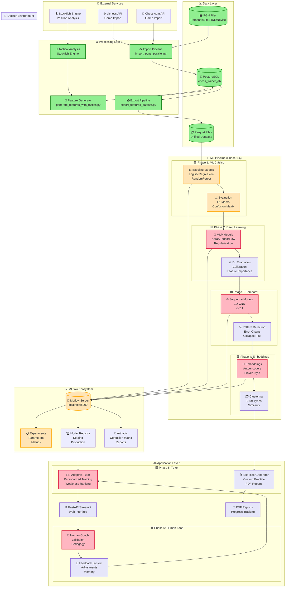

```mermaid
graph TB
    %% Data Layer
    subgraph "📊 Data Layer"
        PGN[("🗃️ PGN Files<br/>Personal/Elite/FIDE/Novice")]
        POSTGRES[("🐘 PostgreSQL<br/>chess_trainer_db")]
        PARQUET[("📦 Parquet Files<br/>Unified Datasets")]
    end

    %% Processing Layer
    subgraph "⚙️ Processing Layer"
        IMPORT["📥 Import Pipeline<br/>import_pgns_parallel.py"]
        FEATURES["🔧 Feature Generator<br/>generate_features_with_tactics.py"]
        TACTICS["🧠 Tactical Analysis<br/>Stockfish Engine"]
        EXPORT["📤 Export Pipeline<br/>export_features_dataset.py"]
    end

    %% ML Pipeline
    subgraph "🤖 ML Pipeline (Phase 1-6)"
        subgraph "🟩 Phase 1: ML Clásico"
            BASELINE["📊 Baseline Models<br/>LogisticRegression<br/>RandomForest"]
            EVAL1["📈 Evaluation<br/>F1 Macro<br/>Confusion Matrix"]
        end
        
        subgraph "🟨 Phase 2: Deep Learning"
            MLP["🧠 MLP Models<br/>Keras/TensorFlow<br/>Regularization"]
            EVAL2["📊 DL Evaluation<br/>Calibration<br/>Feature Importance"]
        end
        
        subgraph "🟧 Phase 3: Temporal"
            TEMPORAL["⏰ Sequence Models<br/>1D-CNN<br/>GRU"]
            PATTERNS["🔍 Pattern Detection<br/>Error Chains<br/>Collapse Risk"]
        end
        
        subgraph "🟥 Phase 4: Embeddings"
            EMBED["🎯 Embeddings<br/>Autoencoders<br/>Player Style"]
            CLUSTER["🗂️ Clustering<br/>Error Types<br/>Similarity"]
        end
    end

    %% MLflow Tracking
    subgraph "📊 MLflow Ecosystem"
        MLFLOW[("🔬 MLflow Server<br/>localhost:5000")]
        EXPERIMENTS["📋 Experiments<br/>Parameters<br/>Metrics"]
        MODELS["🏆 Model Registry<br/>Staging<br/>Production"]
        ARTIFACTS["📁 Artifacts<br/>Confusion Matrix<br/>Reports"]
    end

    %% Application Layer
    subgraph "🎮 Application Layer"
        subgraph "🟪 Phase 5: Tutor"
            TUTOR["👨‍🏫 Adaptive Tutor<br/>Personalized Training<br/>Weakness Ranking"]
            EXERCISES["📚 Exercise Generator<br/>Custom Practice<br/>PDF Reports"]
        end
        
        subgraph "🟫 Phase 6: Human Loop"
            COACH["👥 Human Coach<br/>Validation<br/>Pedagogy"]
            FEEDBACK["💬 Feedback System<br/>Adjustments<br/>Memory"]
        end
        
        API["🌐 FastAPI/Streamlit<br/>Web Interface"]
        REPORTS["📄 PDF Reports<br/>Progress Tracking"]
    end

    %% External Services
    subgraph "🔗 External Services"
        STOCKFISH["♟️ Stockfish Engine<br/>Position Analysis"]
        LICHESS["🌐 Lichess API<br/>Game Import"]
        CHESS_COM["🔷 Chess.com API<br/>Game Import"]
    end

    %% Data Flow Connections
    PGN --> IMPORT
    LICHESS --> IMPORT
    CHESS_COM --> IMPORT
    
    IMPORT --> POSTGRES
    POSTGRES --> FEATURES
    STOCKFISH --> TACTICS
    TACTICS --> FEATURES
    FEATURES --> POSTGRES
    
    POSTGRES --> EXPORT
    EXPORT --> PARQUET
    PARQUET --> BASELINE
    
    %% ML Pipeline Flow
    BASELINE --> EVAL1
    EVAL1 --> MLP
    MLP --> EVAL2
    EVAL2 --> TEMPORAL
    TEMPORAL --> PATTERNS
    PATTERNS --> EMBED
    EMBED --> CLUSTER
    
    %% MLflow Integration
    BASELINE --> MLFLOW
    MLP --> MLFLOW
    TEMPORAL --> MLFLOW
    EMBED --> MLFLOW
    
    MLFLOW --> EXPERIMENTS
    MLFLOW --> MODELS
    MLFLOW --> ARTIFACTS
    
    %% Application Integration
    MODELS --> TUTOR
    CLUSTER --> EXERCISES
    TUTOR --> API
    EXERCISES --> REPORTS
    
    %% Human-in-the-loop
    API --> COACH
    COACH --> FEEDBACK
    FEEDBACK --> TUTOR

    %% Docker Environment
    subgraph "🐳 Docker Environment"
        POSTGRES
        MLFLOW
        API
    end

    classDef completed fill:#90EE90,stroke:#228B22,stroke-width:2px
    classDef inprogress fill:#FFE4B5,stroke:#FFA500,stroke-width:2px
    classDef pending fill:#E6E6FA,stroke:#9370DB,stroke-width:2px
    classDef critical fill:#FFB6C1,stroke:#DC143C,stroke-width:2px

    %% Apply styles based on current status
    class PGN,POSTGRES,IMPORT,FEATURES,TACTICS,EXPORT,PARQUET completed
    class BASELINE,EVAL1,MLFLOW,EXPERIMENTS inprogress
    class MLP,TEMPORAL,EMBED,TUTOR,COACH critical
    class EVAL2,PATTERNS,CLUSTER,EXERCISES,FEEDBACK,API,REPORTS pending
```