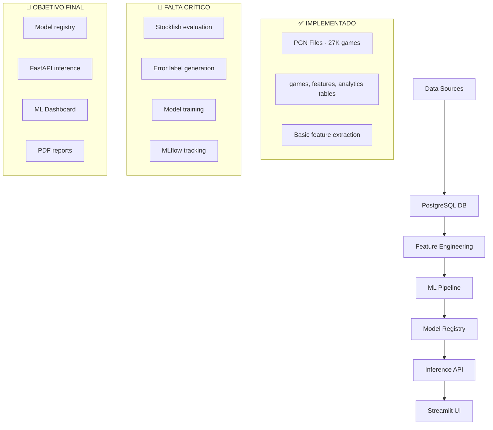

# CHESS TRAINER - Análisis del Estado Actual ML Pipeline
**Actualización**: 02-08-2025

## 🎯 **RESUMEN EJECUTIVO - PROGRESO RECIENTE**

### ✅ **AVANCES SIGNIFICATIVOS DESDE JULIO 2025**

#### 1. **Base de Datos Totalmente Poblada** 🚀
- ✅ **27,251 partidas importadas** exitosamente
- ✅ **Diversidad de fuentes**: Personal (1K), Novice (2K), Elite (4K), Stockfish (3K), FIDE (17K+)
- ✅ **Schema alineado**: Modelos SQLAlchemy sincronizados con PostgreSQL
- ✅ **Pipeline import robusto**: Manejo de múltiples formatos (PGN, ZIP, TAR, GZ, BZ2)

#### 2. **Infraestructura de Features Completada** 🏗️
- ✅ **Tabla `features` reestructurada**: Para análisis por movimiento
- ✅ **Migración exitosa**: Estructura optimizada para ML
- ✅ **Pipeline features listo**: `generate_features_with_tactics.py` funcional
- ✅ **Composite key**: (game_id, move_number, player_color)

#### 3. **Datasets ML Preparados** 📊
- ✅ **Dataset balanceado**: 44,980 registros para entrenamiento
- ✅ **Formato Parquet**: Optimizado para ML workflows
- ✅ **Export automatizado**: `overnight_features_to_dataset.py`
- ✅ **Agregaciones por partida**: Estadísticas listas para análisis

---

## 📋 **ESTADO ACTUAL DE COMPONENTES**

### **✅ COMPONENTES COMPLETADOS**

#### 1. **Data Collection & Storage**
```python
# Fuentes de datos implementadas:
data_sources = {
    'personal': '1,000 partidas - Chess.com/Lichess personal',
    'novice': '~2,000 partidas - Jugadores principiantes',
    'elite': '~4,000 partidas - Jugadores elite', 
    'stockfish': '~3,000 partidas - Engine analysis',
    'fide': '~17,000+ partidas - Maestros históricos'
}

# Estructura DB optimizada:
tables_ready = ['games', 'features', 'game_analytics']
```

#### 2. **Feature Engineering Pipeline**
```python
# Features extraídos (26+ columnas implementadas):
features_ready = [
    'game_id', 'move_number', 'player_color',
    'fen', 'move_san', 'move_uci',
    'material_balance', 'material_total', 'num_pieces',
    'branching_factor', 'self_mobility', 'opponent_mobility',
    'phase', 'has_castling_rights', 'is_repetition',
    'is_low_mobility', 'is_center_controlled', 'is_pawn_endgame',
    'site', 'event', 'date', 'white_player', 'black_player',
    'result', 'num_moves', 'is_stockfish_test'
]
```

#### 3. **MLOps Infrastructure**
- ✅ **Docker containerizado**: Separación notebooks/app
- ✅ **PostgreSQL**: Base de datos robusta
- ✅ **Pipeline automatizado**: `run_pipeline.sh` funcional
- ✅ **Volúmenes compartidos**: Sincronización data/models
- ✅ **Git LFS**: Versionado de datasets

### **❌ GAPS CRÍTICOS IDENTIFICADOS**

#### 1. **Features ML Faltantes** ⚠️
```python
# Features críticos no implementados:
missing_ml_features = [
    'error_label',              # TARGET PRINCIPAL ❌
    'score_before',             # Evaluación pre-movimiento ❌
    'score_after',              # Evaluación post-movimiento ❌ 
    'score_diff',               # Cambio evaluación ❌
    'mate_in',                  # Mate detectado ❌
    'threatens_mate',           # Amenaza mate ❌
    'is_forced_move',           # Movimiento forzado ❌
    'is_tactical_sequence',     # Secuencia táctica ❌
    'standardized_elo'          # ELO normalizado ❌
]
```

#### 2. **Engine Integration Missing** 🤖
```python
# Evaluación engine necesaria:
engine_integration_needed = {
    'stockfish_depth': 15,      # Profundidad análisis
    'evaluation_format': 'centipawns',
    'mate_detection': True,
    'tactical_analysis': True,
    'position_scoring': True
}
```

#### 3. **ML Pipeline Sin Implementar** 🧠
```python
# Componentes ML faltantes:
ml_pipeline_gaps = [
    'systematic_eda',           # EDA completo ❌
    'preprocessing_robust',     # Preprocessing sistemático ❌
    'model_training',          # Entrenamiento modelos ❌
    'cross_validation',        # Validación cruzada ❌
    'hyperparameter_tuning',   # Optimización hiperparámetros ❌
    'model_evaluation',        # Evaluación y métricas ❌
    'mlflow_tracking',         # Tracking experimentos ❌
    'inference_pipeline'       # Pipeline producción ❌
]
```

---

## 🎯 **ROADMAP ACTUALIZADO - PRIORIDADES**

### **🚨 FASE 1: Engine Integration (CRÍTICO)**
**Duración estimada**: 1-2 semanas

#### Issue #85: Stockfish Engine Integration
```python
# Implementar evaluación por movimiento:
tasks_phase_1 = [
    'setup_stockfish_engine',           # Configurar Stockfish en container
    'implement_position_evaluation',    # Evaluar posiciones
    'detect_tactical_sequences',        # Detectar tácticas
    'calculate_score_differences',      # Calcular cambios evaluación
    'generate_error_labels',            # Crear labels de error
    'update_features_table'            # Actualizar tabla features
]
```

#### Resultado esperado:
- ✅ Tabla `features` con evaluaciones Stockfish
- ✅ `error_label` generado automáticamente
- ✅ Scores antes/después por movimiento
- ✅ Detección automática de blunders/mistakes

### **🧠 FASE 2: ML Pipeline Core (ALTO)**
**Duración estimada**: 2-3 semanas

#### Issue #86: Complete ML Training Pipeline
```python
# Pipeline completo de entrenamiento:
tasks_phase_2 = [
    'systematic_eda_notebook',          # EDA completo con insights
    'robust_preprocessing_pipeline',    # Preprocessing automatizado
    'baseline_model_training',          # Modelos baseline (RF, LogReg)
    'advanced_model_training',          # XGBoost, LightGBM, NN
    'cross_validation_framework',       # CV estratificado
    'mlflow_experiment_tracking',       # Tracking sistemático
    'model_evaluation_metrics',         # Métricas completas
    'feature_importance_analysis'       # SHAP/LIME analysis
]
```

#### Resultado esperado:
- ✅ Modelo entrenado prediciendo `error_label`
- ✅ Pipeline reproducible con MLflow
- ✅ Métricas de evaluación completas
- ✅ Feature importance insights

### **🎯 FASE 3: Application Layer (MEDIO)**
**Duración estimada**: 2-3 semanas

#### Issue #87: Production Inference & Recommendations
```python
# Sistema de recomendaciones:
tasks_phase_3 = [
    'inference_service_api',            # FastAPI para inferencia
    'game_analysis_recommendations',    # Análisis partida individual
    'elo_pattern_analysis',            # Patrones por nivel ELO
    'pdf_report_generation',           # Reportes automatizados
    'playing_style_classification',     # Clasificación estilo juego
    'streamlit_dashboard_ml',          # Dashboard ML integrado
    'performance_monitoring'           # Monitoreo performance
]
```

#### Resultado esperado:
- ✅ API para análisis de partidas en tiempo real
- ✅ Recomendaciones personalizadas por jugador
- ✅ Reportes PDF automatizados
- ✅ Dashboard interactivo con insights ML

---

## 🔧 **ARQUITECTURA TÉCNICA ACTUALIZADA**

### **Estructura Actual vs Objetivo**:



### **Stack Tecnológico Recomendado**:
```python
ml_stack = {
    'engine_analysis': 'python-chess + stockfish',
    'ml_framework': 'scikit-learn + xgboost + lightgbm',
    'experiment_tracking': 'mlflow',
    'model_serving': 'fastapi + uvicorn',
    'visualization': 'plotly + seaborn + streamlit',
    'report_generation': 'reportlab + matplotlib',
    'feature_store': 'postgresql + parquet',
    'containerization': 'docker + docker-compose'
}
```

---

## 📊 **MÉTRICAS DE PROGRESO ACTUALIZADAS**

### **Pipeline Progress (Actualizado)**
| Component                        | Status    | Progress | Priority | Issues # |
| -------------------------------- | --------- | -------- | -------- | -------- |
| ✅ Data collection (PGN import)   | Completed | 100%     | ✅        | -        |
| ✅ Database schema & storage      | Completed | 100%     | ✅        | -        |
| ✅ Basic feature extraction       | Completed | 90%      | ✅        | -        |
| 🚨 Engine evaluation integration  | Missing   | 0%       | CRITICAL | #85      |
| ❌ ML features (error_label, etc) | Missing   | 0%       | CRITICAL | #85      |
| ❌ Model training pipeline        | Missing   | 0%       | HIGH     | #86      |
| ❌ MLflow experiment tracking     | Missing   | 0%       | HIGH     | #86      |
| ❌ Model evaluation & selection   | Missing   | 0%       | HIGH     | #86      |
| ❌ Production inference API       | Missing   | 0%       | MEDIUM   | #87      |
| ❌ Recommendation system          | Missing   | 0%       | MEDIUM   | #87      |

### **New Issues to Create**:
```bash
# Issues críticos para crear:
gh issue create --title "Stockfish Engine Integration for Move Evaluation" --label "critical,ml,engine" --body "Integrate Stockfish engine to evaluate positions and generate error labels"

gh issue create --title "Complete ML Training Pipeline" --label "high,ml,training" --body "Implement systematic ML pipeline from EDA to model evaluation"

gh issue create --title "Production Inference & Recommendation System" --label "medium,api,recommendations" --body "Build FastAPI service for real-time game analysis and recommendations"
```

---

## 🚧 **FEATURES ADICIONALES NECESARIOS**

### **Features para Prevenir Overfitting/Underfitting**:

```python
# Features adicionales propuestos:
additional_features = [
    # Temporal features
    'move_time_seconds',        # Tiempo por jugada
    'time_pressure_flag',       # Si queda poco tiempo
    'game_duration_minutes',    # Duración total partida
    
    # Opening features  
    'opening_eco_code',         # Código ECO apertura
    'opening_depth',            # Jugadas de teoría conocida
    'opening_preparation_score', # Qué tan preparado está
    
    # Positional features
    'king_safety_score',        # Seguridad del rey
    'pawn_structure_score',     # Calidad estructura peones
    'piece_coordination',       # Coordinación piezas
    'space_advantage',          # Ventaja espacial
    
    # Strategic features
    'initiative_score',         # Quién tiene la iniciativa
    'weakness_exploitation',    # Explotación debilidades
    'endgame_technique_score',  # Técnica en finales
    
    # Meta features
    'recent_form',              # Forma reciente jugador
    'opponent_strength_diff',   # Diferencia ELO oponente
    'tournament_pressure',      # Presión torneo vs casual
]
```

### **Casos de Overfitting a Prevenir**:
1. **Memorización de aperturas específicas**: Modelo que solo funciona con aperturas vistas
2. **Sesgo por jugador específico**: Sobreajuste a Magnus Carlsen o jugadores elite
3. **Dependencia temporal**: Modelo que solo funciona con partidas 2020-2024
4. **Sesgo plataforma**: Funciona solo Chess.com pero no Lichess

### **Casos de Underfitting a Prevenir**:
1. **Modelo demasiado simple**: Solo usar ELO para predecir todo
2. **Features insuficientes**: No considerar contexto posicional
3. **Datos limitados**: Solo entrenar con 1000 partidas
4. **Una sola métrica**: Solo optimizar accuracy, ignorar F1-score

---

## 🎯 **DECISIONES ESTRATÉGICAS REQUERIDAS**

### **1. Engine Integration Strategy**
```python
# Opción A: Integración completa Stockfish
stockfish_full_integration = {
    'pros': ['Evaluaciones precisas', 'Detección tácticas', 'Error labeling automático'],
    'cons': ['Computacionalmente costoso', 'Tiempo procesamiento alto'],
    'recommendation': 'RECOMENDADO - Esencial para ML quality'
}

# Opción B: Evaluaciones pre-calculadas
precalculated_evaluations = {
    'pros': ['Procesamiento rápido', 'Sin overhead computacional'],
    'cons': ['Dependiente de datos externos', 'Menos flexibilidad'],
    'recommendation': 'ALTERNATIVA - Si tiempo es crítico'
}
```

### **2. ML Model Strategy**
```python
# Enfoque recomendado:
ml_approach = {
    'baseline_models': ['LogisticRegression', 'RandomForest'],
    'advanced_models': ['XGBoost', 'LightGBM', 'Neural Networks'],
    'ensemble_strategy': 'Voting Classifier con mejores modelos',
    'evaluation_metrics': ['accuracy', 'f1_macro', 'roc_auc', 'confusion_matrix'],
    'cross_validation': 'StratifiedKFold por ELO ranges'
}
```

### **3. Production Deployment**
```python
# Arquitectura recomendada:
production_architecture = {
    'inference_api': 'FastAPI + Uvicorn',
    'model_storage': 'MLflow Model Registry',
    'caching_strategy': 'Redis para evaluaciones frecuentes',
    'monitoring': 'Prometheus + Grafana',
    'scaling': 'Docker Swarm o Kubernetes'
}
```

---

## 🚀 **PRÓXIMOS PASOS INMEDIATOS**

### **Semana 1-2: Engine Integration**
1. **Setup Stockfish en container Docker**
2. **Implementar evaluación por posición**
3. **Generar error_labels automáticamente**
4. **Actualizar tabla features con evaluaciones**

### **Semana 3-4: ML Pipeline Core**
1. **EDA sistemático con nuevos features**
2. **Preprocessing pipeline robusto**
3. **Entrenamiento modelos baseline**
4. **Setup MLflow tracking**

### **Semana 5-6: Advanced ML & Production**
1. **Modelos avanzados (XGBoost, NN)**
2. **Hyperparameter optimization**
3. **Model evaluation completo**
4. **FastAPI inference service**

### **Código para comenzar inmediatamente**:
```bash
# 1. Setup Stockfish engine
docker-compose exec chess_trainer bash -c "
apt update && apt install -y stockfish
pip install python-chess stockfish
"

# 2. Crear script evaluación
docker-compose exec chess_trainer bash -c "
cd /app && python src/scripts/integrate_stockfish_evaluation.py
"

# 3. Actualizar features table
docker-compose exec chess_trainer bash -c "
cd /app && python src/scripts/update_features_with_engine.py
"
```

---

## 🏗️ **ARQUITECTURA PROPUESTA DETALLADA**

### **Capas del Sistema**:
```
┌─────────────────────────────────────────┐
│                UI Layer                 │
│  - Streamlit Dashboard                  │
│  - PDF Report Generator                 │
│  - Interactive Analysis Tools           │
└─────────────────────────────────────────┘
                    ↓
┌─────────────────────────────────────────┐
│              FastAPI Services           │
│  - Game Analysis Service               │
│  - Recommendation Service              │
│  - Report Generation Service           │
│  - User Profile Service                │
└─────────────────────────────────────────┘
                    ↓
┌─────────────────────────────────────────┐
│              ML Repository              │
│  - Model Inference                     │
│  - Feature Engineering                 │
│  - Pattern Analysis                    │
│  - Style Classification                │
└─────────────────────────────────────────┘
                    ↓
┌─────────────────────────────────────────┐
│              Data Sources               │
│  - PostgreSQL (games, features)        │
│  - Parquet Datasets                    │
│  - MLflow Model Registry               │
│  - JSON Config Files                   │
└─────────────────────────────────────────┘
```

---

## 📋 **UPDATED TABLES - CURRENT STATE**

### **Current ML Workflow Progress (ACTUALIZADO)**
| Item                             | Status    | Priority | Issues # | Progress |
| -------------------------------- | --------- | -------- | -------- | -------- |
| ✅ Collect game data (PGN, APIs)  | Completed | ✅        | #72      | 100%     |
| ✅ Get features and training data | Completed | ✅        | #73      | 90%      |
| ✅ Basic feature extraction       | Completed | ✅        | -        | 90%      |
| 🚨 Engine evaluation integration  | Missing   | CRITICAL | #85      | 0%       |
| ❌ Systematic EDA and insights    | Pending   | HIGH     | #86      | 0%       |
| ❌ Train multiple ML models       | Pending   | HIGH     | #86      | 0%       |
| ❌ Model evaluation and selection | Pending   | HIGH     | #86      | 0%       |
| ❌ Production inference pipeline  | Pending   | HIGH     | #87      | 0%       |

### **New ML Pipeline Issues (PROPUESTOS)**
| Item                                       | Status  | Priority | Issues # | Dependencies |
| ------------------------------------------ | ------- | -------- | -------- | ------------ |
| Stockfish engine integration               | Pending | CRITICAL | #85      | -            |
| Complete ML training pipeline              | Pending | HIGH     | #86      | #85          |
| Individual game analysis & recommendations | Pending | HIGH     | #87      | #86          |
| ELO-based pattern analysis                 | Pending | HIGH     | #87      | #86          |
| Automated PDF report generation            | Pending | MEDIUM   | #87      | #86          |
| Playing style classification               | Pending | MEDIUM   | #87      | #86          |
| MLflow experiment tracking setup           | Pending | HIGH     | #86      | -            |
| Cross-validation pipeline                  | Pending | HIGH     | #86      | #85          |

---

## ❓ **PREGUNTAS CRÍTICAS PARA DECISIÓN INMEDIATA**

1. **¿Comenzamos con Stockfish integration o prefieres skip to ML directamente?**
2. **¿Qué profundidad de análisis Stockfish prefieres (depth 10-20)?**
3. **¿Priorizamos speed vs accuracy en las evaluaciones?**
4. **¿Implementamos MLflow tracking desde el inicio?**
5. **¿Qué tipo de recomendaciones son más valiosas para los usuarios?**

---

## 📈 **DATOS ACTUALIZADOS DE SISTEMA**

### **Estado de Base de Datos**:
```python
current_database_state = {
    'total_games': 27251,
    'games_sources': {
        'personal': 1000,
        'novice': 2000,  
        'elite': 4000,
        'stockfish': 3000,
        'fide': 17251
    },
    'features_table': 'Ready for engine evaluation',
    'pipeline_status': 'Ready to generate features'
}
```

### **Próxima Ejecución Recomendada**:
```bash
# Ejecutar generación de features con las 27K partidas
docker-compose exec chess_trainer bash -c "cd /app && bash src/pipeline/run_pipeline.sh generate_features"

# Después integrar Stockfish
docker-compose exec chess_trainer bash -c "cd /app && python src/scripts/integrate_stockfish_evaluation.py"
```

---

**El proyecto tiene una base sólida de datos y está listo para el salto crítico hacia ML production. La integración del engine es el cuello de botella principal que desbloqueará todo el pipeline ML downstream.**

---

**Estado**: ✅ Datos listos, 🚨 Engine integration crítico, 🎯 ML pipeline pendiente  
**Próxima milestone**: Stockfish integration + Error label generation  
**Última actualización**: 02-08-2025  
**Autor**: GitHub Copilot Analysis Update